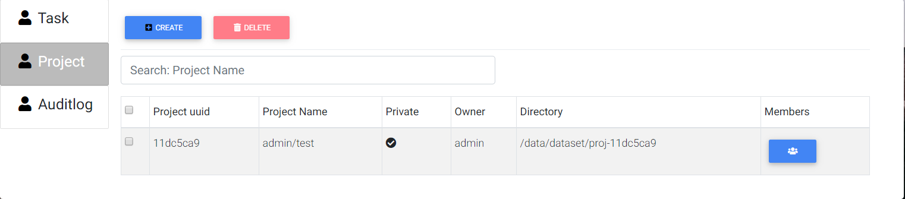

.. _admin:

**************
Administration
**************

To enter administration settings click "System" on the drop down menu in the top-right corner.

Default login
=============

The defauld administration credentials are **admin/admin**.

.. image:: ../_static/admin_dropdown.png

Profile
=======

It shows current user profile and change password operation.

.. image:: ../_static/profile.png

.. image:: ../_static/change_password.png

Account
=======

User
----

In user managment tab

Allows create, edit or delete user.

Create
++++++

Press "Create" button.

.. image:: ../_static/create_user.png

Fill name, password.

Sellect roles from drop down list.

Gpu limit is how many gpus can this user occupy, "-1" means no restriction.

Manage group if user needs.

.. image:: ../_static/create_user2.png

Edit
++++

Sellect user that needs to be edited, press "Edit" button.

.. image:: ../_static/edit_user.png

Fill new info.

.. image:: ../_static/edit_user2.png

Delete
++++++

Select user that needs to be deleted, press "Delete" button. Confirm.

.. image:: ../_static/delete_user.png

Group
-----

Is group managment tab

Allows add and delete group.

Create
++++++

Press "Create" button.

.. image:: ../_static/create_group.png

Fill group name and confirm.

.. image:: ../_static/create_group2.png

Delete
++++++

Select group that needs to be deleted, press "Delete" button. Confirm.

.. image:: ../_static/delete_group.png

Dashboard
=========

Task
----

Is a list of currently running instances of labs and jobs.

.. image:: ../_static/list_task.png

Stop
++++

Select instance that needs to be stopped and press "Stop".

Only running status can stop.

.. image:: ../_static/stop_task.png

Delete
++++++

Select needed run and click "Delete" to remove the run.

Only not running status can delete.

.. image:: ../_static/delete_task.png

Project
-------

Project management tab. Shows list of projects.

Create
++++++

Press create button.

.. image:: ../_static/create_project_system.png

Input project name and annotation, press "Create".

.. image:: ../_static/create_project_system2.png

Members
+++++++

To edit project members click "Members" button next to the project name.

.. image:: ../_static/members_project.png

To add user to the project press "Add member", then type their name, select permissions and press "Save", then press "Done".

.. image:: ../_static/members_project2.png

To delete user from project press "Delete" next to the username, then press "Done".

.. image:: ../_static/members_project3.png

Delete
++++++

Sellect needed project and press "Delete" button. Confirm.

.. image:: ../_static/delete_project_system.png

Auditlog
--------

Log of system events in chronological order. Use "Search" box on top to look for specific events.

.. image:: ../_static/log_system.png

Device
======

Shows All hosts' hardwave informations.

.. image:: ../_static/view_device.png

Setting
=======

Host
----

Shows list of hosts in the system.

.. image:: ../_static/list_host.png

Create
++++++

First on the target host create a sudo user account.

Give it the password-less privilege for mount related commands. For this create fallowing file `/etc/sudoers.d/<account>` with content

.. code-block:: console

  <account> ALL=(ALL) NOPASSWD: /usr/bin/mount,/usr/bin/umount,/bin/sh

Then generate the pair of ssh-keys (sellect all defaults). For this on host machine console type:

.. code-block:: console

  ssh-keygen -t rsa -b 4096 -C "<your_string>"
  eval "$(ssh-agent -s)"
  ssh-add ~/.ssh/id_rsa
  cat ~/.ssh/id_rsa.pub > authorized_keys

On MLSteam webportal Host page press "Create". 

.. image:: ../_static/new_host.png

Then fill the form with ip address, account name and for "SSH KEY" field copy the content of `~/.ssh/id_rsa`.

.. image:: ../_static/new_host1.png

Delete
++++++

Sellect needed host and press "Delete" button. Confirm.

.. image:: ../_static/delete_host.png

Certificate
-----------

Shows list of certificates in the system.

.. image:: ../_static/list_certificate.png

Create
++++++

Press create button.

.. image:: ../_static/create_certificate.png

Input certificate name and doamin name, press "Test anc Create". (Optional, email) 

.. image:: ../_static/create_certificate2.png

Delete
++++++

Sellect needed host and press "Delete" button. Confirm.

.. image:: ../_static/delete_certificate.png

Repository
++++++++++

License
+++++++

Shows current license file.

If license needs to be updated press "Edit" to input new license file.

.. image:: ../_static/license_system.png

Input license text in the field and press "Save".

.. image:: ../_static/license_system2.png
