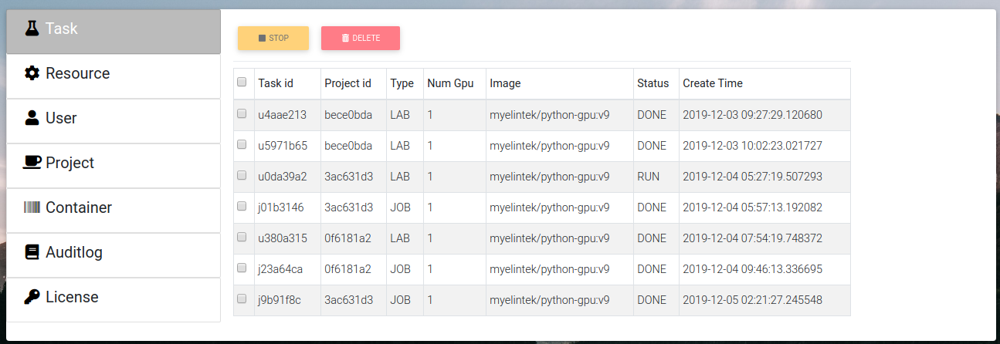
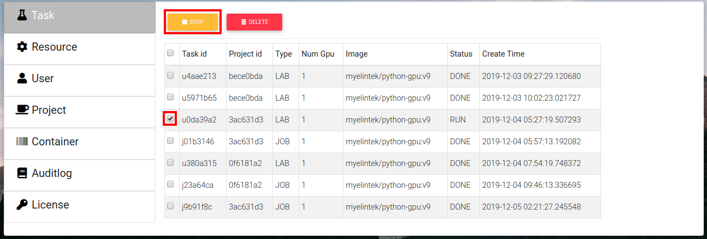
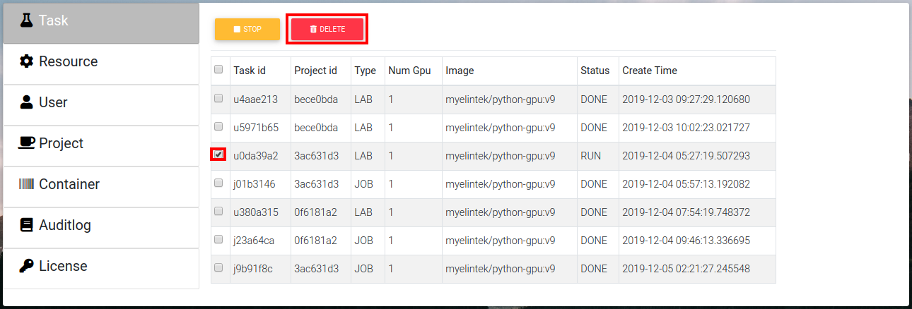
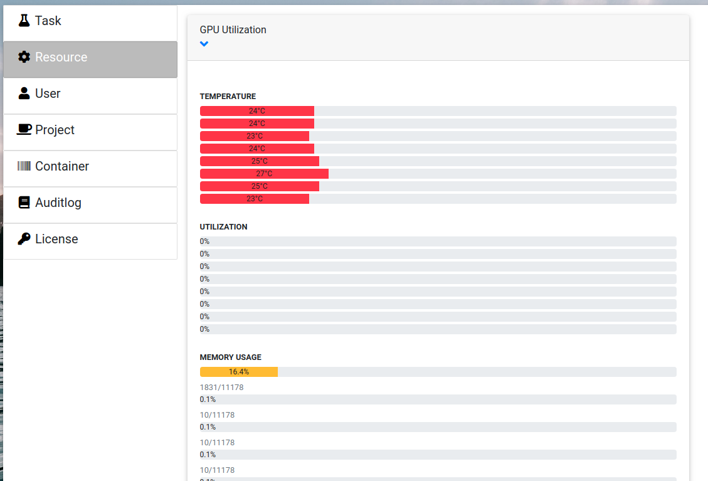

.. _admin:

**************
Administration
**************

To enter administration settings click "System" on the drop down menu in the top-right corner.

Default login
=============

The defauld administration credentials are **admin/admin**. 

Task
====

Is a list of currently running instances of labs and jobs.

Stop
++++

Select instance that needs to be stopped and press "Stop".

Delete
++++++

Select needed run and click "Delete" to remove the run.

Resource
========

Shows current GPU utilization

User
====

Is user managment tab

Allows add, edit or delete user.

Create
++++++

Press "Create" button.

.. image:: ../_static/create_user.png

Fill name, password.

Sellect roles from drop down list.

Gpu limit is how many gpus can this user occupy, "-1" means no restriction.

.. image:: ../_static/create_user2.png

Edit
++++

Sellect user that needs to be edited, press "Edit" button.

.. image:: ../_static/edit_user.png

Fill new info.

.. image:: ../_static/edit_user2.png

Delete
++++++

Select user that needs to be deleted, press "Delete" button. Confirm.

.. image:: ../_static/delete_user.png

Projects
========

Project management tab. Shows list of projects.

Create
++++++

Press create button.

.. image:: ../_static/create_project_system.png

Input project name and annotation, press "Create".

.. image:: ../_static/create_project_system2.png

Edit
++++

Select a project to modify, press "Edit".

.. image:: ../_static/edit_project_system.png

Modify needed fields.

.. image:: ../_static/edit_project_sytem2.png 

Members
+++++++

To edit project members click "Members" button next to the project name.

.. image:: ../_static/members_project.png

To add user to the project press "Add member", then type their name, select permissions and press "Save", then press "Done".

.. image:: ../_static/members_project2.png

To delete user from project press "Delete" next to the username, then press "Done".

.. image:: ../_static/members_project3.png

Delete
++++++

Sellect needed project and press "Delete" button. Confirm.

.. image:: ../_static/delete_project_system.png

Auditlog
========

Log of system events in chronological order. Use "Search" box on top to look for specific events.

.. image:: ../_static/log_system.png

License
=======

Shows current license file.

Edit
++++

If license needs to be updated press "Edit" to input new license file.

.. image:: ../_static/license_system.png

Input license text in the field and press "Save".

.. image:: ../_static/license_system2.png
