.. _admin:

**************
Administration
**************

To enter administration settings click "System" on the drop down menu in the top-right corner.

Default login
=============

The defauld administration credentials are admin/admin. 

Runs
====

Is a list of currently running instances of labs and jobs.

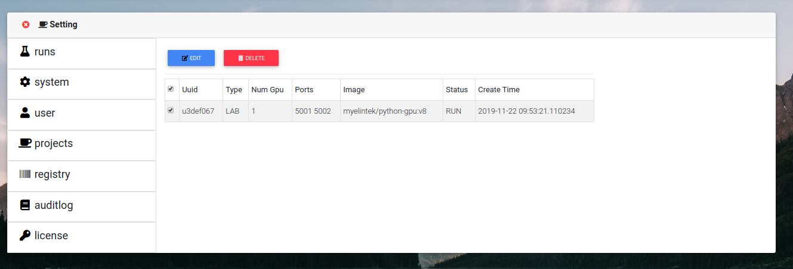

Edit
++++

Select needed run and click "Edit" to modify the parameters of run.

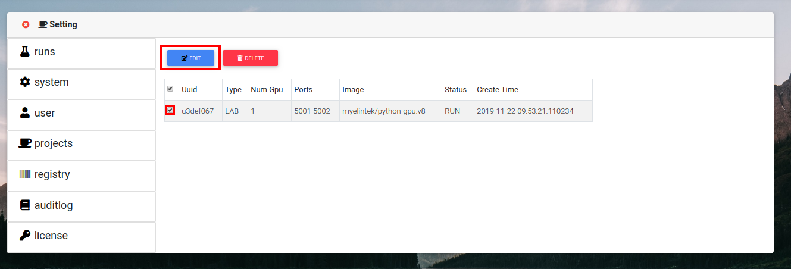

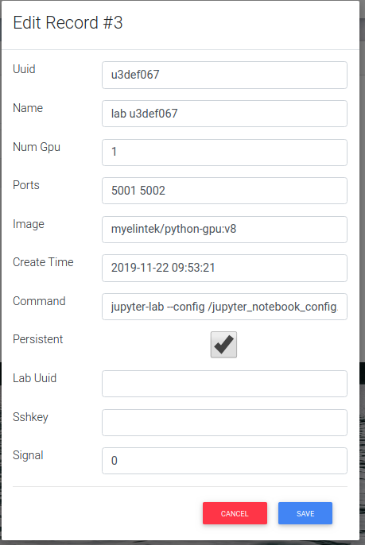

Delete
++++++

Select needed run and click "Delete" to remove the run.

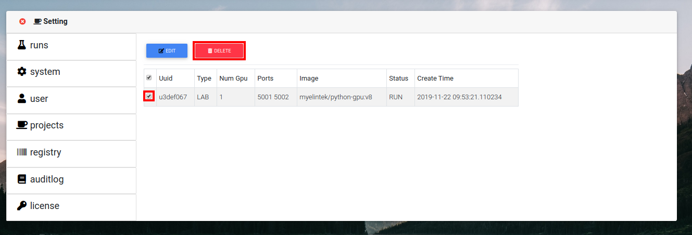

System
======

Shows current status of system:

* System load

* GPU utilization

* Mount points

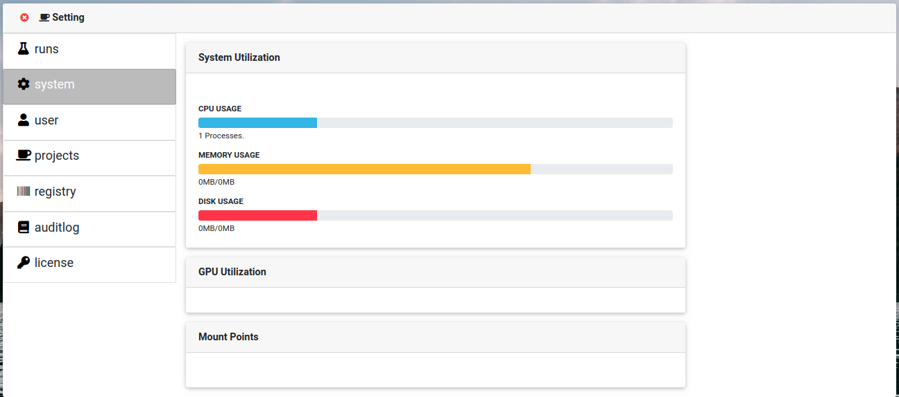

User
====

Is user managment tab

Allows add, edit or delete user.

Create
++++++

Press "Create" button.

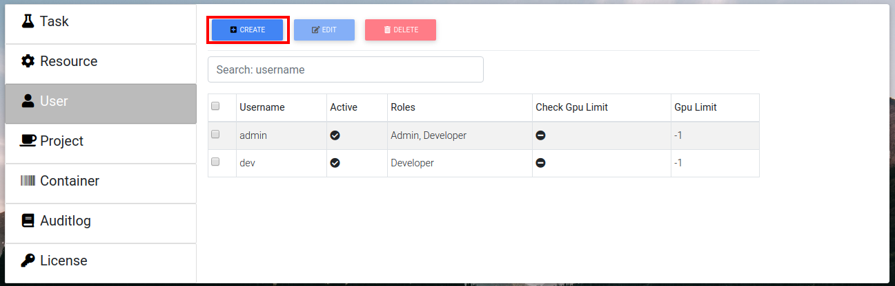

Fill name, password.

Sellect roles from drop down list.

Gpu quota is how many gpus can this user occupy, "-1" means no restriction.

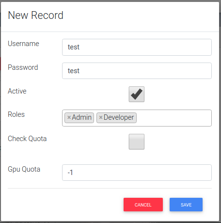

Edit
++++

Sellect user that needs to be edited, press "Edit" button.

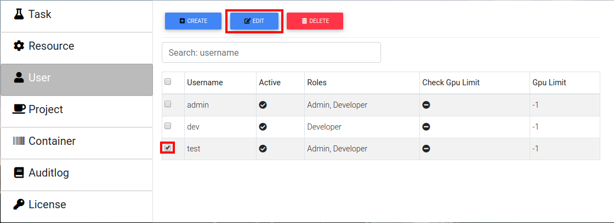

Fill new info.

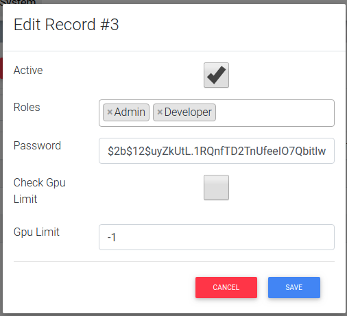

Delete
++++++

Select user that needs to be deleted, press "Delete" button. Confirm.

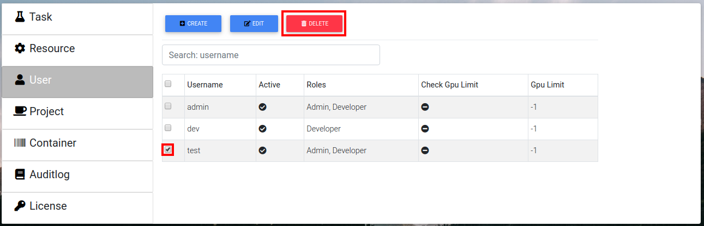

Projects
========

Project management tab. Shows list of projects.

Create
++++++

Press create button.

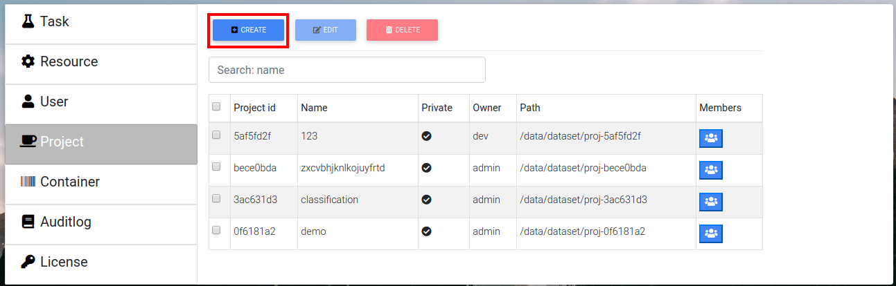

Input project name and annotation, press "Create".

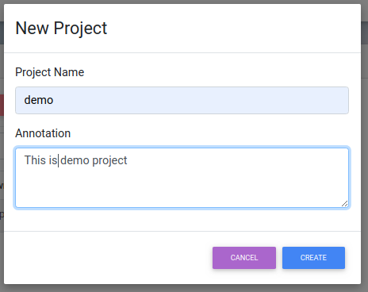

Edit
++++

Select a project to modify, press "Edit".

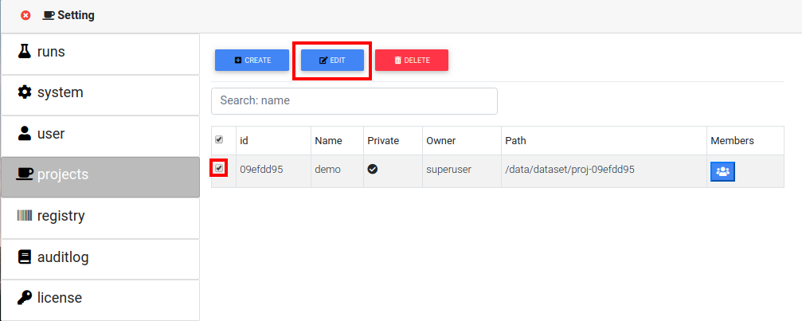

Modify needed fields.

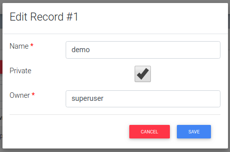

Members
+++++++

To edit project members click "Members" button next to the project name.

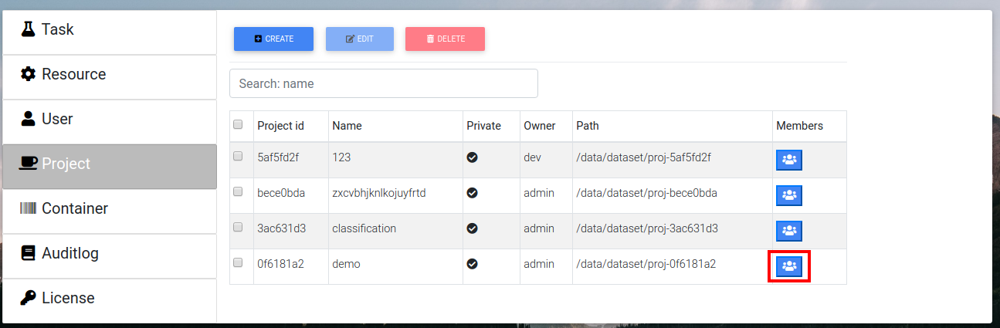

To add user to the project press "Add member", then type their name, select permissions and press "Save", then press "Done".

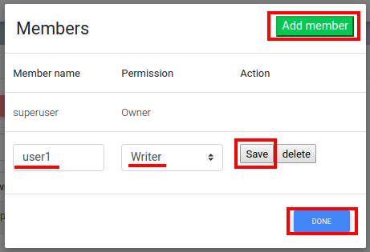

To delete user from project press "Delete" next to the username, then press "Done".

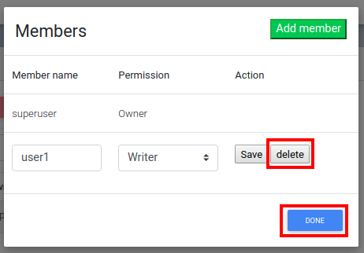

Delete
++++++

Sellect needed project and press "Delete" button. Confirm.

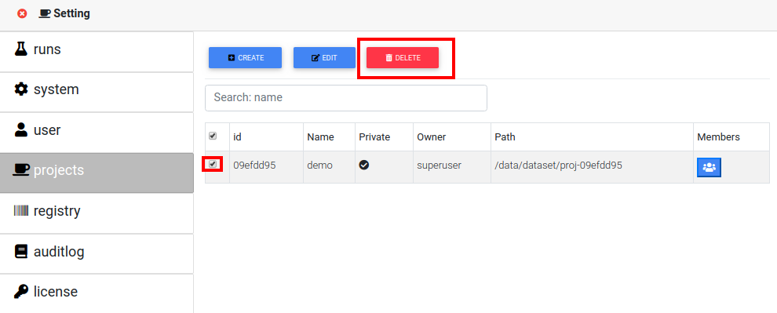

Registry
========

Auditlog
========

Log of system events in chronological order. Use "Search" box on top to look for specific events.

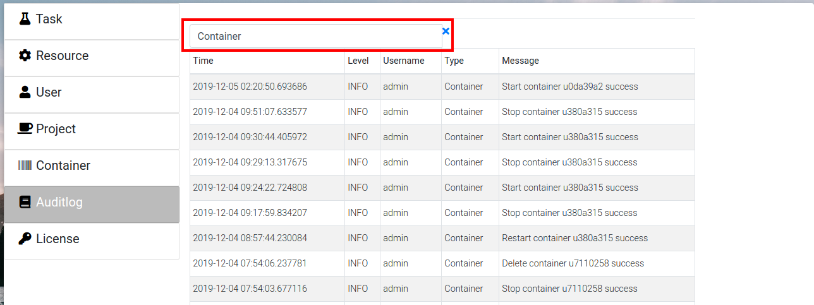

License
=======

Shows current license file.

Edit
++++

If license needs to be updated press "Edit" to input new license file.

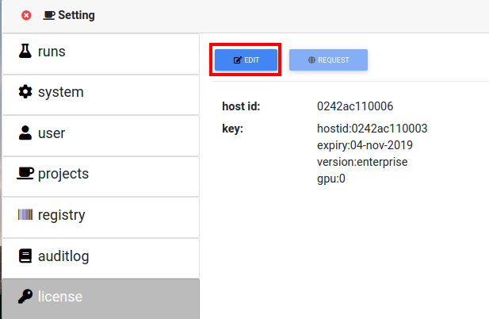

Input license text in the field and press "Save".

.. image:: ../_static/license_system2.png
