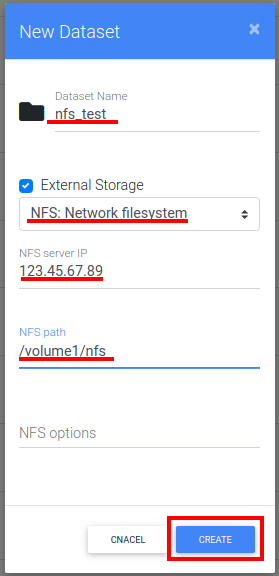
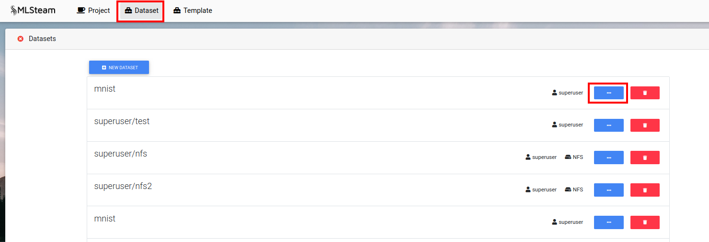
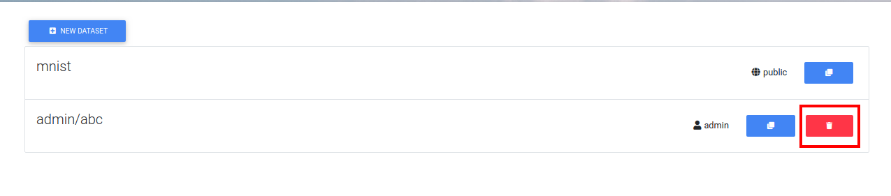

.. _dataset:

*******
Dataset
*******

.. _create_dataset:

Create dataset
==============

Click "Dataset" button.

Click "New dataset".

.. image:: ../_static/new_dataset.png

Input dataset name and press "Create"

Empty dataset will be created.

.. image:: ../_static/new_dataset2.png

Create dataset from remote source
=================================

Currently system supports creation of dataset from NFS.

Click "New dataset". Input dataset name and check "External storage" box. From drop down menu select dataset type as NFS.
Input ip and mount point. Press "Create".

Manipulate dataset
==================

Browse dataset
++++++++++++++

Click Dataset button.

Click on dataset name.

Clone dataset
+++++++++++++

Press "Clone" button to create a copy of dataset.

.. image:: ../_static/clone_dataset.png

Upload files to dataset
+++++++++++++++++++++++

Browse needed dataset.

Then drag and drop files from local pc. Or click "Upload" button.

.. image:: ../_static/upload_dataset.png

Extract files from archive
++++++++++++++++++++++++++

Supported format *tar, tgz, tar.gz, zip.*

Select archive file and press "Extract".

.. image:: ../_static/extract_dataset.png

New folder
++++++++++

Press "New folder" button to create new folder within dataset.

.. image:: ../_static/new_folder_dataset0.png

Input folder name. Press create.

.. image:: ../_static/new_folder_dataset.png

Download folder/file
++++++++++++++++++++

Select folders and/or files that need to be downloaded and press "Download".

.. image:: ../_static/download_dataset.png

Delete folder/file
++++++++++++++++++

Select folders and/or files that need to be deleted and press "Delete".

.. image:: ../_static/delete_file_dataset.png

Visualize dataset
=================

If the dataset is of standart types it can be visualized.

Sellect folder with images, then press "Visualize" button. Sellect dataset type.
In our example the dataset is of yolov3 type.

.. image:: ../_static/visualize_dataset.png

Fill all fields with pathes inside datased folder. Press "Start". Refresh page to see changes.

.. image:: ../_static/visualize_dataset2.png

Visualization with bounding boxes will appear on the left when one image is selected.

.. image:: ../_static/visualize_dataset3.png

If visualization needs to be removed go inside folder with images and press cross on the visualization tag.

.. image:: ../_static/visualize_dataset4.png

Delete dataset
==============

Open the list of datasets then press trash icon in front of dataset name. Confirm.

