########
Dataset
########

Dataset is any collection of data. Here we listed all available operations below, each in a separate section.

* :ref:`create_dataset`
* :ref:`manipulate_dataset`
* :ref:`delete_dataset`

.. _create_dataset:

Create dataset
==============

To create an empty dataset, click new dataset button and specify dataset name.

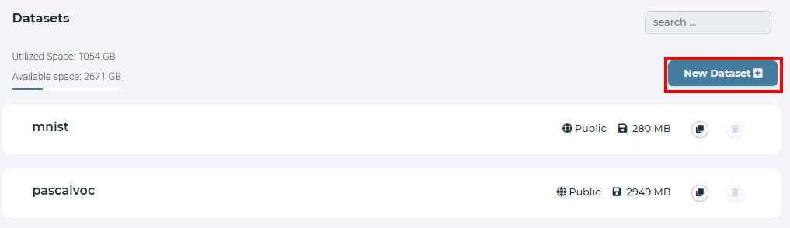

  click new dataset button on the dataset page

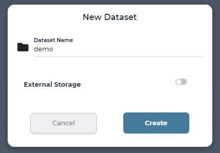

  named 'demo' for this dataset

.. tip::

  All created datasets are private and are within your account's namespace.

.. _manipulate_dataset:

Manipulate dataset
==================

All available operations, that one can do in the dataset page, are shown below.

Browse dataset
--------------

To browse the dataset, click on dataset name.

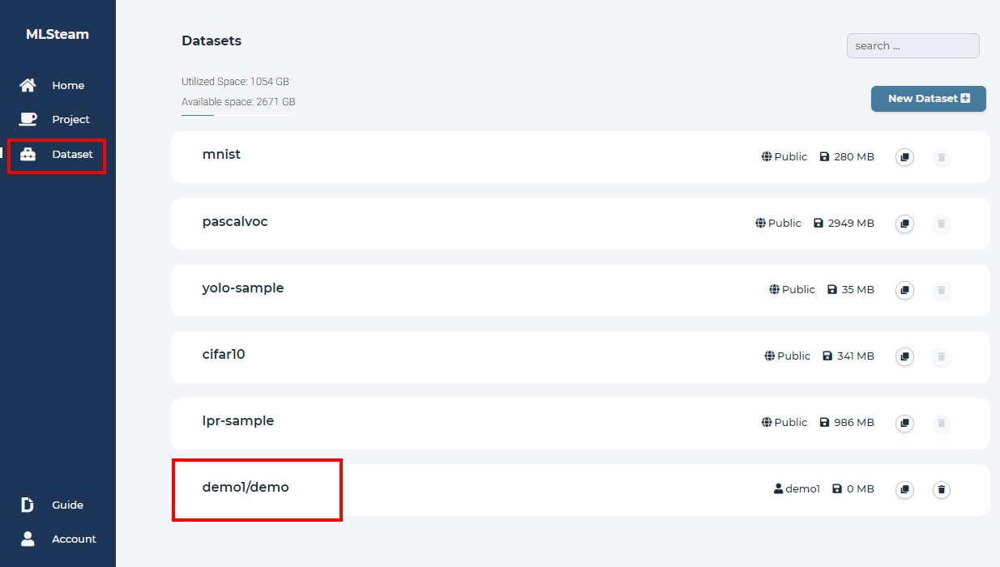

Clone dataset
-------------

To clone a dataset, click *Clone* button to create a copy of dataset.

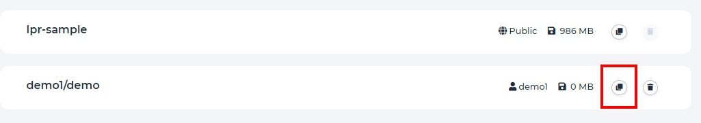

Upload files to dataset
-----------------------

To upload files to a dataset, simply drag and drop files from local PC or click *Add Data* -> *Local* -> *Browse* to select local files.

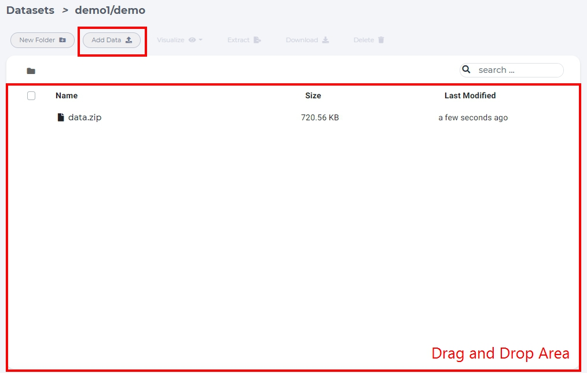
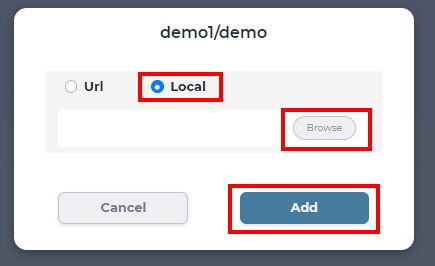

Extract files from archive
---------------------------

Uploading too many files at the same time will cause your web browser to freeze. A better way to upload large collection of files is to compress them first into one archive file and uncompress the file on the dataset page.

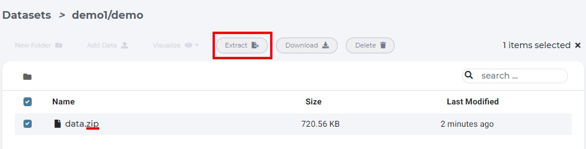

  select archive file and click "Extract".

.. tip::

  Supported compress file format *tar, tgz, tar.gz, zip.*

New folder
-----------

To create folders in dataset, click *new folder* button within a dataset.

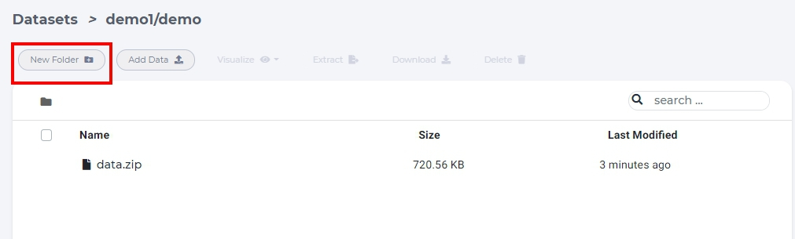

  click *new folder*

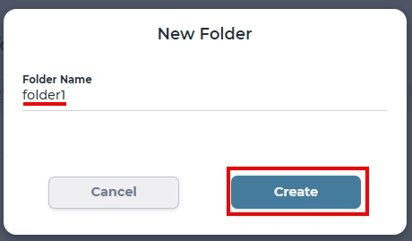

  input folder name and click create.

Download files
--------------

To download files, select a file and click *download* button.

.. figure:: ../_static/dataset/download_dataset.jpg

  download a file

Delete folder/file
------------------

To delete files or folders, select a folder or a file and click *delete*.

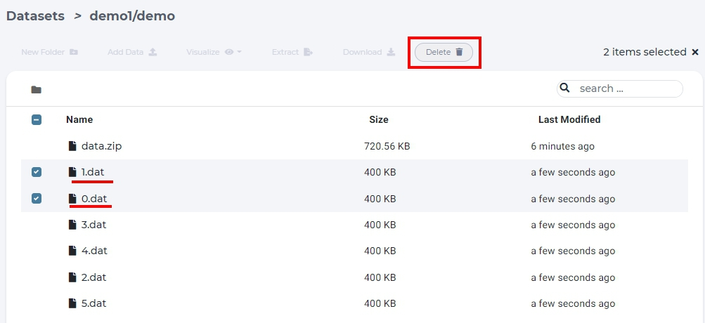

  delete a file in dataset page

.. _delete_dataset:

Delete dataset
==============

To delete a dataset, simply click trash icon in the dataset page.

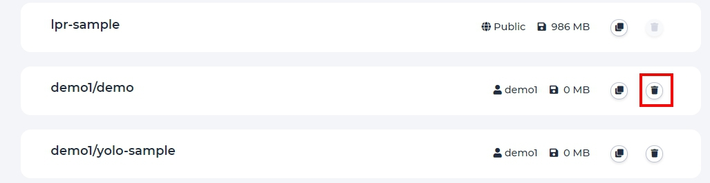

  delete a dataset.