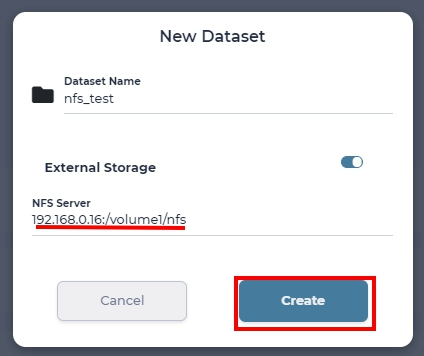
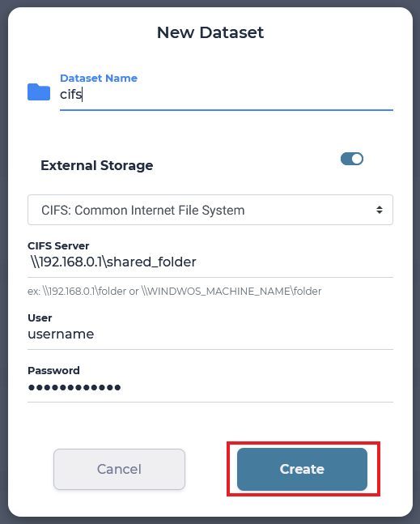
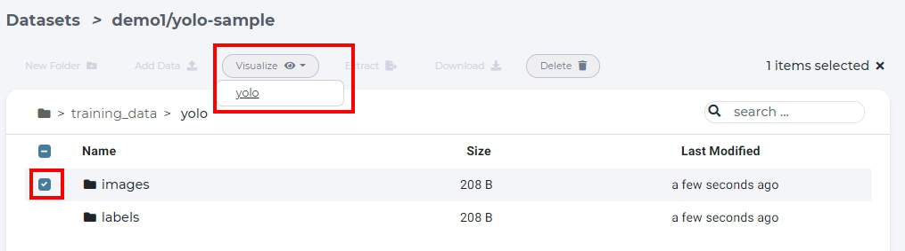
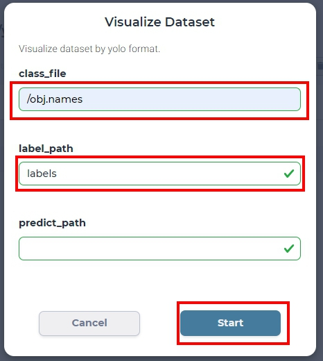
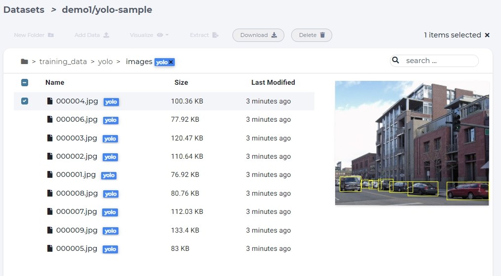
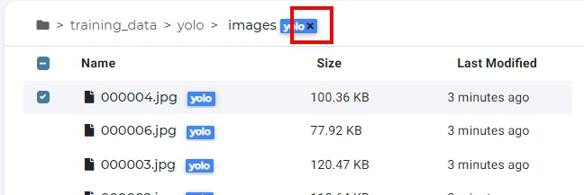

########
Dataset
########

Dataset is any collection of data. Here we listed all available operations below, each in a separate section.

* :ref:`create_dataset`
* :ref:`create_dataset_from_nfs`
* :ref:`manipulate_dataset`
* :ref:`visualize_dataset`
* :ref:`delete_dataset`

.. _create_dataset:

Create dataset
==============

To create an empty dataset, click new dataset button and specify dataset name.

.. figure:: ../_static/dataset/new_dataset.jpg

  click new dataset button on the dataset page

.. figure:: ../_static/dataset/new_dataset_modal.jpg

  named 'demo' for this dataset

.. tip::

  All created datasets are private and are within your account's namespace.

.. _create_dataset_from_nfs:

Create dataset from NFS volume
==============================

You can create a dataset which mounts a remote NFS volume and manage the data in the system.

Simply click new dataset button, specify the dataset name and check *External Storage* toggle. From drop down menu select NFS.
Input the NFS server ip and mount point path. Click *Create*.

  create a dataset which mounts remote NFS volume

Create dataset from Windows shared folder
==========================================

You can create dataset from remote Windows shared folder.

Click new dataset button, specify the dataset name and check *External Storage* toggle. From drop down menu select CIFS.
Input the shared folder server ip, mount point path and remote machine credentials. Click *Create*.

.. _manipulate_dataset:

Manipulate dataset
==================

All available operations, that one can do in the dataset page, are shown below.

Browse dataset
--------------

To browse the dataset, click on dataset name.

.. image:: ../_static/dataset/browse_dataset.jpg

Clone dataset
-------------

To clone a dataset, click *Clone* button to create a copy of dataset.

.. image:: ../_static/dataset/clone_dataset.jpg

Upload files to dataset
-----------------------

To upload files to a dataset, simply drag and drop files from local PC or click *Add Data* -> *Local* -> *Browse* to select local files.

.. image:: ../_static/dataset/upload_dataset.jpg
.. image:: ../_static/dataset/upload_dataset_local.jpg

Extract files from archive
---------------------------

Uploading too many files at the same time will cause your web browser to freeze. A better way to upload large collection of files is to compress them first into one archive file and uncompress the file on the dataset page.

.. figure:: ../_static/dataset/extract_dataset.jpg

  select archive file and click "Extract".

.. tip::

  Supported compress file format *tar, tgz, tar.gz, zip.*

New folder
-----------

To create folders in dataset, click *new folder* button within a dataset.

.. figure:: ../_static/dataset/new_folder_dataset0.jpg

  click *new folder*

.. figure:: ../_static/dataset/new_folder_dataset.jpg

  input folder name and click create.

Download files
--------------

To download files, select a file and click *download* button.

.. figure:: ../_static/dataset/download_dataset.jpg

  download a file

Delete folder/file
------------------

To delete files or folders, select a folder or a file and click *delete*.

.. figure:: ../_static/dataset/delete_file_dataset.jpg

  delete a file in dataset page

.. _visualize_dataset:

Visualize labeled dataset
=========================

For supervised learning, dataset has to be labeled with correct answers. For better visualization, system support following labeling format for visualization.

* :ref:`yolo`

.. _yolo:

YOLO format
-----------

To visualize YOLO dataset, we have to select the folder which contains images and specify it's *yolo* format in dataset page.

  select *images* folder and selct yolo in *Visualize* dropdown list.

To visualize YOLO dataset, we need the following annotation files and inputs:

* class_file: specify each index name of labels.
* label_path: contains YOLO format label files.
* predict_path: (optional) contains model prediction results in YOLO format.

  example of specifying a YOLO format image folder

If visualization is successfull, *yolo* tag will appear in related files and folder.

click images to visualize bounding box in each labeld image.

  visualize bouding box in a yolo image

If you want remove the *yolo* tag, click 'x' on top of the dataset page.

  remove yolo tag images

.. _delete_dataset:

Delete dataset
==============

To delete a dataset, simply click trash icon in the dataset page.

.. figure:: ../_static/dataset/delete_dataset.jpg

  delete a dataset.