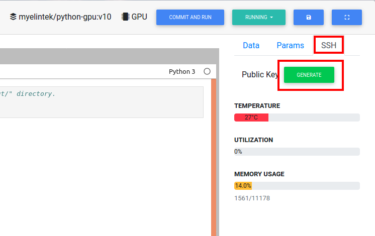

.. _ide_pycharm_windows:

PyCharm
=======

Tested setup: Window 10, 2019.3.3 (Professional Edition)

Open needed lab in the browser and generate ssh key.

Download <lab_id>_sshkey file (downloading will start automatically, if it does not press "Download" button).

.. image:: ../_static/pycharm_remote2.png

Open the PyCharm application and create new project.

.. image:: ../_static/pycharm_remote3.png

Find the existing interpreter and click the rightmost button in "Pure Python".

.. image:: ../_static/pycharm_remote4.png

Type your host, port and user information. (You can find it in lab page)

.. image:: ../_static/pycharm_remote5.png

.. image:: ../_static/pycharm_remote6.png

Jump out the warning modal to ask if you need to add new host in ~/.ssh/known_host

Click Yes to continue

.. image:: ../_static/pycharm_remote7.png

Select the Key pair option and input the location of the private key.

.. image:: ../_static/pycharm_remote8.png

PyCharm will connect and find the default python path. However, if using MLSteam, you need to select "/ var / bin / python3".

Click Finish to complete the configuration in PyCharm.

.. image:: ../_static/pycharm_remote9.png

Make sure your existing interpreter is correct, then click the "Create" button. You can select a remote project location at this time or later.

.. image:: ../_static/pycharm_remote10.png

If you want to change the location of the remote project after the project is created. You can find the configuration in the toolbar. (Tools-> Deployment-> Configuration)

.. image:: ../_static/pycharm_remote11.png

Select the configuration you want to edit. Select the Mapping tab. Click the folder button to the right of Deployment Path.

.. image:: ../_static/pycharm_remote12.png

Selector will display the remote path after a success connection.

Select the desired path and click OK.

.. image:: ../_static/pycharm_remote13.png

There is nothing in your folder now.
You can find "Download from" in the toolbar. (Tools-> Deployment-> Download from ...)

.. image:: ../_static/pycharm_remote14.png

Click this button and download all folders and data files from the mapped folder.
You can also click the "Sync with Deployed to ..." button to synchronize the mapped folder and working directory on your local host.

.. image:: ../_static/pycharm_remote15.png

Next, set up a python interpreter for your project.
Click Settings (Ctrl + Alt + S) in the File tab.

.. image:: ../_static/pycharm_remote16.png

Select the project interpreter below the project: <localhost_folder>.
Select your remote python via the drop-down menu.

.. image:: ../_static/pycharm_remote17.png