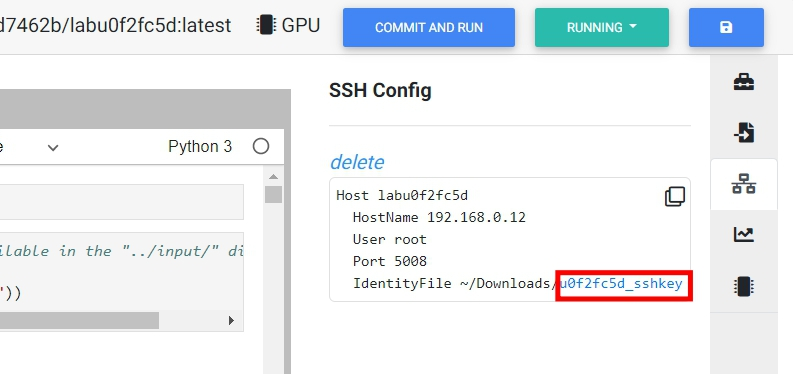

.. _ide_vscode_windows:

VSCode
======

Step by step tutorial to setup VSCode for a lab

.. note: following steps is for Windows

Install VSCode
-----------------

download VSCode from following link

https://code.visualstudio.com/Download

.. image:: ../_static/remote_ide/vscode-win-install.gif

Click downloaded file to install VSCode.

Install extenstions in VSCode
--------------------------------

Search and install extension for remote SSH

.. image:: ../_static/remote_ide/vscode-win-ssh.gif

SSH key and SSH config
-----------------------

Make sure the lab is running, click SSH tab in right navbar and generate SSH conifg.

Download the ssh private key by clicking sshkey link

Copy the ssh config by clicking copy icon on top right of the config

.. image:: ../_static/remote_ide/vscode-win-copyconf.jpg

.. note:: Windows10 accept both / and \ as path separator

Paste ssh config in VSCode
-----------------------------

Paste the copied ssh config to ssh config in VSCode

.. image:: ../_static/remote_ide/vscode-win-sshconfig.gif

Connect to remote lab
-------------------------

Click created ssh target to connect to remote lab

.. image:: ../_static/remote_ide/vscode-win-connect.gif

.. note:: if there is an error while connecting, try to remove *know_hosts* file in .ssh folder

Open remote folder
---------------------

Once connected to remote lab, open remote folder in left column to browse files

.. image:: ../_static/remote_ide/vscode-win-openfolder.gif

Edit in VSCode
-----------------

You can open console in VSCode and upload/download files in left column.

.. image:: ../_static/remote_ide/vscode-win-edit.gif

You can visit VSCode website to find out more extensions supported by VSCode!

https://code.visualstudio.com/docs/editor/extension-gallery

