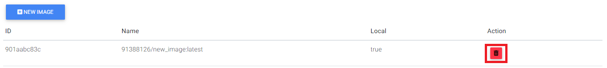
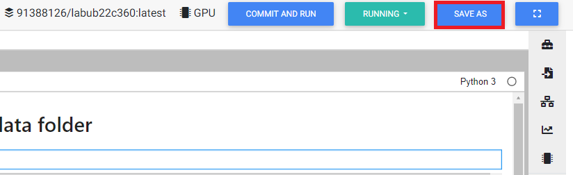
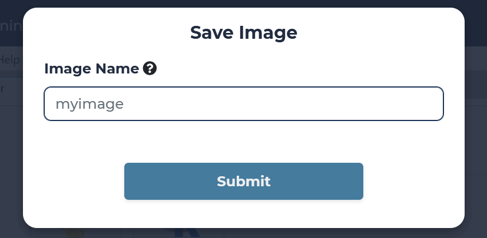
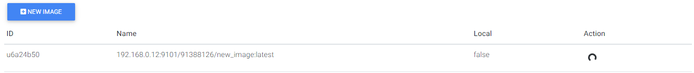
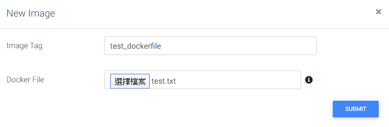
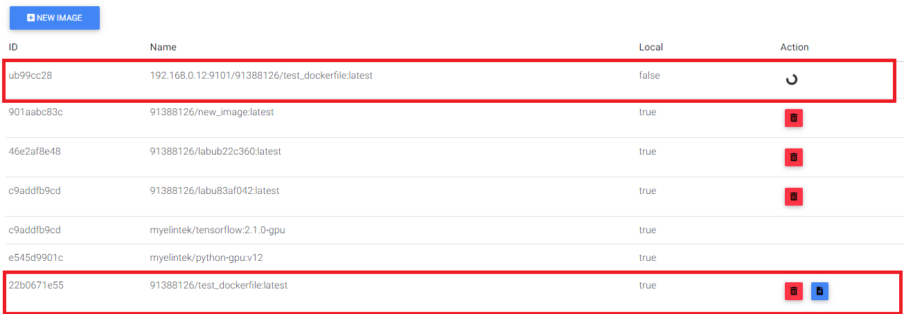
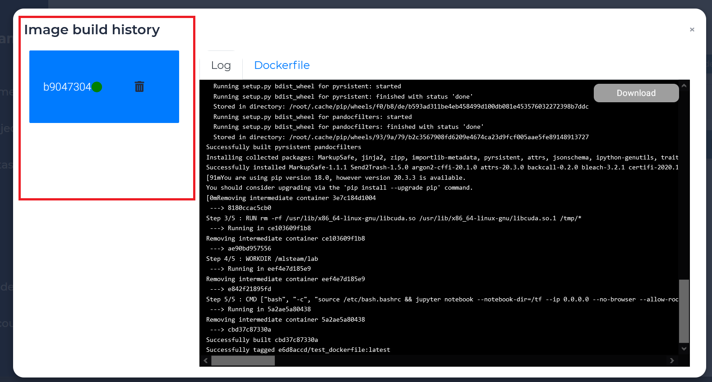
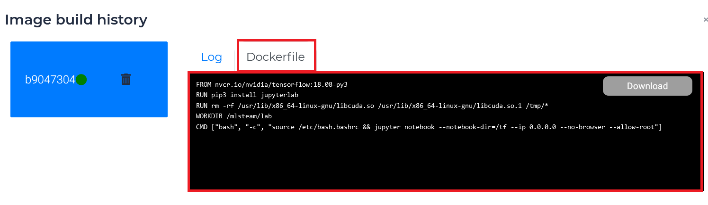
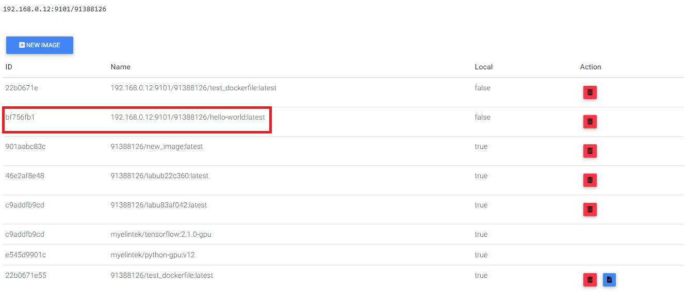

.. _image:

****************
Image Management
****************

Install Docker Desktop
----------------------

Docker Desktop for Windows is Docker designed to run on Windows 10.

System Requirements
+++++++++++++++++++

- Windows 10 64-bit: Pro, Enterprise, or Education (Build 15063 or later).
- Hyper-V and Containers Windows features must be enabled.
- The following hardware prerequisites are required to successfully run Client Hyper-V on Windows 10:
    - 64 bit processor with Second Level Address Translation (SLAT) 4GB system RAM
    - BIOS-level hardware virtualization support must be enabled in the BIOS settings. For more information, see Virtualization.

You can get Docker Desktop on Windows from following link.

https://hub.docker.com/editions/community/docker-ce-desktop-windows/

.. image:: ../_static/image/install.png

Legacy desktop solution. Docker Toolbox is for older Mac and Windows systems that do not meet the requirements of Docker Desktop for Mac and Docker Desktop for Windows. We recommend updating to the newer applications, if possible.

You can get Docker Toolbox on Windows from following link:

https://docs.docker.com/toolbox/toolbox_install_windows/

Double-click Docker for Windows Installer to run the installer.

When the installation finishes, Docker starts automatically. The whale in the notification area indicates that Docker is running, and accessible from a terminal.

List Image
----------

It shows the docker image in the local host and the repository.

Delete
++++++

On the list of image page click on the trash icon on the side of the lab name.

If you delete the existing laboratory image. It will start with the default image and save again.

Save Image
----------

After creating a new laboratory. The system will save this lab to automatically build its own environment.

But you can still save the image to the remote repository of the registered server.

Click "Save as" button in running lab. Pop up a modal and type the image name.

.. note:: 
    Name components may contain lowercase letters, digits and separators. A separator is defined as a period, one or two underscores, or one or more dashes. A name component may not start or end with a separator.

    You can tag the image with a colon. Otherwise it will be automatically tag latest.

    A tag name must be valid ASCII and may contain lowercase and uppercase letters, digits, underscores, periods and dashes. A tag name may not start with a period or a dash and may contain a maximum of 128 characters.

DockerFile
----------

If you want to upload your own dockerfile and build it.  Click the "New Image" button.

.. image:: ../_static/image/new_image.png

Type the image name and select dockerfile in your file system.

.. note:: 
    Name components may contain lowercase letters, digits and separators. A separator is defined as a period, one or two underscores, or one or more dashes. A name component may not start or end with a separator.

    You can tag the image with a colon. Otherwise it will be automatically tag latest.

    A tag name must be valid ASCII and may contain lowercase and uppercase letters, digits, underscores, periods and dashes. A tag name may not start with a period or a dash and may contain a maximum of 128 characters.

It will build dockerfile in the system. Click the file icon to check out.

When the build is successful, it will also be pushed to the repository of the registration server.

When you type the same image name a second time. It will fit into the same space.

Select and click docker id to view the difference log and content.

Build image log
++++++++++++++++

.. image:: ../_static/image/dockerfile_log.png

dockerfile
++++++++++

Push / Pull Image
-----------------

Deploy a plain HTTP registry
++++++++++++++++++++++++++++

.. warning:: 
    This procedure configures Docker to entirely disregard security for your registry. This is very insecure and is not recommended. It exposes your registry to trivial man-in-the-middle (MITM) attacks. Only use this solution for isolated testing or in a tightly controlled, air-gapped environment.

1. Edit the ``daemon.json`` file, whose default location is ``/etc/docker/daemon.json`` on Linux or ``C:\ProgramData\docker\config\daemon.json`` on Windows Server. If you use Docker Desktop for Mac or Docker Desktop for Windows, click the Docker icon, choose Preferences, and choose +Daemon.

    If the ``daemon.json`` file does not exist, create it. Assuming there are no other settings in the file, it should have the following contents:

    .. code-block::

        {
            "insecure-registries" : ["<domain.sample.com>:<port>"]
        }

    Substitute the address of your insecure registry for the one in the example.

    With insecure registries enabled, Docker goes through the following steps:

    - First, try using HTTPS.
        - If HTTPS is available but the certificate is invalid, ignore the error about the certificate.
        - If HTTPS is not available, fall back to HTTP.

2. Restart Docker for the changes to take effect.

Repeat these steps on every Engine host that wants to access your registry.

Login
+++++

Turn on a terminal and login to registry.

.. code-block::

    sudo echo "cT6Xi2Ajcgs32M96QswD" | docker login <domain.sample.com>:<port> -u admin --password-stdin

.. note::
    You can find out access_token in profile page.

.. image:: ../_static/image/access_token.png

.. image:: ../_static/image/login.png

Pull
++++

Your access_token can only pull images if you are project member.

Pull the image we just uploaded. 

.. code-block::

    docker pull 192.168.0.12:9101/91388126/test_dockerfile:latest

.. image:: ../_static/image/pull.png

You can also pull the public image, hello-world.

.. image:: ../_static/image/pull_helloworld.png

Push
++++

Tag its name if you want to psuh to registry.

.. code-block::

    docker tag hello-world:latest 192.168.0.12:9101/91388126/hello-world:latest

.. image:: ../_static/image/tag_image.png

Make sure tag is successful before push.

.. code-block::

    docker push 192.168.0.12:9101/91388126/hello-world

.. image:: ../_static/image/push_helloworld.png

Check out in image page.

