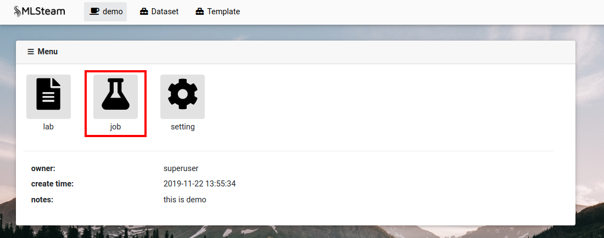
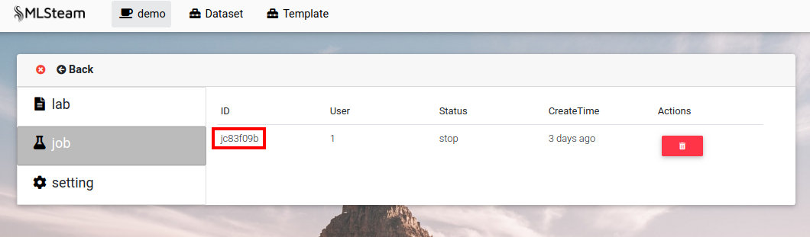
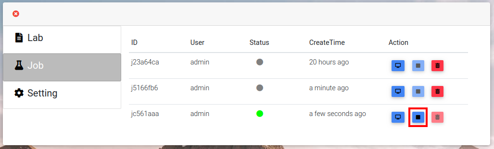
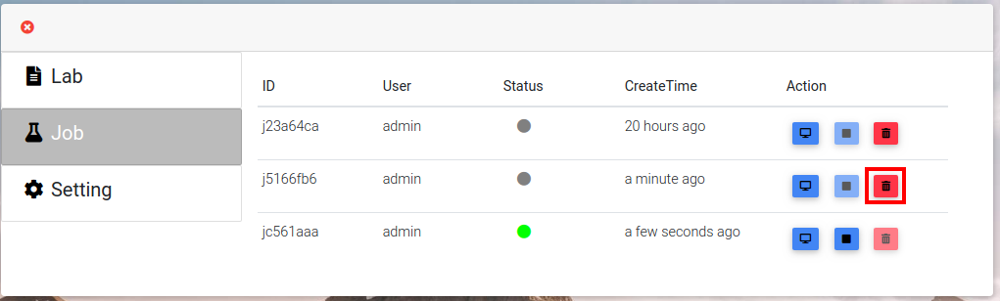
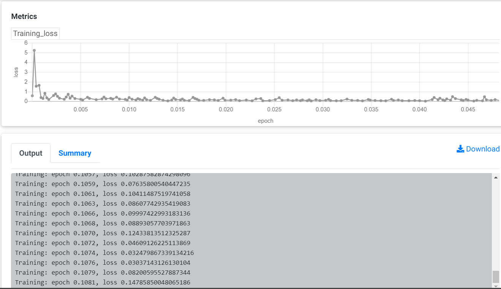

.. _job:

***
Job
***

Create job
==========

Jobs are created by running code in labs or running templates.

Browse jobs
===========

Go into project page.
Click on "Job" button.

List of jobs belonging to project will show up.
Click on job's id or screen icon next to it to see details.

Stop job
========

Click on stop icon next to running job id.

Delete job
==========

First stop job, if it is running. Click on tresh icon next to job id.

Metrics of job
==============

First You should define your programe output to fit below format:
  [Group] [x-axis]=[x-value] [y1-axis]=[y1-value] [y2-axis]=[y2-value]...[yn-axis]=[y2-value]

"Occur Only Onece"

- [Group] can be those words: Validation, Train, Test

- [x-axis]: Step, Iter, Epoch

"Occur Many"

- [yn-axis]: Any words you like, such as loss, mvp, avg, acc....

Every [y-axis] will output a metrics, and prefixed by [group]. For example, 'Train_loss'.

The metrics and output should be:

