##########
Tutorial
##########

Introduction
============
In this tutorial, you will learn how to upload dataset to the system and start a training environment (lab) in the system.

This tutorial uses `Dog Breed Identification <https://www.kaggle.com/c/dog-breed-identification/data>`__  dataset to train a classification model to identify the dog breeds.

Upload Dataset
==============

First, click 'New Dataset' button in dataset page to create an empty directory. 

.. figure:: ../_static/dataset/new_dataset.png

  click *New Dataset* in dataset page.

Input the dataset name 'Dog Breed Identification'.

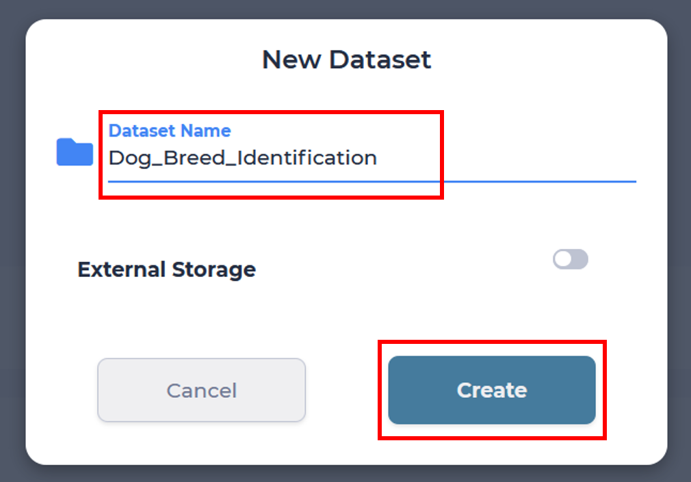

  name the dataset as 'Dog Breed Identification'.

Download the `Dog Breed Identification <https://www.kaggle.com/c/dog-breed-identification/data>`__ archive file to your PC.

In the previous created **Dog Breed Identification** dataset, click **Upload** button to upload the archive dataset from you PC.

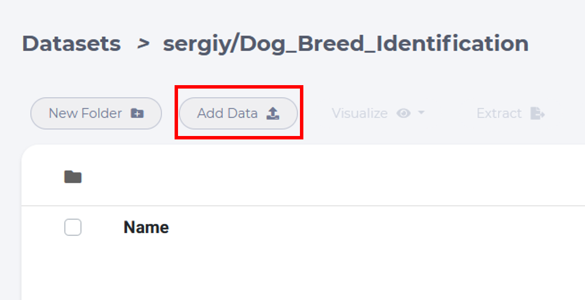

Choose the archive file.

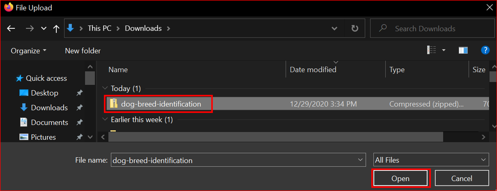

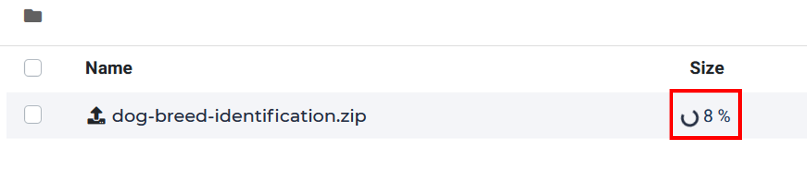

  uploading.

After uploading done, choose the archive file and then click the **Extract** button. It takes a few seconds for extracting.

.. figure:: ../_static/tutorial/extract_dogbreed_archive.png
  :width: 400

  click extract button to extract the compressed file

Now we can scan the content as shown below.

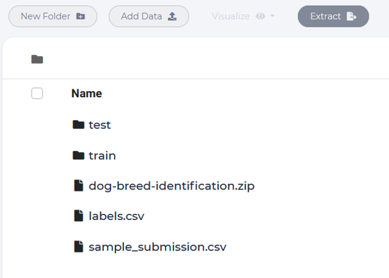

Create a LAB
============

Click **LAB** button in your project and click **NEW LAB** in Lab home page

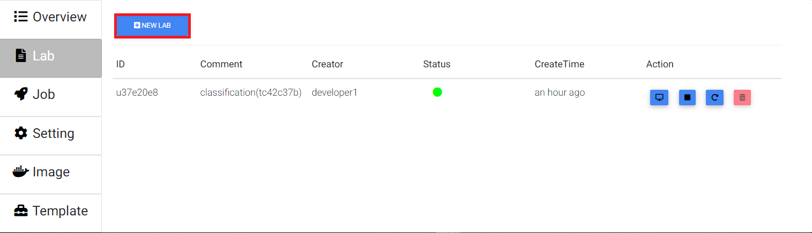

  click *NEW LAB* to launch a modal.

Choose the *python-gpu* image and select 1 GPU for this lab. 

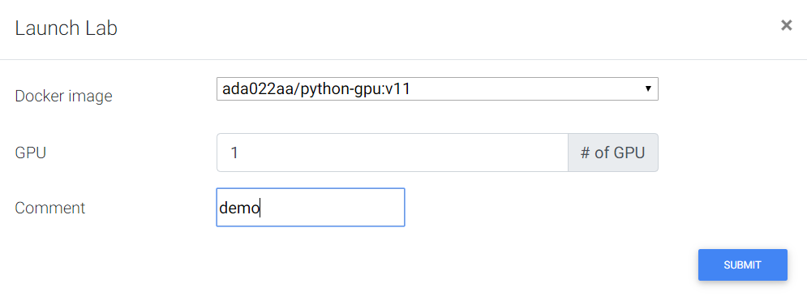

  specify which image to use

.. tip::
   You can set GPU to 0, which means created labs use CPU only.

Attach Dataset in a LAB
========================

Now we can attach the Dog Breed dataset to a LAB.

Open the Lab page, click the dataset icon at top-right of the Lab page. Select Dog Breed dataset. 

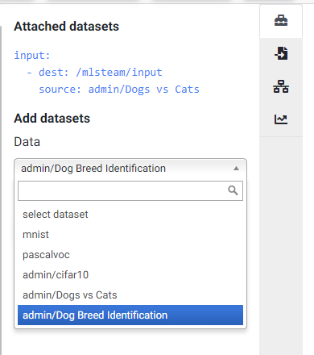
  
  select dataset at top-right of the Lab page

Click *Attach Dataset* button and confirm the warning, the LAB will restart for dataset connection.

.. image:: ../_static/lab/attach_dataset_alert.png
  :width: 400

Write a Notebook file for training
==================================

Start a notebook
----------------

Click the '+' button if you can't find the launcher tab.

.. image:: ../_static/lab/open_launcher.png

Choose the Python3 Notebook.

.. image:: ../_static/lab/open_notebook_python3.png

We might rename the notebook file to 'dog_breed.ipynb'.

.. image:: ../_static/lab/rename_file.png

In the notebook window, we can input our code in the cell, 
and then click the run button.

The interpreter will excute code in the cell section and print the output below the cell. 

.. image:: ../_static/lab/notebook_execute_cell_code.png

Dataset Preprocessing
---------------------
The Dog breed dataset contains a lot of images with different breeds of dogs.
The folder structure should be like this:

.. code-block:: plant

    input -|
           |- test - 
           |- train - 
           |- labels.csv
           |- sample_submission.csv
            

The dataset contains 120 breeds, but we will select the most common 20 of those breeds for simplicity.

The labels.csv records mappings between dog images and labels of breeds.

Now we start to read labels.csv, and to produce the train_df and valid_df, 
each contains a dataframe consists of many (id, breed) pairs.

In the first, define path of data: 

.. code-block:: python

    import os

    base_folder = '/mlsteam/input'
    train_folder = os.path.join(base_folder, 'train')
    test_folder = os.path.join(base_folder, 'test')

    label_file = os.path.join(base_folder, 'labels.csv')

Read name and label of images from label_file, 
get the most common 20 breeds based on number of images per bread in the dataset.
and then filter those breeds and shuffle the arrange, 
finally split it to two parts: train and valid.

The image name in 'id' column is missing the file extension, 
so we should append '.jpg' following those 'id'.

We can modify 'NUM_CLASSES' to change the breed number to be filtered, 
and 'ratio' for train/validation data ratio.

.. code-block:: python

    import pandas as pd
    import random

    train_label = pd.read_csv(label_file)
    NUM_CLASSES = 20

    random.seed(NUM_CLASSES)

    top_num_breed = list(train_label.groupby('breed').count().sort_values(by='id', ascending=False).head(NUM_CLASSES).index)

    train_df = pd.DataFrame()
    valid_df = pd.DataFrame()

    ratio = 0.8
    print('{:<20} {:>10} {:>10} {:>10}'.format('Breed', 'Total', 'Train', 'Valid'))
    print('-'*60)
    for breed in top_num_breed:
        tmp = train_label.loc[train_label['breed'].isin([breed])].reset_index(drop=True)
        train_num = int(len(tmp) * 0.8)
        print('{:<20} {:10} {:10} {:10}'.format(breed, len(tmp), train_num, len(tmp) - train_num))
        
        # random
        tmp_list = list(range(len(tmp)))
        random.shuffle(tmp_list)

        train_df = train_df.append(tmp.iloc[tmp_list[:train_num]], ignore_index=True)
        valid_df = valid_df.append(tmp.iloc[tmp_list[train_num:]], ignore_index=True)

    for i, row in train_df.iterrows():
        train_df.at[i, 'id'] = row['id'] + '.jpg'

    for i, row in valid_df.iterrows():
        valid_df.at[i, 'id'] = row['id'] + '.jpg'
        

Show the train and validation dataframe:

.. code-block:: python

    print(train_df)
    print(valid_df)

Use ImageDataGenerator for model input
--------------------------------------

Create a image generator for training and add augmentation here, 
the parameters contains: the angle range of rotation, 
the shift range of horizontal and vertical direction, 
randomly flip images, and the switch of normalization for sample-wise

.. code-block:: python

    from keras.preprocessing.image import ImageDataGenerator
    train_datagen = ImageDataGenerator(
        #samplewise_center=True,
        #samplewise_std_normalization=True,
        rotation_range=45,
        width_shift_range=0.2,
        height_shift_range=0.2,
        shear_range=0.2,
        zoom_range=0.25,
        horizontal_flip=True,
        fill_mode='nearest',
        rescale=1./255
    )

Then pass datafrme into a generator's function, named flow_from_dataframe, 
this function get images name specified by 'x_col' and read image 
file as array type automaticlly.

.. code-block:: python

    train_generator = train_datagen.flow_from_dataframe(
                            dataframe=train_df,
                            directory=train_folder,
                            x_col="id",
                            y_col="breed",
                            class_mode="categorical",
                            target_size=(299, 299),
                            batch_size=32,
                            shuffle=True)

And we do the same thing for validation data, 
it's worth to mention that we shouldn't 
add any augmentation on valid data, 
except the rescale parameter.

.. code-block:: python

    valid_generator = ImageDataGenerator(rescale=1./255).flow_from_dataframe(
                            dataframe=valid_df,
                            directory=train_folder,
                            x_col="id",
                            y_col="breed",
                            class_mode="categorical",
                            target_size=(299, 299),
                            batch_size=32,
                            shuffle=False)

Model Training
---------------

We use the pre-trained Xception model and building new laypers on top for Transfer Learning.

The `Xception Model Paper <https://arxiv.org/abs/1610.02357>`_ 

.. code-block:: python

    ### MODEL - BOTTLENECK FEATURES - OPTMIZER

    from keras.layers import GlobalAveragePooling2D, Dense, BatchNormalization, Dropout
    from keras.optimizers import Adam, SGD, RMSprop
    from keras.models import Model, Input
    from keras.applications import xception

    # Download and create the pre-trained Xception model for transfer learning
    base_model = xception.Xception(weights='imagenet', include_top=False)

    # add a global spatial average pooling layer
    x = base_model.output
    x = BatchNormalization()(x)
    x = GlobalAveragePooling2D()(x)
    # let's add a fully-connected layer
    x = Dropout(0.5)(x)
    x = Dense(1024, activation='relu')(x)
    x = Dropout(0.5)(x)
    # and a logistic layer -- let's say we have NUM_CLASSES classes
    predictions = Dense(NUM_CLASSES, activation='softmax')(x)

    # this is the model we will train
    model = Model(inputs=base_model.input, outputs=predictions)

    # first: train only the top layers (which were randomly initialized)
    # i.e. freeze all convolutional Xception layers
    for layer in base_model.layers:
        layer.trainable = False

    # compile the model (should be done *after* setting layers to non-trainable)
    optimizer = RMSprop(lr=0.001, rho=0.9)
    model.compile(optimizer=optimizer,
                loss='categorical_crossentropy',
                metrics=["accuracy"])
    model.summary()

Start Training and validation for 10 epochs.

Training shows the progress bar of every epoch, the loss and accuracy will be printed behind each bar. 

.. code-block:: python

    from keras.callbacks import TensorBoard, ModelCheckpoint, Callback

    class TrainLogger(Callback):
        def on_epoch_begin(self, epoch, logs={}):
            self.epoch = epoch
        def on_train_batch_end(self, batch, logs={}):
            print("Train epoch={:.6f} loss={:.6f} acc={:.6f}".format(self.epoch+batch/self.params.get('steps'), logs.get('loss'), logs.get('accuracy')))
        def on_epoch_end(self, epoch, logs={}):
            print("Validation epoch={:.6f} loss={:.6f} acc={:.6f}".format(epoch+1.0, logs.get('val_loss'), logs.get('val_accuracy')))
            
    tb_callBack = TensorBoard(log_dir='./tb', histogram_freq=0, write_graph=True, write_images=True)
    model_checkpoint = ModelCheckpoint(filepath='./checkpoints', monitor='loss', verbose=0, save_best_only=True)

    model.fit_generator(train_generator, 
                        epochs=10,
                        steps_per_epoch=train_generator.n // train_generator.batch_size,
                        validation_data=valid_generator,
                        verbose=0, 
                        callbacks=[tb_callBack, model_checkpoint, TrainLogger()])

.. figure:: ../_static/tutorial/dog_breed_train_output.png

Tensorboard visualization
-------------------------

A Tensorboard can be launched from web, at right sidebar menu, speficy the logdir path for tensorboard to read the summary files.

.. figure:: ../_static/tutorial/launch_tensorboard_server.png

  input logdir path for tensorboard to read the summary files.

To store the training result, we can save the model parameters as a HDF5 format file.

.. code-block:: python

    model.save('my_model.h5')

Evaluate Model
================

We can evaluate the model by predicting the validation images.

.. code-block:: python

    from sklearn.metrics import confusion_matrix
    import numpy as np

    cnf_matrix = confusion_matrix(valid_generator.labels,  np.argmax(valid_pred,axis=1))

And plot a confusion matrix:

.. code-block:: python

    # Mapping
    breed_mapping = {v: k for k, v in train_generator.class_indices.items()}

    breed_list = [b for b in breed_mapping.values()]
    df_cm = pd.DataFrame(cnf_matrix, index=breed_list, columns=breed_list)

    import matplotlib.pyplot as plt

    fig = plt.figure(figsize=(10, 7))
    try:
        import seaborn as sns
        heatmap = sns.heatmap(df_cm, annot=True, fmt="d")
    except ValueError:
        raise ValueError("Confusion matrix values must be integers.")

    heatmap.yaxis.set_ticklabels(heatmap.yaxis.get_ticklabels(), rotation=0, ha='right', fontsize=10)
    heatmap.xaxis.set_ticklabels(heatmap.xaxis.get_ticklabels(), rotation=45, ha='right', fontsize=10)
    plt.title('Confusion Matrix')
    plt.ylabel('True label')
    plt.xlabel('Predicted label')

    plt.show()

.. image:: ../_static/tutorial/dog_breed_confusion_matrix.png

Image Prediction
================

The test_folder contain 10360 images to be predicted.

After model training, we can use it to prediction the breed of dog in those images.

Since there is no label but only images is the test folder. 
In order to fit the flow_from_dataframe function input: a dataframe, 
we have to get all path of images and put them in a new dataframe with one column.

In the prediction case, we can specify only x_col, and set the class_mode=None. 
The prediction generator will output each item that is a tuple but only contain a single element (images).

.. code-block:: python

    def get_imgs(path):
        imgs = []
        for entry in os.scandir(path):
            if entry.is_dir():
                imgs.extend(get_imgs(entry.path))
            else:
                imgs.append(entry.path)
        return imgs

    test_imgs = get_imgs(test_folder)

    test_df = pd.DataFrame({"x":test_imgs})

    test_generator = ImageDataGenerator(rescale=1./255).flow_from_dataframe(
                            test_df,
                            x_col='x',
                            class_mode=None,
                            target_size=(299, 299),
                            batch_size=32,
                            shuffle=False)

Now we can start prediction and save the result to a variable.

.. code-block:: python

    pred = model.predict_generator(test_generator, verbose=1)

The prediction result is a array, it contains probability of breeds. 
We can get the largest probability to get the breed index.

But we don't know the mapping between index and breed name.

Use this to get the mapping:

.. code-block:: python

    breed_mapping = {v: k for k, v in train_generator.class_indices.items()}

.. figure:: ../_static/tutorial/dog_breed_mapping.png
  
  mapping between index and breed name

If we want to show some prediction of images, we can use the code to show it:

.. code-block:: python

    # Get first batch
    test_generator.reset()
    first_batch = test_generator.next()
    (first_batch_imgs) = first_batch
    first_batch_pred = pred[:len(first_batch_imgs)]

    def get_max_index(array):
        max = 0
        max_index = 0
        for i in range(len(array)):
            if array[i] > max:
                max = array[i]
                max_index = i
        return max_index

    # Mapping
    breed_mapping = {v: k for k, v in train_generator.class_indices.items()}

    # Start to Plot
    import matplotlib.pyplot as plt

    fig=plt.figure(figsize=(16, 16))
    columns = 4
    rows = 5

    for i in range(1, columns*rows +1):
        fig.add_subplot(rows, columns, i)
        plt.tick_params(
            bottom=False,
            left=False,
            labelbottom=False,
            labelleft=False
        )
        plt.tight_layout(pad=2, h_pad=0.2, w_pad=0.2)
        plt.title(breed_mapping[get_max_index(first_batch_pred[i-1])])
        plt.imshow(first_batch_imgs[i-1])
    plt.show()
    plt.savefig('prediction_20.png')

The output should be like this:

.. figure:: ../_static/tutorial/dog_breed_prediction_20_output.png

  prediction results with trained model

Submit a training job
=====================

We can create to a training job in another container to keep each training results.

First, download the `dog_breed.ipynb <https://github.com/myelintek/documentation/blob/master/_static/tutorial/dog_breed.ipynb>`_ file which includes above code.

Open mlsteam.yml in lab folder, typing 'ipython3 /mlsteam/lab/dog_breed.ipynb' behind 'command:'.

.. caution::
  
  set the GPU number to 1 for GPU training.

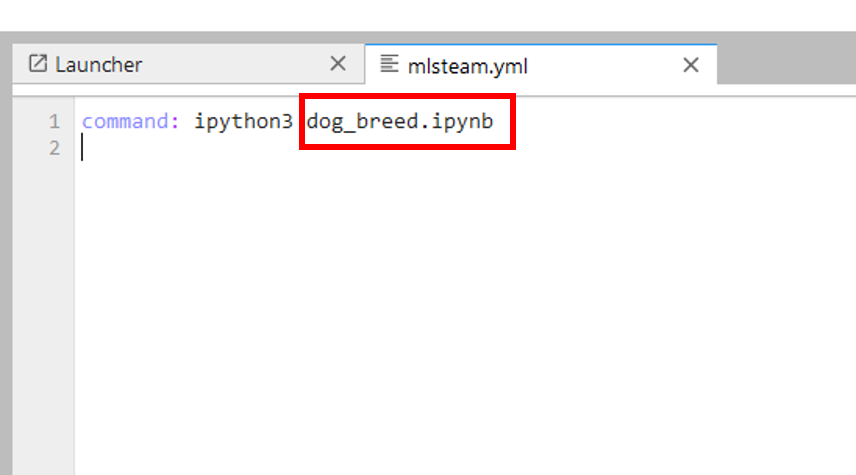

  specify 'command' for training job

Click the 'COMMIT AND RUN' button and confirm the training parameters.

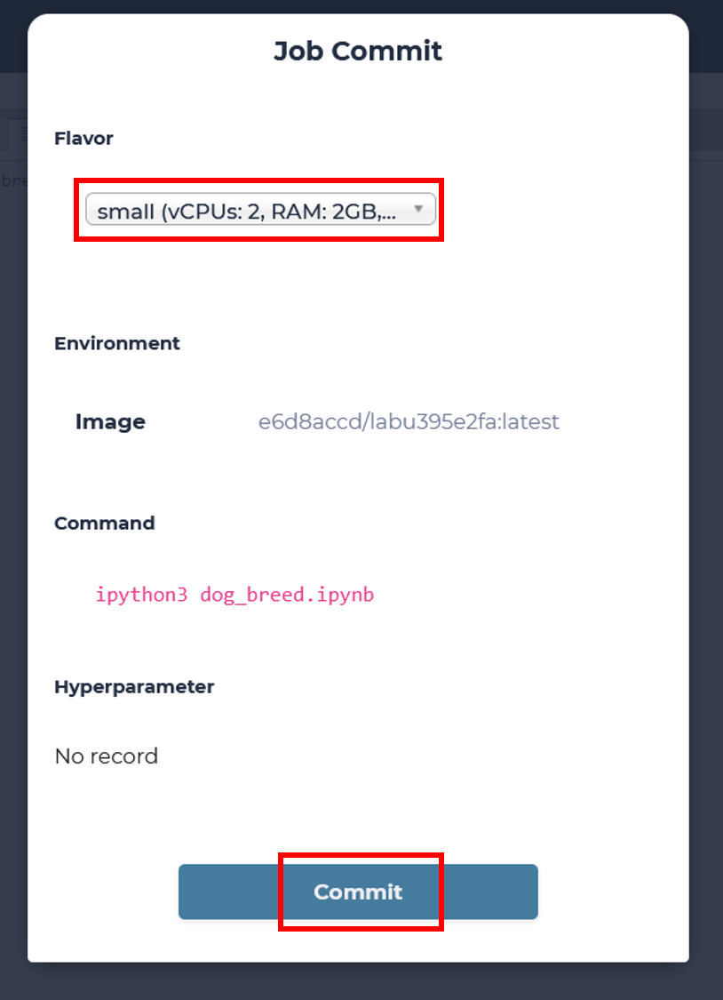

A new JOB is running now.

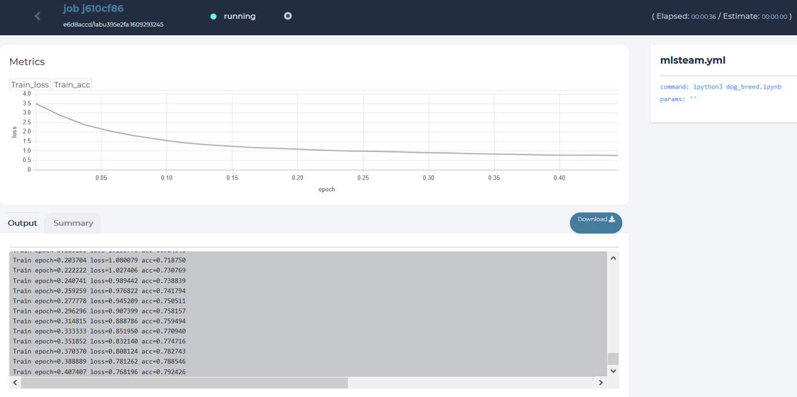