.. _lab:

***
Lab
***

.. _create_lab:

Create lab
==========

Select project then click lab tab.

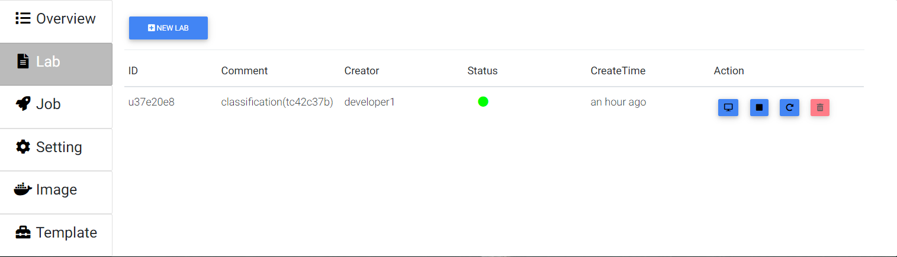

Press "New Lab".

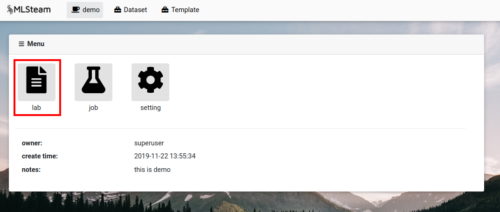

Select docker image to create lab in. The default image is "myelintek/python-gpu".
Select the number of gpus to assign to lab. Add a comment, if needed.
Press "Submit".

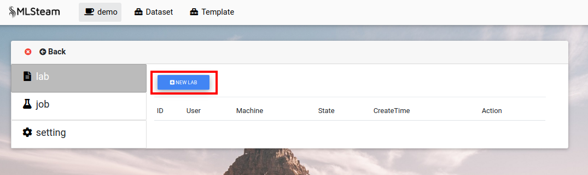

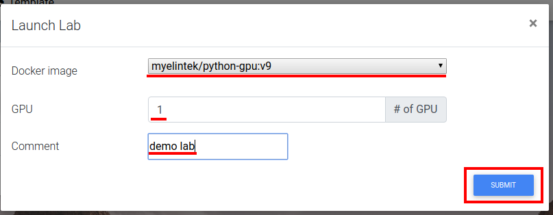

.. _browse_lab:
 
Browse labs
===========

Browse labs of the specific project. Go to project page. Press "Lab" tab.

Press on lab id or "Browse" button at the Actions collumn.

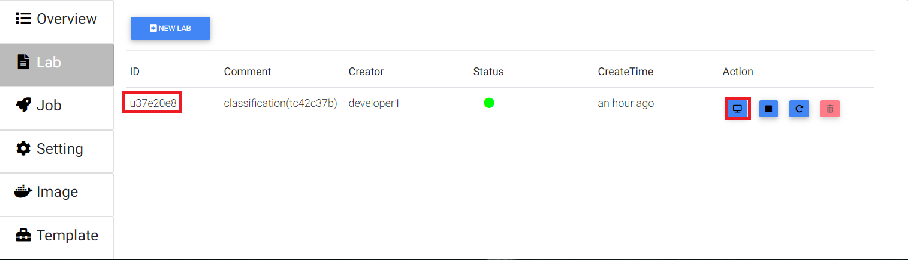

Start lab
=========

Press "Done" dropdown, then select "Start" 

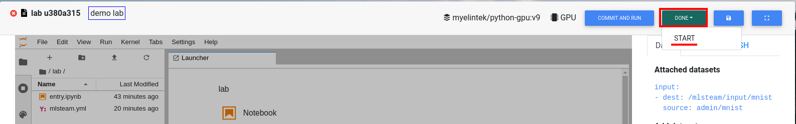

or press "Start" at the Actions column.

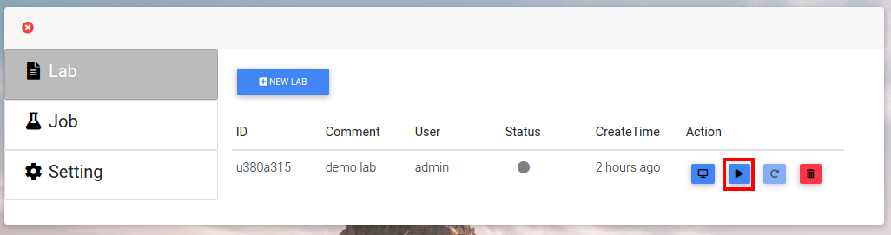

Stop lab
========

Press on "Running" button, then select "Stop"

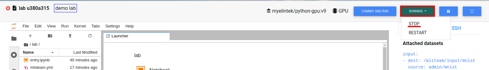

or press "Stop" at the Actions column.

.. _start_lab:

Restart lab
===========

Press "Running" button, then select "Restart"

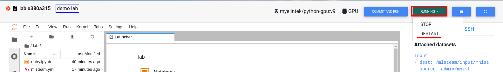

or press "Restart" at the Actions column.

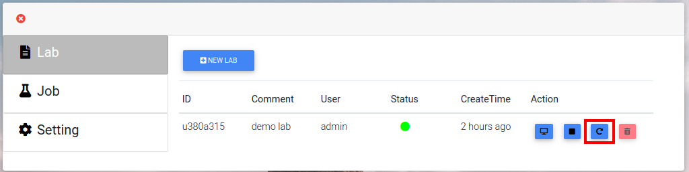

.. _attach_dataset_lab:

Attach dataset to the lab
=========================

Type dataset name at the "Attach dataset" box.
Press "Attach dataset" button. 

.. note::

    Restart lab for changes to take effect.

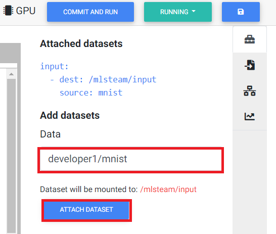

Need restart lab container to re-mount data directory.
Make sure all the files saved already.

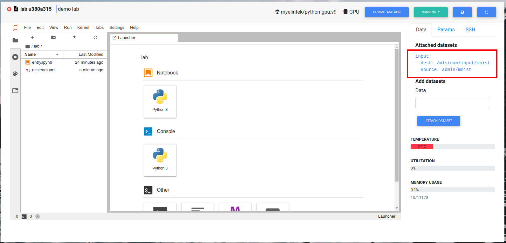

Attached dataset info will appear on the right.

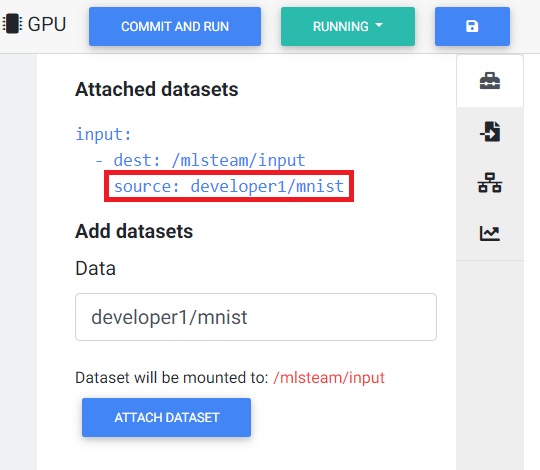

Dataset files can be browsed in the window on the left under `/input` directory.

.. image:: ../_static/attach_dataset4.png

Add new directory to dataset, if needed.

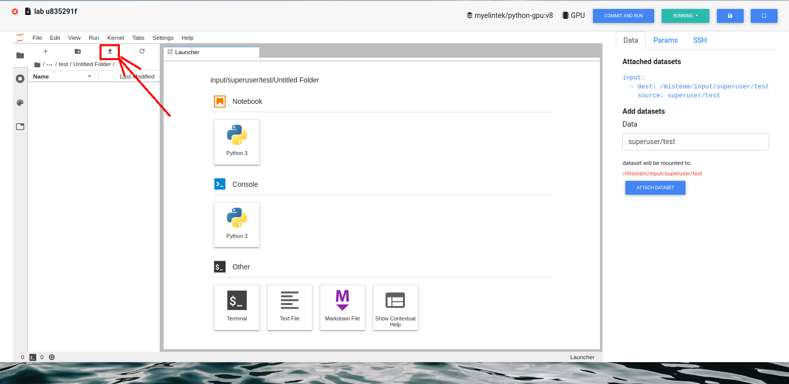

Upload new files to dataset, if needed.

.. image:: ../_static/attach_dataset6.png

.. _pass parameters:

Pass parameters
===============

Users can update parameters (hypter-parameters) of a model by defining parameters on web page. Parameters supports YAML format definition and also supports multiple values per key value. System will automatically create multiple jobs for all combinations and run created jobs in parallel on different GPUs.

In your model source code. Please import mlsteam function

.. code-block:: python

  from mlsteam import stparams

Replace code as below to enable parameter update from web page. in this example, we define 'train_bs' keyword.

.. code-block:: python

  -      default=128,
  +      default=stparams.get_value('train_bs', 128),

All parameters will show on the right.

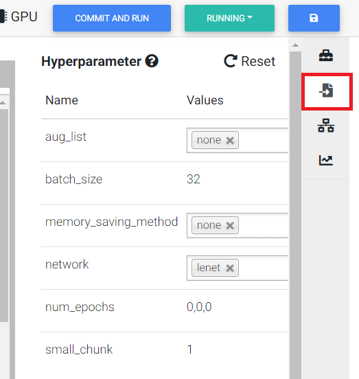

Use comma separator to pass multiple values, or select multiple values from a list to create multiple jobs.

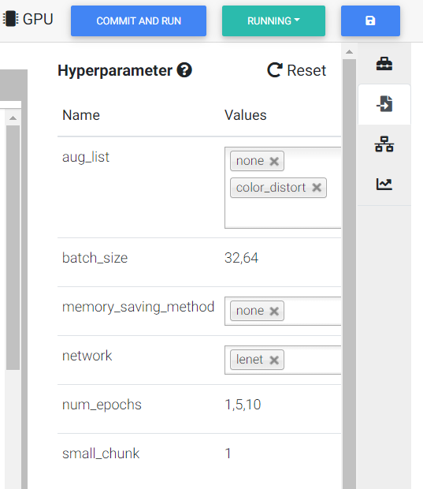

Press "Reset" button to reset to default parameters.

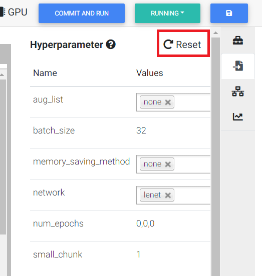

Now you can define default keyword value in mlsteam.yml of a lab.

If you want to make a dropdown and selector, use "-" to perform it is list.

If you want to make a text editor, use type "String" or type "Int".

.. image:: ../_static/default_params.png

Don't use like following example.

.. code-block:: YAML

  params:
    train_bs:
      - 32
      - 64

.. _lab_tensorboard:

Use Tensorboard
===============
Users can open tensorboard for current lab. First, use classification template to open a lab. then, type following command in console to generate checkpoint files.

.. code-block:: console

  python2 trainer.py --num_gpus=1 --batch_size=32 --network=lenet.py --data_dir=../input/mnist --train_dir=backup

checkpoint files will located in backup folder. Now, click tensorboard -> start button on top-right corner of lab page.
    
.. image:: ../_static/start_lab_tensorboard.png

Click tensorboard button again, the dropdown list will show OPEN button. Click open button to open tensorboard in a new tab.

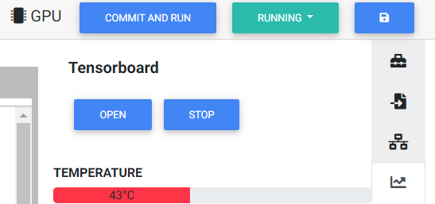

The tensorboard will read current lab folder and display content accordingly.

.. note::

  If the new tab page shows 502, please reload page again.

To close tensorboard, click tensorboard -> close button to terminate tensorboard process.

.. note::

  tensorboard will been terminated when the associated lab is deleted.

.. _run_lab:

Run lab
=======

First attach dataset to the lab.

Write necessary code and adjust config file `mlsteam.yml`.

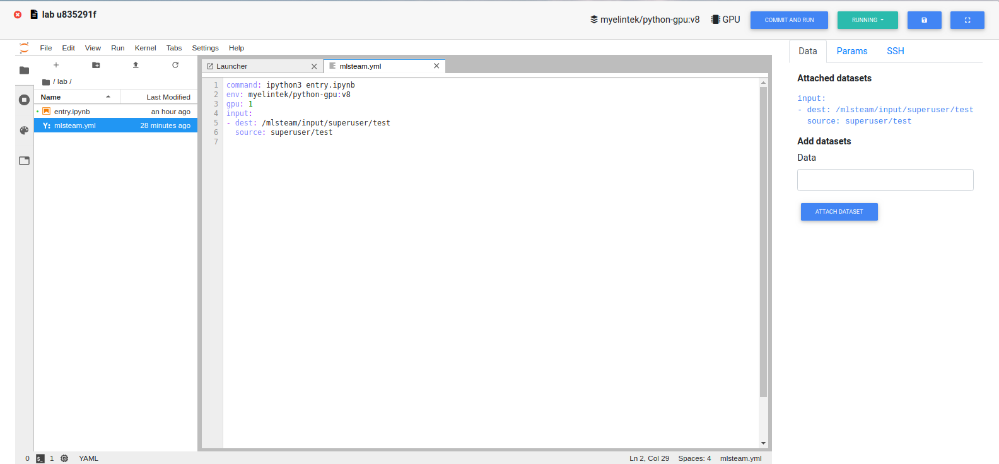

Press "Commit and run".

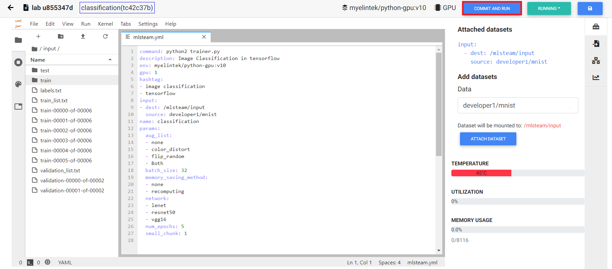

Check parameters if any wrong.

.. image:: ../_static/check_params.png

This will create a job from the code that lab contains.

Browse job to see output. In our case, output is the content of folder `/mlsteam/input`.

.. image:: ../_static/run_output.png

.. _delete_lab:

Delete lab
==========
On the project page press "Lab" button.
Stop needed lab.
On the list of labs page click on the trash icon on the side of the lab name.

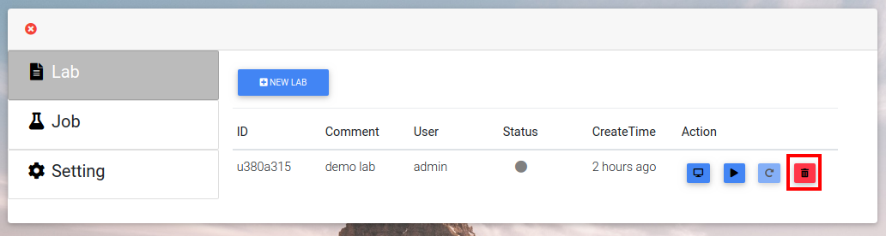
