####
Lab
####

A lab is a web IDE (based on JupyterLab). Here we listed all available operations in each section.

* :ref:`create_lab`
* :ref:`browse_lab`
* :ref:`stop_lab`
* :ref:`start_lab`
* :ref:`attach_dataset_lab`
* :ref:`pass parameters`
* :ref:`lab_tensorboard`
* :ref:`commit_lab`
* :ref:`delete_lab`

.. _create_lab:

Create lab
==========

To create a lab, navigate to your project dashboard and click the *Check* button on the *Lab* panel.

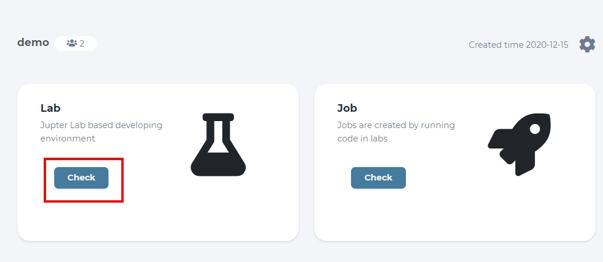

  click the *Check* button on the *Lab* panel

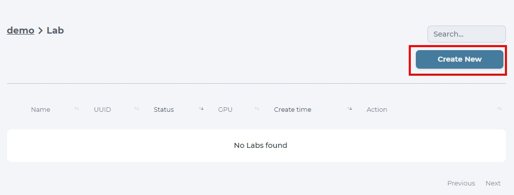

  click the *Create New* button

Write a name for your lab, choose a flavor you want, and select a docker image to create a lab. Choose from 2 images based on *myelintek/python-gpu*, which have all common libraries for deep learning built-in, but use different versions of tensorflow. You can also choose the type of lab to run, it will either use Jupyterlab or a simple terminal.  
Finalize your choice by clicking *Create* button and your lab should be ready in a moment!

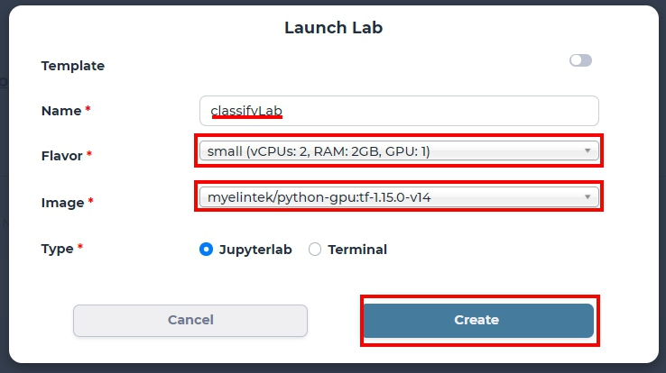

  create a lab with small flavor and python-gpu:tf-1.15.0-v14 (tensorflow v1) image

.. caution::

  GPU number is exclusive for each lab and job. Be cautious that system may run out of GPU resources and labs won't be launched unless GPU resources are released.

.. tip::

  Set flavor to micro (gpu 0), which will make your lab run with CPU only.

.. _browse_lab:
 
Browse labs
===========

To browse labs of a specific project, navigate to the *Home* dashboard first and choose the project you want. 

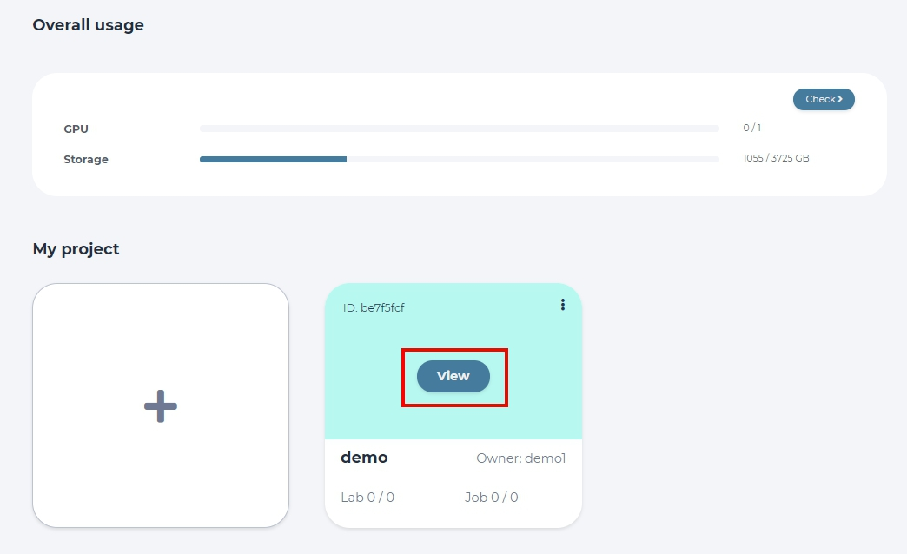

  click *View* button to enter that project dashboard

This project will become *default* and can be accessed quickly from the *Project* tab. To look at all the labs created in the current project, click the *Check* button. 

  click the *Check* button on the *Lab* panel

Labs are listed together with information like name, UUID, status indicator, number of GPUs used, and also time of creation. You can get more details by clicking the *+* sign.

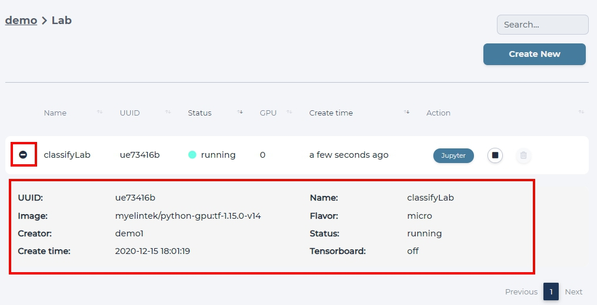

  Check the detail of the lab.

To open the lab to modify it or run experiments click *Jupyter*, this will open another window, where you need to start your lab.

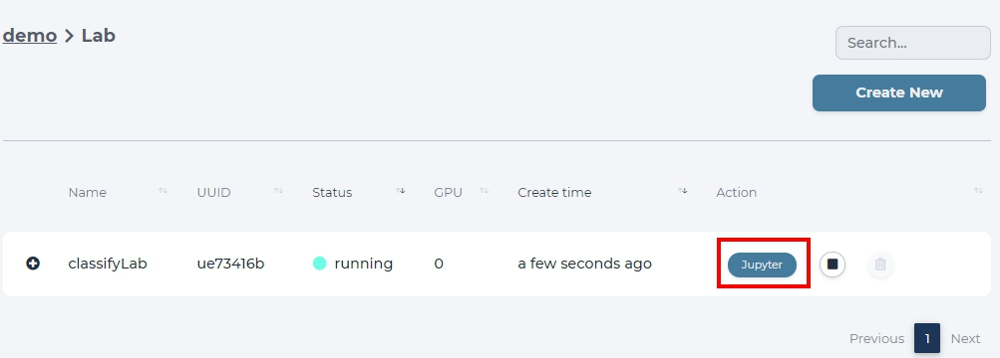

  click *Jupyter* button to open the lab

.. _start_lab:

Start lab
=========

To start a lab, click *Start* indicator

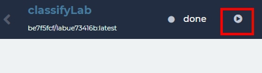

or click *Start* at the lab list page.

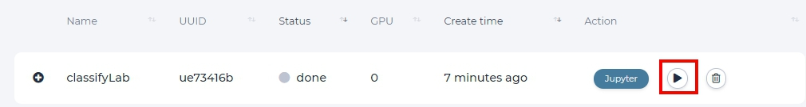

.. _stop_lab:

Stop lab
========

To stop a lab, click the *Stop* button

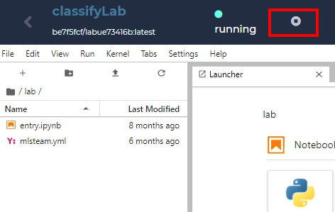

or click *Stop* at the lab list page.

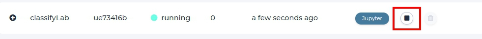

.. _attach_dataset_lab:

Attach dataset to the lab
=========================

To attach a dataset, select the desired dataset in dataset section and click *attach dataset*.

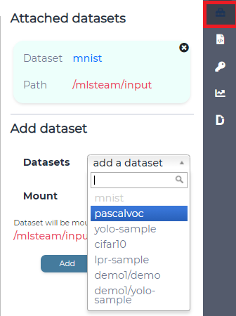

  attach *mnist* dataset for this lab.

.. note::

    Attaching dataset will automatically restart the lab, make sure all the files have already been saved.

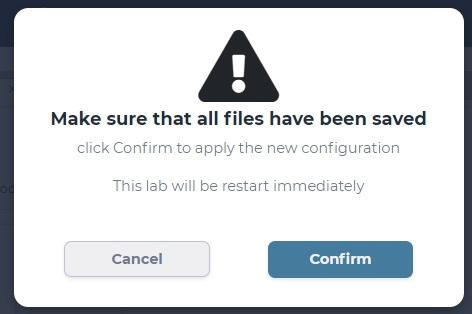

  confirm to restart the lab

Attached dataset info will appear on the dataset section.

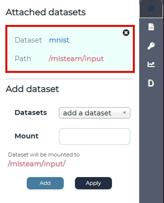

Dataset files can be browsed in the window on the left under `/input` directory.

.. tip::

    You can choose to mount your dataset in a subdirectory inside /input/ by writing appropriate name in the *Mount* form

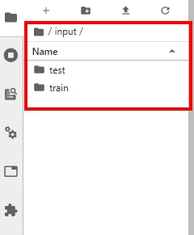

  browse dataset files in /mlsteam/input folder

Add new directory to dataset, if needed.

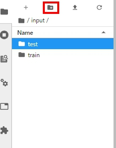

Upload new files to dataset, if needed.

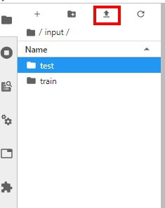

Upload a zip file to lab.

.. image:: ../_static/lab/zipfile.png

Launch the terminal and unzip the file.

.. code-block:: batch

  unzip <file_name.zip>

.. image:: ../_static/lab/unzipfile.png

.. _pass parameters:

Pass parameters
===============

Users can update parameters (hypter-parameters) of a model by defining parameters on web page. Parameters supports YAML format definition and also supports multiple values per key value. System will automatically create multiple jobs for all combinations and run created jobs in parallel on different GPUs.

In your model source code. Please import mlsteam function

.. code-block:: python

  from mlsteam import stparams

Replace code as below to enable parameter update from web page. In this example, we define 'train_bs' keyword.

.. code-block:: python

  -      default=128,
  +      default=stparams.get_value('train_bs', 128),

All parameters will be show on the right hyperparameter section.

.. image:: ../_static/lab/list_params.jpg
  :width: 400

Use comma separator to pass multiple values, or select multiple values from a list to create multiple jobs.

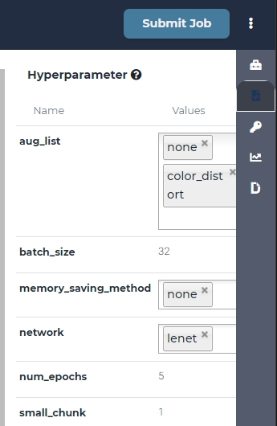

Now you can define default keyword value in mlsteam.yml of a lab.

If you want to make a dropdown and selector, use "-" to perform it in a list.

If you want to make a text editor, use type *String* or type *Int*.

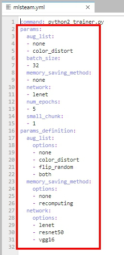

.. _lab_tensorboard:

Generate ssh key (if enabled)
=============================

This feature is disabled by default. Generates ssh key to be able to ssh into lab. Click on ssh tab, inside tab click "Generate", save sshkey file to your local PC.
More about connecting to the lab in "Remote connection to the lab" section.

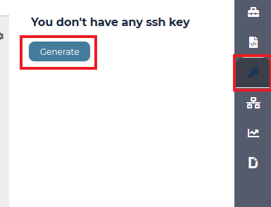

Expose port with proxy (after v3.8.30 replaced by port expose)
==============================================================

Expose port from inside of the lab to the outer world. Click on "Proxy" tab, enter port you want to expose, press "Expose".

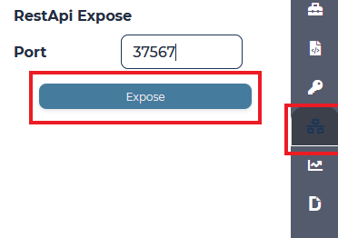

Use the shown link to access specified port.

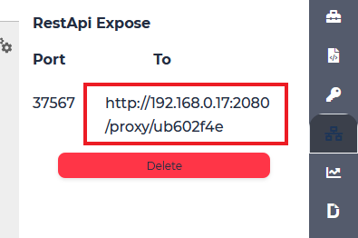

To stop expossing port and delete the proxy press "Delete".

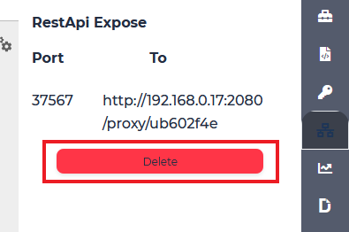

Port expose
===========

Expose port from inside of the lab to the outer world. Click on "Port" tab, enter port you want to expose, press "Expose".

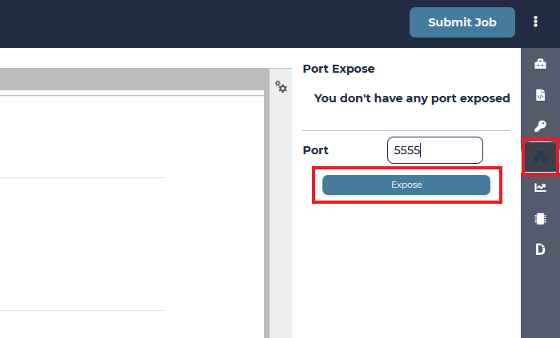

Shown port is exposed to the world and mapped to specified port inside container.

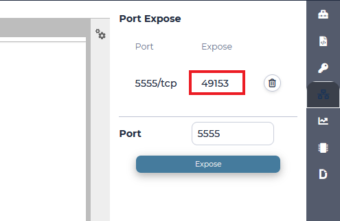

To stop expossing port press "Delete".

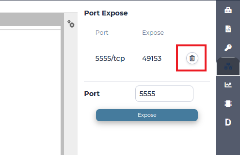

Use Tensorboard
===============
Users can open tensorboard for current lab. First, use classification template to open a lab. Then, type following command in console to generate checkpoint files.

.. code-block:: console

  python2 trainer.py --num_gpus=1 --batch_size=32 --network=lenet.py --data_dir=../input/mnist --train_dir=backup

Checkpoint files will be located in the backup folder. Now, click tensorboard -> start button on top-right corner of lab page.
    
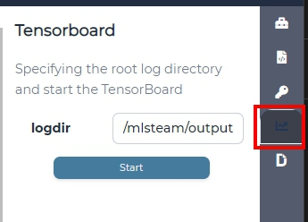

Click tensorboard button again, the dropdown list will show OPEN button. Click open button to open tensorboard in a new tab.

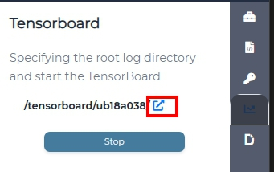

The tensorboard will read current lab folder and display content accordingly.

.. note::

  If the new tab page shows 502, please reload page again.

To close tensorboard, click tensorboard -> stop button to terminate tensorboard process.

.. note::

  Tensorboard will been terminated when the associated lab is deleted.

.. _commit_lab:

Commit lab
==========

First attach dataset to the lab.

Click "Submit Job".

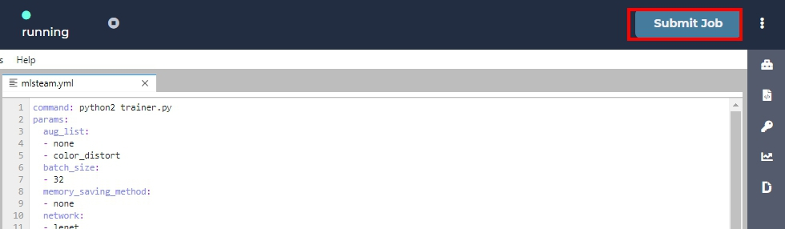

Check parameters to be correct.

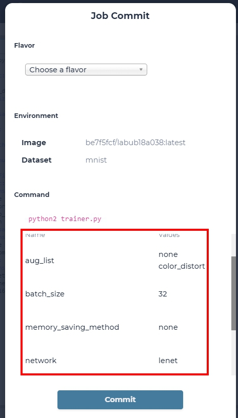

This will create a job from the code that lab contains.

Browse job to see output. In our case, output is the content of folder `/mlsteam/input`.

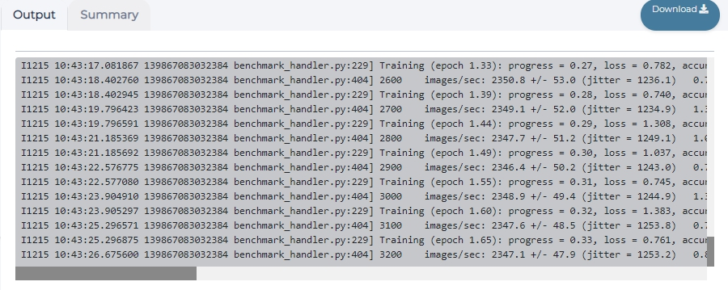

  a training job with output display

.. _delete_lab:

Delete lab
==========
On the project page click "Lab" button.
Stop needed lab.
On the list of labs page click on the trash icon on the side of the lab name.

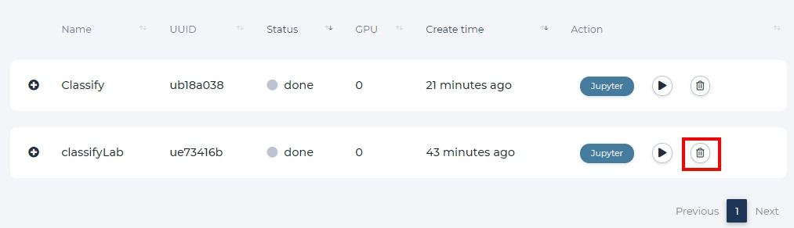
