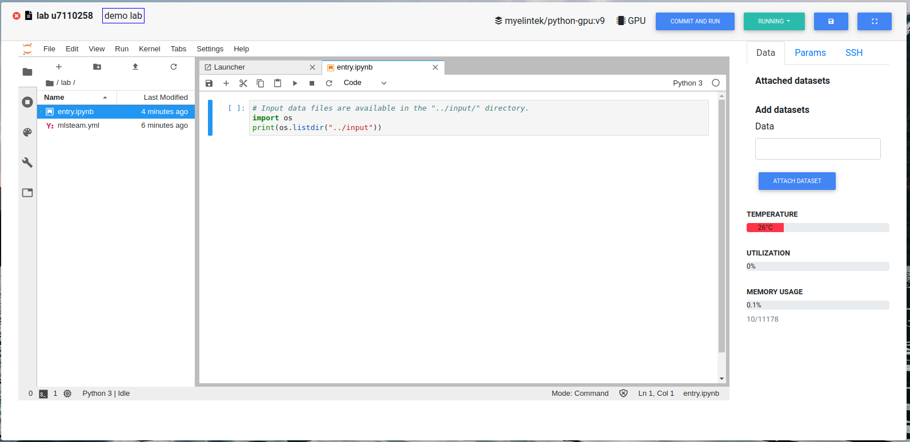
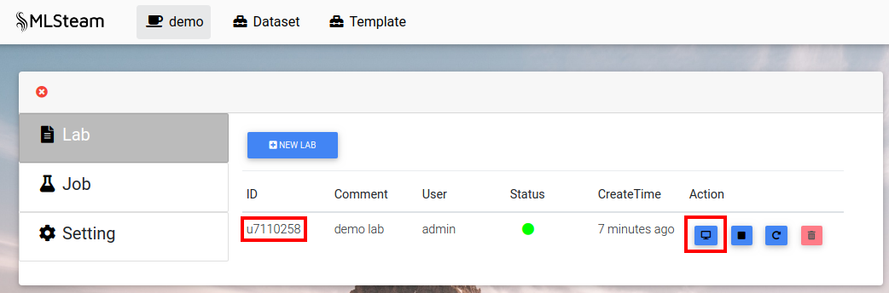
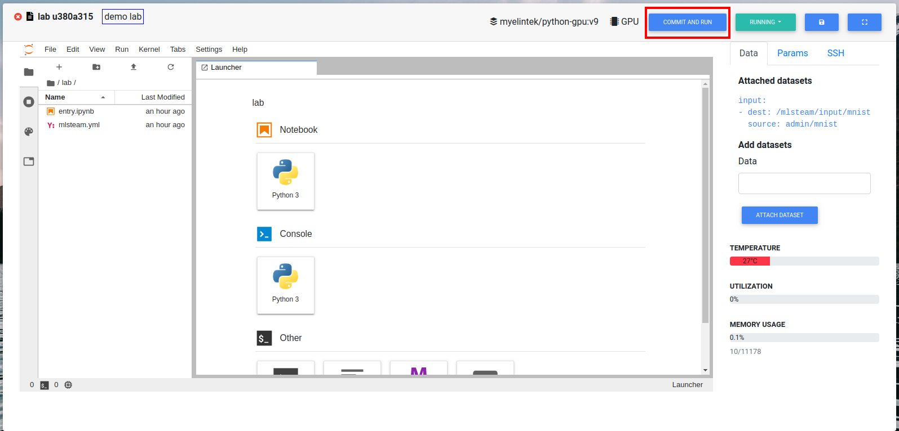

.. _lab:

***
Lab
***

.. _create_lab:

Create lab
==========

Select project that lab will be created in.
Press "Lab" button.

.. image:: ../_static/create_lab.png

Press "New Lab".

.. image:: ../_static/create_lab2.png

Sellect docker image to create lab in. The default image is "myelintek/python-gpu".
Sellect the number of gpus to assign to lab.
Press "Submit".

.. image:: ../_static/create_lab3.png

.. _browse_lab:
 
Browse labs
===========

Browse labs of the specific project. Go to project page. Press "Lab" button.

.. image:: ../_static/create_lab.png

Press on lab id to browse it.

.. _attach_dataset_lab:

Attach dataset to the lab
=========================

Type dataset name at the "Attach dataset" box.
Press "Attach dataset" button.

.. image:: ../_static/attach_dataset_lab.png

.. image:: ../_static/attach_dataset2.png

.. image:: ../_static/attach_dataset3.png

Add new directory to dataset, if needed.

.. image:: ../_static/attach_dataset4.png

Upload new files to dataset, if needed.

.. image:: ../_static/attach_dataset5.png

.. _run_lab:

Run lab
=======

First attach dataset to the lab.

Write necessary code and adjust config file `mlsteam.yml`.

.. image:: ../_static/start_lab_config.png

Press "Commit and run".

.. image:: ../_static/start_lab.png

This will create a job from the code that lab contains.

Browse job to see output. In our case, output is the content of folder `/mlsteam/input`.

.. image:: ../_static/start_lab2.png

.. _stop_lab:

Stop lab
========

Press on "Running" button, then select "Stop".

.. image:: ../_static/stop_lab.png

.. _start_lab:

Start lab
=========

Press "Stop" button, then select "Start".

.. _delete_lab:

Delete lab
==========
On the project page press "Lab" button.
Stop needed lab.
On the list of labs page click on the trash icon on the side of the lab name.

.. image:: ../_static/delete_lab.png
