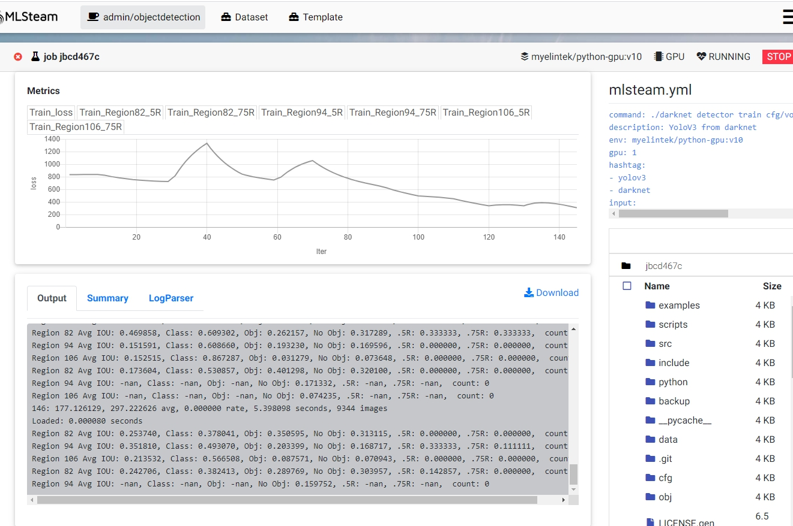

.. _object_detection:

Object Detection
================

This part will show how to train object detection model from template.

Quick start
-----------

On the top bar click "Template".

Then click "Use Template" on the object detection card. This will create an object detection project named "objectdetection" with Pascal dataset already attached to it.

.. image:: ../_static/template/use_template2.jpg

In the lab page, click "Commit and run". This will start training job from the template code and redirect to the jobs list page.

.. image:: ../_static/template/run_template2.jpg

Click on the job id or screen icon to view training progress.

.. image:: ../_static/template/view_job1.png

Job page displays 

* Loss value graph and graphs for three regions each with 50% and 75% recall value.
* Log output
* Configuration file (mlsteam.yml)
* Used docker image name, gpus, status, status button (top panel)

Inference example
-----------------

Back to the Lab page, open the file 'try_detection.ipynb' in jupyterlab. Click run multiple times to examine a pretrained yolov3-tiny.weights file.

.. image:: ../_static/lab/run_lab.jpg
