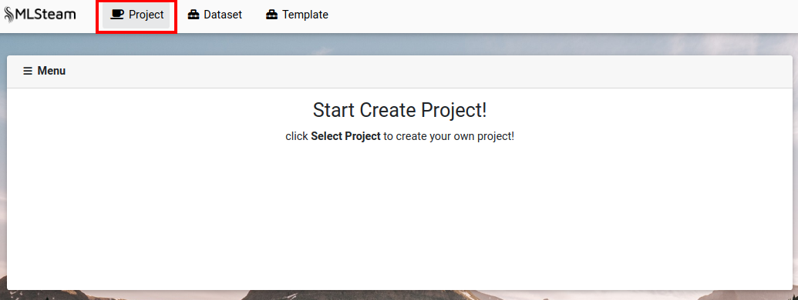
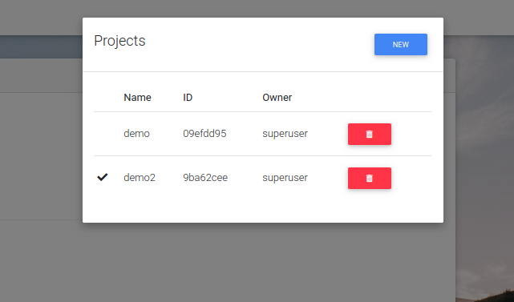
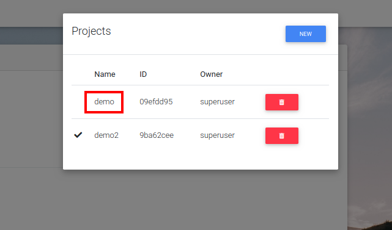
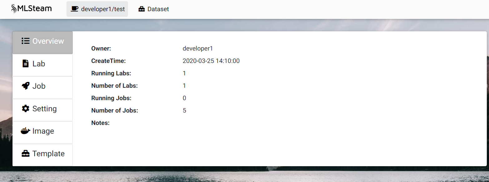
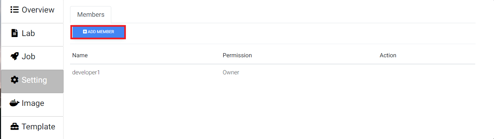
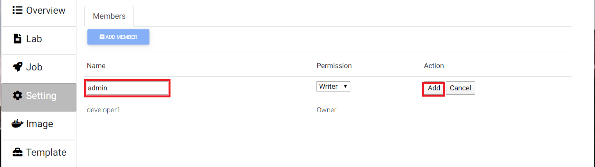
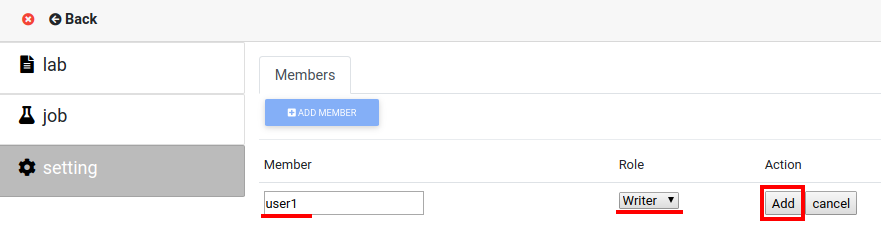
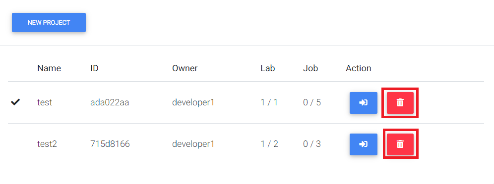

.. _project:

*******
Project
*******

.. _create_project :

Create project
==============

Press "Project" button. 

At the pop-up window press "New".

.. image:: ../_static/create_project2.png

Input project name and any related notes, then press "Create".

.. image:: ../_static/create_project3.png

The last created project becomes the default project.

Browse projects
===============

Press the button with the default project name ("Project" if there are no projects).

.. image:: ../_static/browse_projects.png

View project
============

Open list of projects. 

.. image:: ../_static/browse_projects.png

Click on project's name to view its content.

Add member
==========

On the projects page click "Settings".

Click "Add member".

Type members name. Sellect role. Press add.

Delete project
==============

Press the button with the default project name to open the list of projects. 

.. image:: ../_static/browse_projects.png

Press trash icon on the side of project that needs to be deleted.

Confirm.

.. image:: ../_static/delete_project2.png

