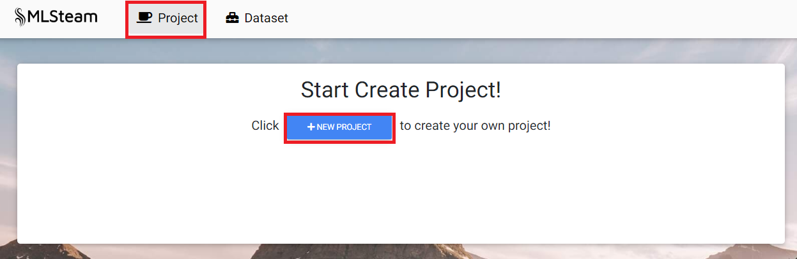
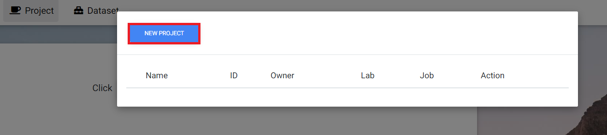
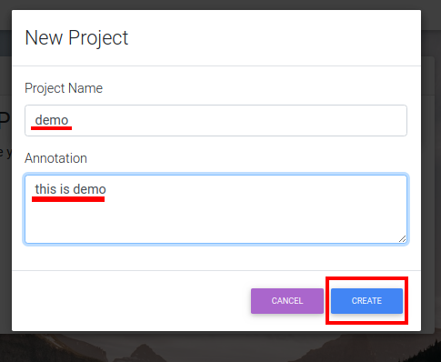
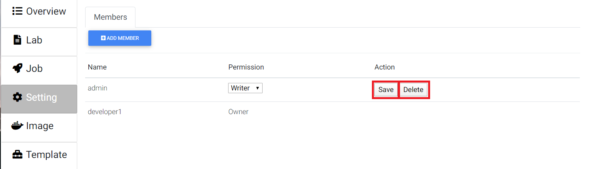

.. _project:

*******
Project
*******

.. _create_project :

Create project
==============

Click "Project" or "new project" button. 

At the pop-up window click "New project".

Input project name and any related notes, then click "Create".

The last created project becomes the default project.

Browse projects
===============

Click the button with the default project name ("Project" if there are no projects).

.. image:: ../_static/project/browse_project.png

.. image:: ../_static/project/browse_project_modal.png

View project
============

Open list of projects. 

.. image:: ../_static/project/browse_project.png

Click on project's name to view its content.

.. image:: ../_static/project/browse_project_modal.png

.. image:: ../_static/project/view_project.png

Add member
==========

On the projects page click "Setting".

Click "Add member".

.. image:: ../_static/project/member_project.png

Type members name. Select role. Click "Add".

.. image:: ../_static/project/member_project_add.png

Modify user name and click "save" button.

"Delete" button will remove member from project.

Delete project
==============

Click the button with the default project name to open the list of projects. 

.. image:: ../_static/project/browse_project.png

Click trash icon on the side of project that needs to be deleted.

.. image:: ../_static/project/delete_project.png

Confirm.

.. image:: ../_static/project/delete_project_modal.png

