.. _project:

*******
Project
*******

.. _create_project :

Create project
==============

Click "Project" or "Create Project" button. 

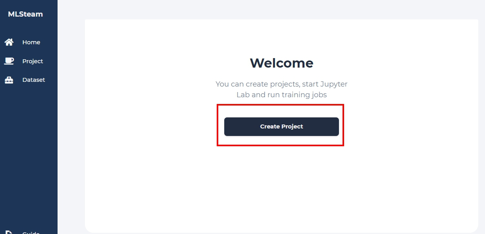

At the *Home* tab, you will see a dashboard with overall usage of resources available to you and browse all created projects. You can add a new project here.

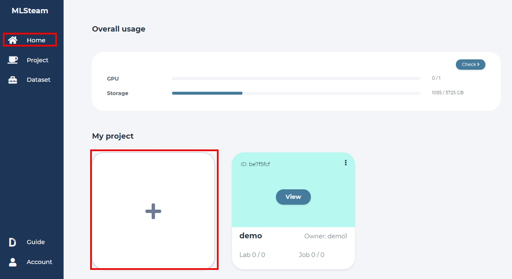

Input project name and any related notes, then click "Create".

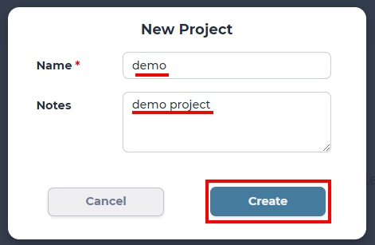

The last created project becomes the default project and can be directly accessed from the *Project* tab.

View project
===============

Click the "View" button to see your project status and the dashboard.

.. image:: ../_static/project/browse_project.jpg

From this dashboard, you can access your Labs, Jobs, as well as settings of your chosen project.

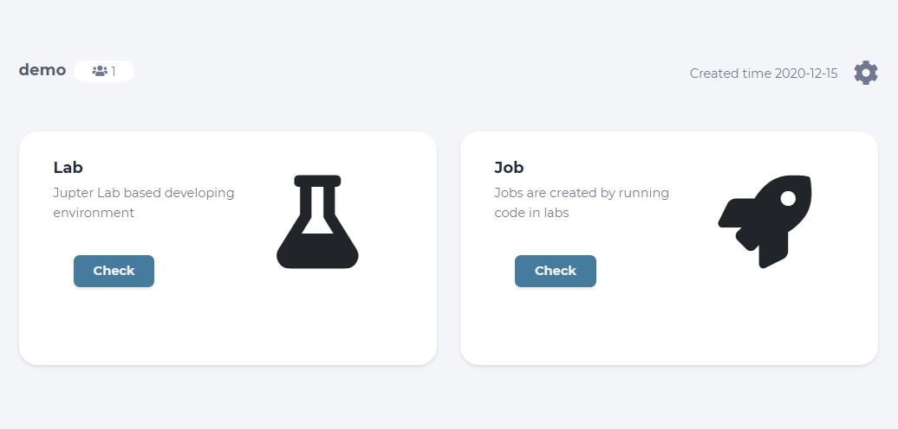

Add member
==========

In your projects' dashboard click the setting button at the upper right of screen and choose the "Member" option from teh drop-down list.

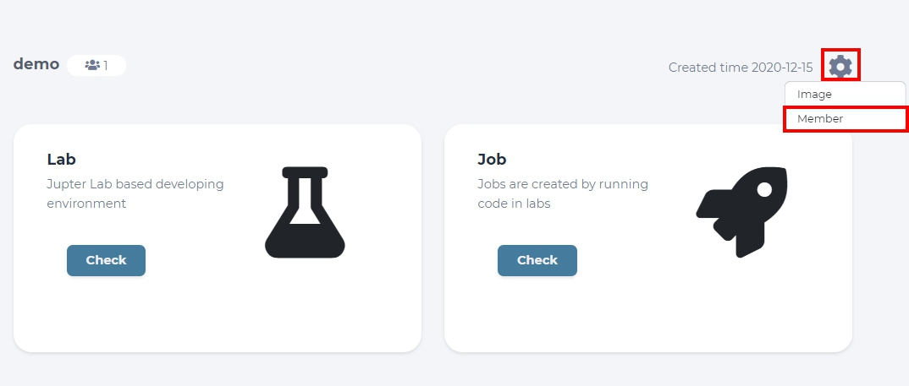

In the page you've been redirected, you can see all members of a given *Project*, yourself included. You can add other members to your project by clicking the "Add Member" button.

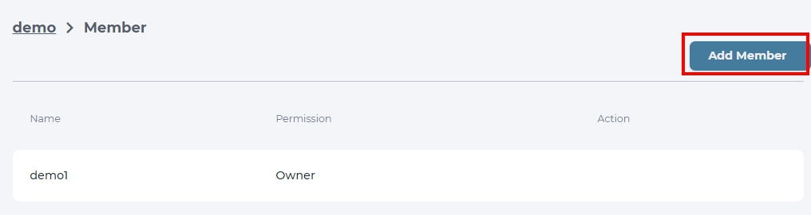

Write the name of the member to add and set their permission. *Writer* can modify your project, while *Reader* can only look at the code and run *Jobs*.

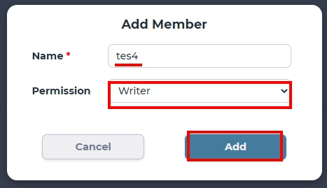

You can edit permissions by clicking "Edit" or remove an unwanted member from your project with a "Delete" button next to that users' name.

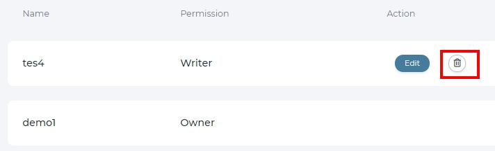

Delete project
==============

To delete a project, you must navigate back to the *Home* dashboard first. 

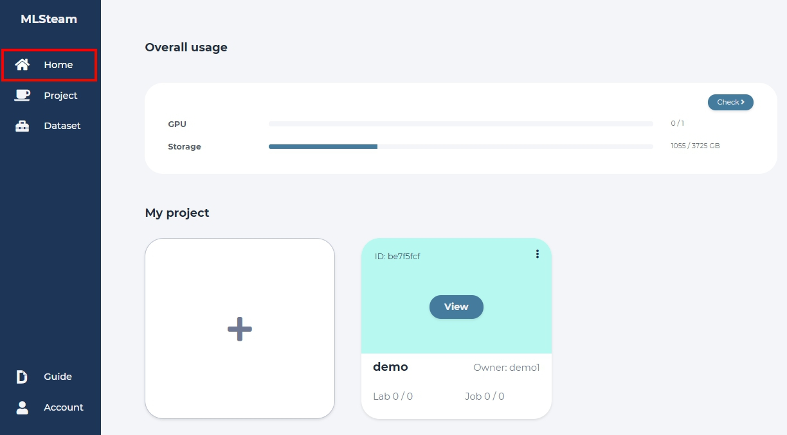

Click the additional settings button at the top left corner of the project you with to remove, and click "Delete" button that will appear.

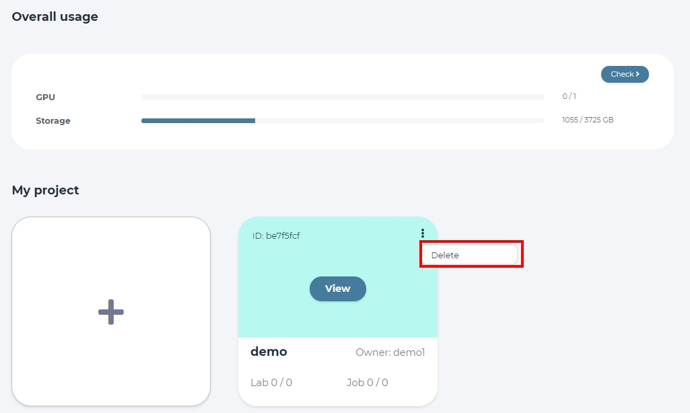

Make sure you have selected the right project for removal and then confirm this change.

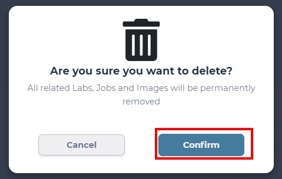

