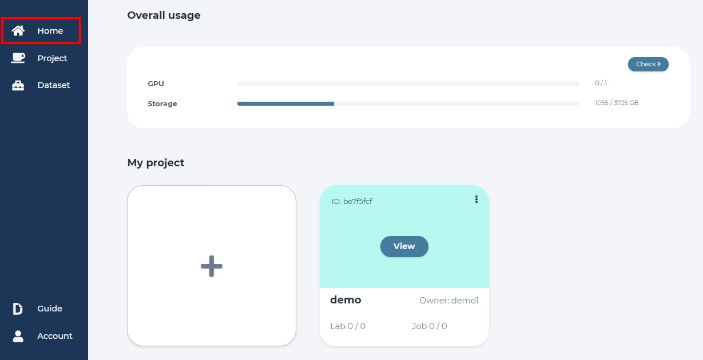

.. _project:

*******
Project
*******

.. _create_project :

Create project
==============

Click "Project" or "Create Project" button. 

.. image:: ../_static/project/create_project.jpg

Click on the upper right button to create a new project.

.. image:: ../_static/project/create_project_modal.jpg

Input project name and any related notes, then click "Create".

.. image:: ../_static/project/create_project_modal2.jpg

The last created project becomes the default project.

Browse projects
===============

Click the button "view" to see your project status and the dashboard.

.. image:: ../_static/project/browse_project.jpg

.. image:: ../_static/project/browse_project_dashboard.jpg

View project
============

Open list of projects. 

Click on project's view button to view its content.

.. image:: ../_static/project/browse_project.jpg

Add member
==========

On the projects page click the setting button at the upper right of screen.

Click "Member".

.. image:: ../_static/project/member_project.jpg

Type members name. Select role. Click "Add".

If you haven't create any user, please create a user in the first.
(Please see the page: :ref:`admin`)

.. image:: ../_static/project/member_project_add.jpg

Modify user name and click "save" button.

.. image:: ../_static/project/member_project_save.jpg

"Delete" button will remove member from project.

.. image:: ../_static/project/edit_delete_member.jpg

Delete project
==============

Click the button with the default project name to open the list of projects. 

.. image:: ../_static/project/browse_project2.jpg

Click trash icon on the side of project that needs to be deleted.

.. image:: ../_static/project/delete_project.jpg

Confirm.

.. image:: ../_static/project/delete_project_modal.jpg

