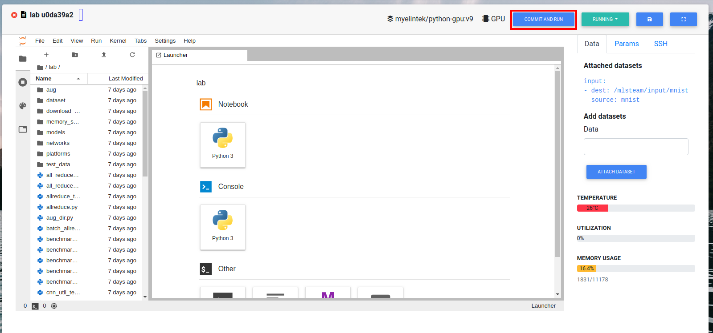

.. _quick_start:

***********
Quick start
***********

This part will show how to train image classification model from template.

On the top bar click "Template".

Then click "Use Template" on the classification card. This will create an image classification project named "classification" with Mnist dataset already attached to it.

.. image:: ../_static/create_template.png

Click "Commit and run". This will start training job from the template code and redirect to the jobs list page.

Click on the job id or screan icon to view training progres.

.. image:: ../_static/view_job1.png

Job page displays 

* Loss value graph
* Log output
* Configuration file (mlsteam.yml)
* Used docker image name, gpus, status, status button (top panel)

.. image:: ../_static/view_job2.png
