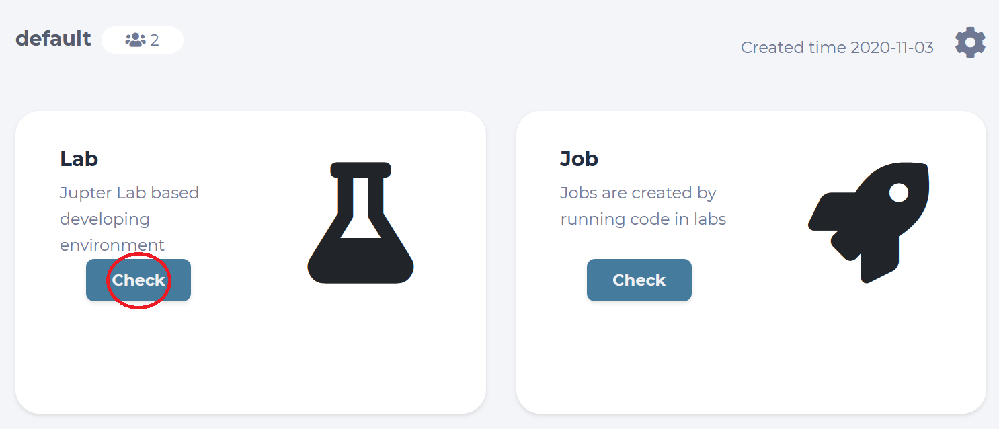
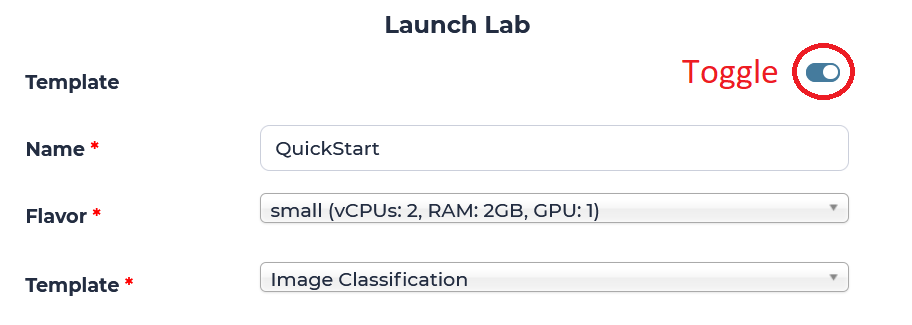
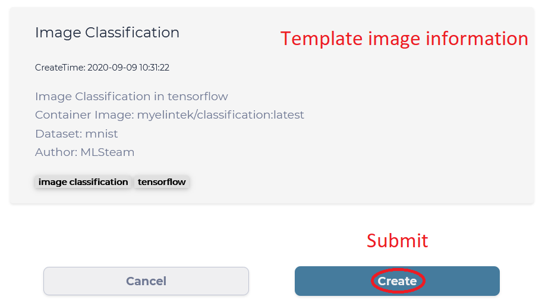
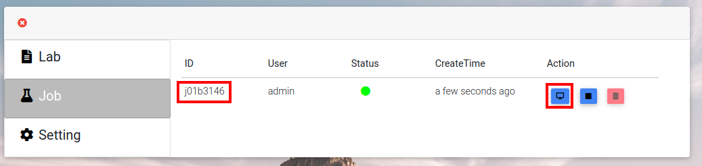
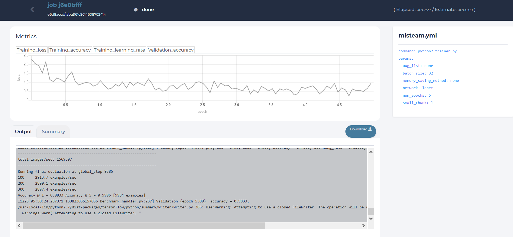

************
Quick start
************

This quick start guide will show you how to train an image classification model from template in your default project.

First, we navigate to check your Labs from Project tab.

Inside your default Project, you will see all Labs you have created. Our goal is to create a new Lab using the template for classification, so we click the "Create New" button.

.. image:: ../_static/template/create_template2.png

We are prompted with the "Launch Lab" window, where we need to toggle the "Template" option, come up with a name for this new Lab, choose a "Flavor" for it, and finally select which template to use. 

We will use "QuickStart" as the name of the Lab in this guide, but you are free to give it any name shorter than 12 characters. "Flavor" of the Lab tells us what kind of hardware is available, and "small" Flavor should be enough, since it has one GPU we can utilize inside the Lab. Finally, "Image Classification" template is the one we need for this guide and it already has the MNIST Dataset attached and ready to use. Click "Create" button to submit this new Lab.

To start a training job from this template, we need to click "Submit job". 

.. image:: ../_static/template/run_template.png

Choose a desired flavor and commit our job to start. We will be transferred to see all Jobs of our default Lab. 

.. image:: ../_static/template/submit_template2.png
    :width: 400
Click on the Lab UUID to return to the Lab, which started this Job or press the "Check" button to view the progress of this Job.

Job page displays 

* Loss value graph
* Log output
* Configuration file (mlsteam.yml)
* Job name, used docker image name, status indicator, elapsed and estimated time(top panel)

