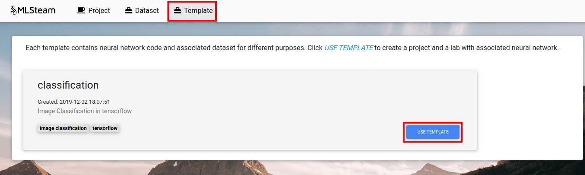
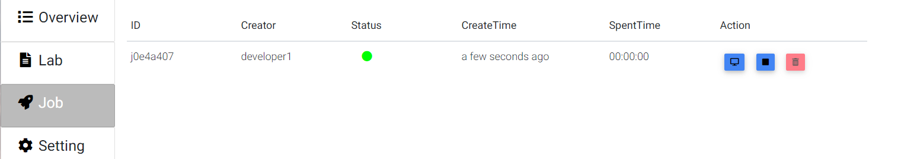

.. _quick_start:

**************************
Quick start (Use Template)
**************************

This part will show how to train image classification model from template.

Create a project first.

.. image:: ../_static/create_project.png

Then click "Use Template" on the classification card in template tab.

Fill comment and number of gpus. Confirm

Click "Commit and run". This will start training job from the template code and redirect to the jobs list page.

.. image:: ../_static/commit_run.png

Click on the job id or screen icon to view training progress.

Job page displays 

* Loss value graph
* Log output
* Configuration file (mlsteam.yml)
* Used docker image name, gpus, status, status button (top panel)

.. image:: ../_static/view_job2.png
