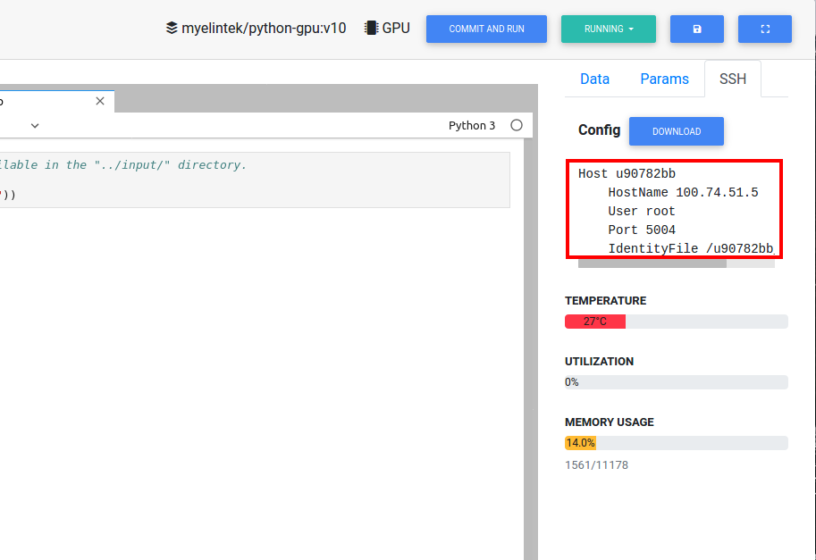
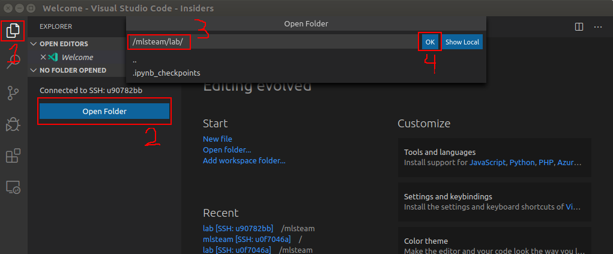

****************************
Remote connection to the lab
****************************

This chapter will explain how to connect IDE on user's PC to the lab running on server.

VSCode
======

Tested setup: Ubuntu 16.04, Visual Studio Code - Insiders.

Install `ms-vscode-remote.remote-ssh` extension on VSCode.

Open needed lab in the browser and generate ssh key.

.. image:: ../_static/generate_ssh.png

Download <lab_id>_sshkey file (downloading will start automatically, if it does not press "Download" button).

Change sshkey file permissions to 600:

.. code-block:: console

  chmod 600 <lab_id>_sshkey

On VSCode bottom-right corner press "Open a remote window" then from drop down menu at top-center select "Open configuration file", finaly select needed ssh configuration (usually /home/<user>/.ssh/config).

Copy lab ssh config from web browser and paste to the configuration file. Modify "IdentityFile" field to match the location of <lab_id>_sshkey file.

Save configuration file.

Press "Open remote window again". 

Sellect "Connect to host" from drop down manu. Then sellect host name corresponding to lab.

VSCode will open new window where it will try to connect to lab. When it asks about fingerprint press "Continue".

Now VSCode is connected to the lab container.

To edit lab code go to Explorer and press "Open Folder". Sellect `/mlsteam/lab`, press "OK". When VSCode asks about fingerprint press "Continue".

