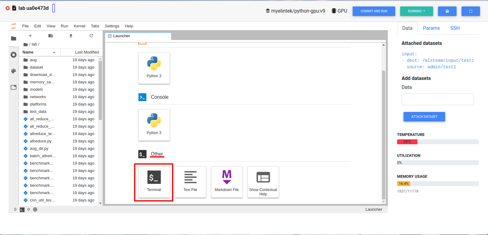

***********************
Classification Template
***********************

Use own dataset with template
=============================

First create project from template and enter attached lab (covered in Quick start).

Default Mnist dataset is read only.

Create empry dataset and attach it to the lab. In this example it will be called "test1".

Enter terminal
++++++++++++++

Scrol down to "Other" block in lab window, click on "Terminal" button:

Download dataset by script
++++++++++++++++++++++++++

Provided script can download and convert to the right folder format standard datasets such as **mnist, iris, cifar10, cifar100**.
This example will show how to download cifar10.

Enter terminal. Type in consol

.. code-block:: console

    python2 download_data cifar10 /mlsteam/input/test1

Folder format
+++++++++++++

If different dataset is needed, convert it to the next folder format yourself

.. code-block:: console

    train
    |----- class1
           |----- trimage1
                  trimage2
                  trimage3
                  ...
           class2
           ...
    test
    |----- class1
           |----- valimage1
                  valimage2
                  valimage3
                  ...
           class2
           ...

Parse dataset
+++++++++++++

To generate labels.txt and file list of dataset, run

.. code-block:: console

  python2 parse_folder.py -t /mlsteam/input/test1/train_list.txt /mlsteam/input/test1/train /mlsteam/input/test1/labels.txt
  python2 parse_folder.py -v /mlsteam/input/test1/validation_list.txt /mlsteam/input/test1/test /mlsteam/input/test1/labels.txt

Generate tfrecord
+++++++++++++++++

To generate tfrecord from dataset, run

.. code-block:: console

  python2 create_db.py --labels_file ../input/test1/labels.txt --prefix=train ../input/test1/train_list.txt ../input/test1/
  python2 create_db.py --labels_file ../input/test1/labels.txt --prefix=validation ../input/test1/validation_list.txt ../input/test1/

Modify configuration file
+++++++++++++++++++++++++

Open mlsteam.yml and modify input directory in "command" field.

.. image:: ../_static/own_dataset_config.png

Configuration file
==================

To run trainer with parameters, following parameters are supported:

* num_epoch 
* batch_size
* piecewise_learning_rate_schedule 
* memory_saving_method - whether to apply or not GPU memory optimization
* small_chunk - forward accumulation times on each GPU
* network - network .py file to use
* data_dir - input directory (dataset)
* train_dir - output directory (checkpoints)

piecewise_learning_rate_schedule
++++++++++++++++++++++++++++++++

Specifies a piecewise learning rate schedule based on the number of epochs. This is the form LR0;E1;LR1;...;En;LRn, 
where each LRi is a learning rate and each Ei is an epoch indexed from 0. The learning rate is LRi if the 
E(i-1) <= current_epoch < Ei. For example, if this paramater is 0.3;10;0.2;25;0.1, the learning rate is 0.3 
for the first 10 epochs, then is 0.2 for the next 15 epochs, then is 0.1 until training ends

memory_saving_method
++++++++++++++++++++

* *none* - do not apply any memory saving mechanism.
* *recomputing* - update graph to minimize GPU memory utilization.

small_chunk
+++++++++++

Small chunk number means number of forward accumulation times on each GPU before doing backforward propogation. This can speed up GPU computing in multiple GPU setup when no nv-link is presented.

network
+++++++

Name of network file. All avaliable networks are located in `lab/networks` directory.
User can modify existing networks or create it from scratch using template.py

data_dir
++++++++

Directory that contains tfrecords.

train_dir
+++++++++

Directory to write checkpoints.

Example
+++++++

.. code-block:: console

  command: python2 trainer.py --num_gpus=1 --batch_size=32 --network=resnet32.py --data_dir=../input/test1 --train_dir=/mlsteam/input/test1/checkpoints
  description: Image Classification in tensorflow
  env: myelintek/python-gpu:v9
  gpu: 1
  hashtag:
  - image classification
  - tensorflow
  input:
  - dest: /mlsteam/input/test1
    source: admin/test1
  name: classification
  params:
    batch_size: 32
    piecewise_learning_rate_schedule: "0.1;3;0.01;8;0.001" 
    memory_saving_method: none
    num_epochs: 10
    small_chunk: 1
  
