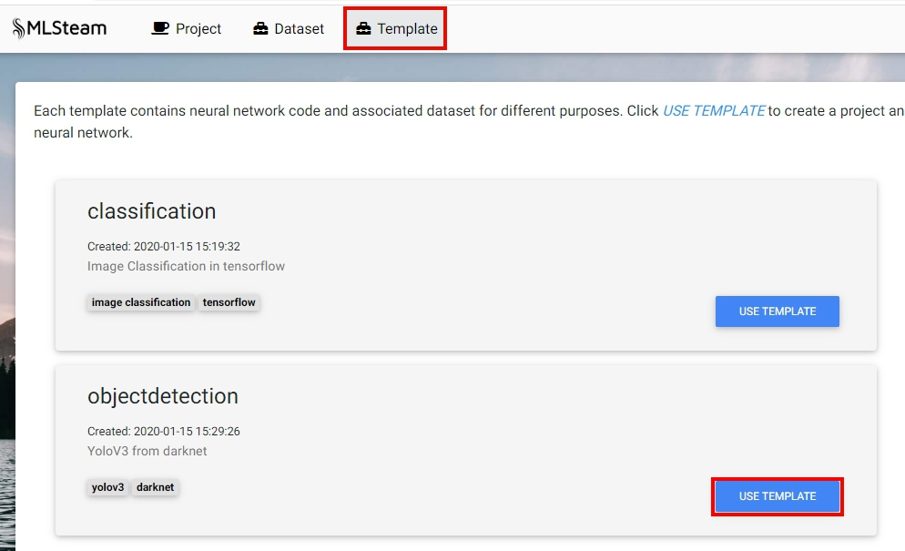
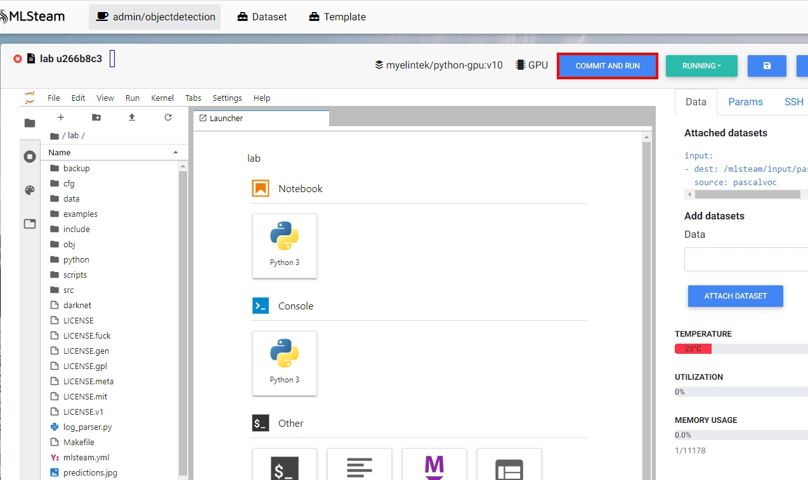
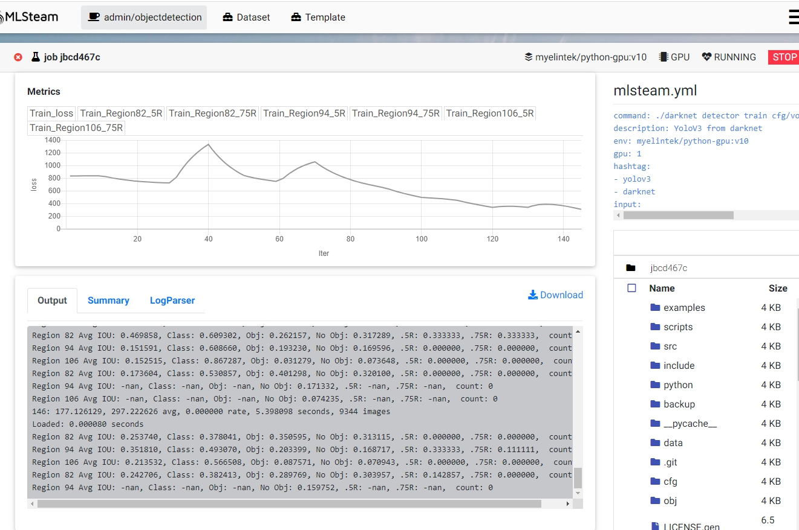

.. _template:

***********************
Template
***********************

Classification
==============

This part will show how to train image classification model from template.

Quick start
-----------

On the top bar click "Template".

Then click "Use Template" on the classification card. This will create an image classification project named "classification" with Mnist dataset already attached to it.

.. image:: ../_static/create_template.png

In the lab page, click "Commit and run". This will start training job from the template code and redirect to the jobs list page.

.. image:: ../_static/run_template.png

Click on the job id or screen icon to view training progress.

.. image:: ../_static/view_job1.png

Job page displays 

* Loss value graph
* Log output
* Configuration file (mlsteam.yml)
* Used docker image name, gpus, status, status button (top panel)

.. image:: ../_static/view_job2.png

Use your own dataset
--------------------

First create project from classification template and enter attached lab (covered in Quick start).

Default Mnist dataset is read only.

Create an empty dataset and attach it to the lab. In this example it will be called "test1".

Download dataset (use cifar10 as example)
+++++++++++++++++++++++++++++++++++++++++++++++++++

If you have your own dataset, skip to next step.

Provided script can download and convert to the right folder format standard datasets such as **mnist, iris, cifar10, cifar100**.
This example shows how to download and store cifar10 into our "test1" dataset.

First, scroll down to "Other" block in lab window, click on "Terminal" button:

.. image:: ../_static/enter_terminal.png

Enter terminal. Type in console

.. code-block:: console

    python2 download_data cifar10 /mlsteam/input/<test1>

.. note::
    replace "test1" for your own dataset name.

Folder format
^^^^^^^^^^^^^

Create *train* and *test* folders each with subdirectories of classes. Put 
If different dataset is needed, convert it to the next folder format yourself.

.. code-block:: console

    train
    |----- class1
           |----- trimage1
                  trimage2
                  trimage3
                  ...
           class2
           ...
    test
    |----- class1
           |----- valimage1
                  valimage2
                  valimage3
                  ...
           class2
           ...

Preprocess dataset
++++++++++++++++++

Parse folder
^^^^^^^^^^^^
To generate labels.txt and file list of dataset, run

.. code-block:: console

  python2 parse_folder.py -t /mlsteam/input/<test1>/train_list.txt /mlsteam/input/<test1>/train /mlsteam/input/<test1>/labels.txt
  python2 parse_folder.py -v /mlsteam/input/<test1>/validation_list.txt /mlsteam/input/<test1>/test /mlsteam/input/<test1>/labels.txt

Generate tfrecord
^^^^^^^^^^^^^^^^^

To generate tfrecord from dataset, run

.. code-block:: console

  python2 create_db.py --labels_file ../input/<test1>/labels.txt --prefix=train ../input/<test1>/train_list.txt ../input/<test1>/
  python2 create_db.py --labels_file ../input/<test1>/labels.txt --prefix=validation ../input/<test1>/validation_list.txt ../input/<test1>/

Modify configuration file
^^^^^^^^^^^^^^^^^^^^^^^^^

Open mlsteam.yml and modify input directory in "command" field.

.. image:: ../_static/own_dataset_config.png

Parameters (optional)
+++++++++++++++++++++

For classification template, following parameters are supported followed by trainer.py:

* num_epoch 
* batch_size
* piecewise_learning_rate_schedule 
* memory_saving_method - whether to apply or not GPU memory optimization
* small_chunk - forward accumulation times on each GPU
* network - network .py file to use
* data_dir - input directory (dataset)
* train_dir - output directory (checkpoints)

piecewise_learning_rate_schedule
^^^^^^^^^^^^^^^^^^^^^^^^^^^^^^^^

Specifies a piecewise learning rate schedule based on the number of epochs. This is the form LR0;E1;LR1;...;En;LRn, 
where each LRi is a learning rate and each Ei is an epoch indexed from 0. The learning rate is LRi if the 
E(i-1) <= current_epoch < Ei.

For example, if this paramater is 0.3;10;0.2;25;0.1, the learning rate is 0.3 
for the first 10 epochs, then is 0.2 for the next 15 epochs, then is 0.1 until training ends

memory_saving_method
^^^^^^^^^^^^^^^^^^^^

* *none* - do not apply any memory saving mechanism.
* *recomputing* - update graph to minimize GPU memory utilization.

small_chunk
^^^^^^^^^^^

Small chunk number means number of forward accumulation times on each GPU before doing backforward propogation. This can speed up GPU computing in multiple GPU setup when no nv-link is presented.

network
^^^^^^^

Name of network file. All avaliable networks are located in `lab/networks` directory.
User can modify existing networks or create it from scratch using template.py

data_dir
^^^^^^^^

Directory that contains tfrecords.

train_dir
^^^^^^^^^

Directory to write checkpoints. Create empty directory in attached dataset (in this example empty directory name is `checkpoints`) and specify it as  train_dir.

Ex: `--train_dir=/mlsteam/input/test1/checkpoints`

Example
^^^^^^^

.. code-block:: console

  command: python2 trainer.py --num_gpus=1 --batch_size=32 --network=resnet32.py --data_dir=../input/test1 --train_dir=/mlsteam/input/test1/checkpoints
  description: Image Classification in tensorflow
  env: myelintek/python-gpu:v9
  gpu: 1
  hashtag:
  - image classification
  - tensorflow
  input:
  - dest: /mlsteam/input/test1
    source: admin/test1
  name: classification
  params:
    batch_size: 32
    piecewise_learning_rate_schedule: "0.1;3;0.01;8;0.001" 
    memory_saving_method: none
    num_epochs: 10
    small_chunk: 1
  

Object Detection
================

This part will show how to train object detection model from template.

Quick start
-----------

On the top bar click "Template".

Then click "Use Template" on the object detection card. This will create an object detection project named "objectdetection" with Pascal dataset already attached to it.

In the lab page, click "Commit and run". This will start training job from the template code and redirect to the jobs list page.

Click on the job id or screen icon to view training progress.

.. image:: ../_static/view_job1.png

Job page displays 

* Loss value graph and graphs for three regions each with 50% and 75% recall value.
* Log output
* Configuration file (mlsteam.yml)
* Used docker image name, gpus, status, status button (top panel)

Inference example
-----------------

Back to the Lab page, open the file 'try_detection.ipynb' in jupyterlab. Click run multiple times to examine a pretrained yolov3-tiny.weights file.

.. image:: ../_static/run_lab.jpg

Segmentation (by request)
=========================

UNet Keras template 
-------------------

https://github.com/myelintek/unet

The code is refer to https://github.com/zhixuhao/unet, and we fixed some issues.

Dataset
+++++++

This program was designed for the http://brainiac2.mit.edu/isbi_challenge/ .

Usage
+++++

Setup the data paths, and call:

python3 main.py

Train Input
+++++++++++

In main.py, you can edit the input path:

.. code-block:: console

    train_path='/mlsteam/input/train'

The train_path should has two child folders named 'image' and 'label', but if you want a different name, edit the line:

.. code-block:: console

    myGene = trainGenerator(batch_one_gpu,train_path,'image','label',data_gen_args,save_to_dir = aug_path)

Predict
+++++++

After training, the model will predict those images in test folder, and save the results in predict folder.

.. code-block:: console

    test_path='/mlsteam/input/test'
    predict_path='./data/predict'

Train Input Augmentation
++++++++++++++++++++++++

The augmentation can adjust parameters at

.. code-block:: console

  data_gen_args = dict(rotation_range=0.2,
                      width_shift_range=0.05,
                      height_shift_range=0.05,
                      shear_range=0.05,
                      zoom_range=0.05,
                      horizontal_flip=True,
                      fill_mode='nearest')

If you want no augmentation, use a empty dict().

And if you want store those augmented images to observe them, specify the path to store. (note: For large Dataset, It might to run slower and cost huge disk space)

.. code-block:: console

    aug_path=None

Customize Output
++++++++++++++++

Edit the callback logger function:

.. code-block:: console

  class TrainLogger(Callback):
      def on_batch_end(self, batch, logs={}):
          print("Train step={} loss={} acc={}".format(batch, logs.get('loss'), logs.get('accuracy')))

And change the content of print()

Define Train Step and Batch
+++++++++++++++++++++++++++

The batch_one_gpu is a number that specify how many images training on one GPU in a step. So if the envirment has 8 GPUs, each step will train 8 x batch_one_gpu images on 8 GPUs.

.. code-block:: console

  batch_one_gpu=2
  steps_per_epoch=400
  total_epochs=1

The steps_per_epoch defines how many step in a epoch.

It will produce the checkpoint file after a epoch finished. And you can specify total_epochs to determine the total epoch.

(Note) In this program, epoch's size is defined by user in steps_per_epoch. It has no relative with dataset size.

Checkpoint
++++++++++

You can specify path to save checkpoint file:

.. code-block:: console

  checkpoint_path='./unet_membrane.hdf5'

And specify a checkpoint file to restore model weights in the begining.

.. code-block:: console

  restore_path='./unet_membrane.hdf5'
 
UNet Pytorch Template
---------------------

https://github.com/myelintek/Pytorch-UNet

The code is refer to https://github.com/milesial/Pytorch-UNet, and we add multiple GPU, remove tqdm(progress bar).

Dataset
+++++++

This program was designed for the https://www.kaggle.com/c/carvana-image-masking-challenge/data .

Usage
+++++

python3 train.py -b [batch_size]

(Note) If you have N GPU, the batch size might be the multiple of N.

Train Input
+++++++++++

In main.py, you can edit the input path:

.. code-block:: console

    dir_img='/mlsteam/input/train/'
    dir_mask='/mlsteam/input/train_masks/'

Predict
+++++++

To predict image, the model checkpoint is needed. So you should train first.

use -i or --input to specify the predict image folder, and use -o or --output for output folder. If you want to overwrite the output, set --overwrite.

.. code-block:: console

    python3 predict.py -m ./checkpoints/CP_epoch1.pth -i /mlsteam/input/test -o predict_output --overwrite

Train Input Augmentation
++++++++++++++++++++++++

In this program, only implement 'scale' to augment fig.
The height and width will multiply scale for resize.

.. code-block:: console

  python3 train.py --scale 0.5

Customize Output
++++++++++++++++

You can change train.py for line 108, 121, 126:

.. code-block:: console

  print("{:.2f} Training: epoch {:6.4f}, loss {} ".format(time.time()-t_start, (global_step*batch_size/n_train), loss.item()))

Define Train Step and Batch
+++++++++++++++++++++++++++

In this Program, one epoch is training the train dataset one round, and we can specify how many epoch to train in the program parameter:

.. code-block:: console

  python3 train.py --epochs 5

The Program divide the whole dataset into two part, train and validation. You can specify the percent of whole dataset for validation part. Ex. 10% for validation: 

.. code-block:: console

  python3 train.py --validation 10

And you can define the frequency to execute validation:

.. code-block:: console

  python3 train.py --validation_epoch 0.5

Checkpoint
++++++++++

You can specify path to save checkpoint file:

.. code-block:: console

  dir_checkpoint = './checkpoints/'

You can specify a checkpoint file to restore model weights at the program parameter:

.. code-block:: console

  python3 train.py --load ./checkpoints/CP_epoch1.pth

