.. _classification:

Image Classification
====================

This part will show how to train an image classification model from template.

Quick start
-----------

In the left bar click "Project" to enter your default project or create new project.

.. image:: ../../_static/project/create_project.jpg

Enter the Lab environment by clicking "Check" button on the *Lab* board. 

.. image:: ../../_static/template/create_template1.png

Inside your default Project, you will see all Labs you have created. Our goal is to create a new Lab using the template for classification, so we click the "Create New" button.

.. image:: ../../_static/template/create_template2.png

We are prompted with the "Launch Lab" window, where we need to toggle the "Template" option, come up with a name for this new Lab, choose a "Flavor" for it, and finally select which template to use. 

.. image:: ../../_static/template/create_template3.png
  :width: 600

We will use "QuickStart" as the name of the Lab in this guide, but you are free to give it any name shorter than 12 characters. "Flavor" of the Lab tells us what kind of hardware is available, and "small" Flavor should be enough, since it has one GPU we can utilize inside the Lab. Finally, "Image Classification" template is the one we need for this guide and it already has the MNIST Dataset attached and ready to use. Click "Create" button to submit this new Lab.

.. image:: ../../_static/template/submit_template.png
  :width: 600

To start a training job from this template, we need to click "Submit job". 

.. image:: ../../_static/template/run_template.png

Choose a desired flavor and commit our job to start. We will be transferred to see all Jobs of our default Lab. 

.. image:: ../../_static/template/submit_template2.png
  :width: 400

Click on the Lab UUID to return to the Lab, which started this Job or press the "Check" button to view the progress of this Job.

.. image:: ../../_static/template/view_job1.png

Job page displays 

* Loss value graph
* Log output
* Configuration file (mlsteam.yml)
* Job name, used docker image name, status indicator, elapsed and estimated time(top panel)

.. image:: ../../_static/template/view_job2.png

Use your own dataset
--------------------

First create lab from classification template and enter attached lab.

MNIST dataset attached to the Image Classificaiton is read-only by default, so you will not be able to make any changes to it. In order to use an arbitrary dataset, we need to create an empty dataset and attach it to the lab. In this example it will be called "demo".

For this go to Dataset page and click "New Dataset". Then enter dataset name and click create.

.. figure:: ../../_static/dataset/new_dataset.jpg

  click new dataset button on the dataset page

.. figure:: ../../_static/dataset/new_dataset_modal.jpg
  
  named 'demo' for this dataset

This will create an empty dataset, where you can upload your custom dataset. Typically, a dataset needs to follow certain structure, we describe structure used in the classification template below.

Folder format
^^^^^^^^^^^^^

If non-standard dataset is needed, convert it to the next folder format yourself.
Create *train* and *test* folders each with subdirectories of classes. 

.. code-block:: console

    train
    |----- class1
           |----- trimage1
                  trimage2
                  trimage3
                  ...
           class2
           ...
    test
    |----- class1
           |----- valimage1
                  valimage2
                  valimage3
                  ...
           class2
           ...

After creating a dataset with required structure, we need to upload it into MLSteam platform 

Upload files to dataset
-----------------------

To upload files to a dataset, simply drag and drop files from local PC or click *Add Data* -> *Local* -> *Browse* to select local files.

.. image:: ../../_static/dataset/upload_dataset.jpg
.. image:: ../../_static/dataset/upload_dataset_local.jpg
  :width: 400

Extract files from archive
---------------------------

Uploading too many files at the same time will cause your web browser to freeze. A better way to upload large collection of files is to compress them first into one archive file and uncompress the file on the dataset page.

.. figure:: ../../_static/dataset/extract_dataset.jpg

  select archive file and click "Extract".

.. tip::

  Supported compress file format *tar, tgz, tar.gz, zip.*

Attach custom dataset
---------------------------

After creating the dataset, we need to go back to the template lab. For this click "Project" -> "Lab".

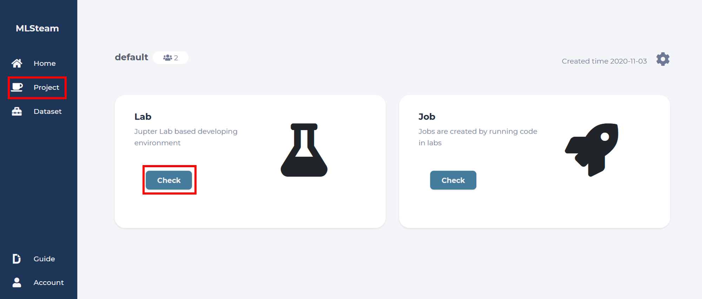

.. image:: ../../_static/template/template_empty_dataset4.png

Click start button to start the lab.

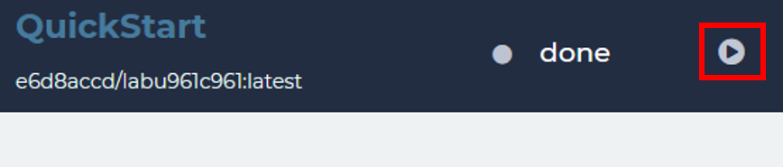

Detach the MNIST dataset in the dataset tab

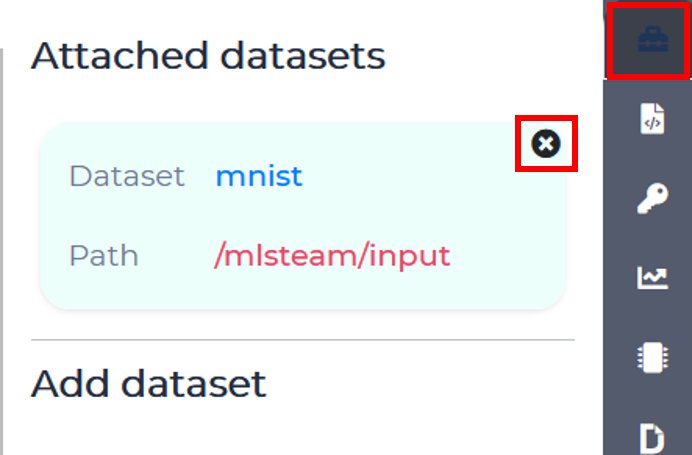

To attach dataset to lab enter it's name and click "Attach dataset".

.. image:: ../../_static/lab/attach_dataset.png
  :width: 400

.. Download dataset (use cifar10 as example)
.. +++++++++++++++++++++++++++++++++++++++++++++++++++

.. If you have your own dataset, skip to next step.

.. Provided script can download and convert to the right folder format standard datasets such as **mnist, iris, cifar10, cifar100**.
.. This example shows how to download and store cifar10 into our "demo" dataset.

.. First, scroll down to "Other" block in lab window, click on "Terminal" button:

.. .. image:: ../../_static/template/enter_terminal.png

.. Enter terminal. Type in console

.. .. code-block:: console

..     python2 download_data cifar10 /mlsteam/input/<demo>

.. .. note::
..     replace "demo" for your own dataset name.

Training hyperparameters
^^^^^^^^^^^^^^^^^^^^^^^^^

MLSteam platform supports native change of training parameters via a friendly UI. To enable this feature, you must specify your hyperparameters in the *mlsteam.yml* file. Let's check the structure of this file provided in the classification template.

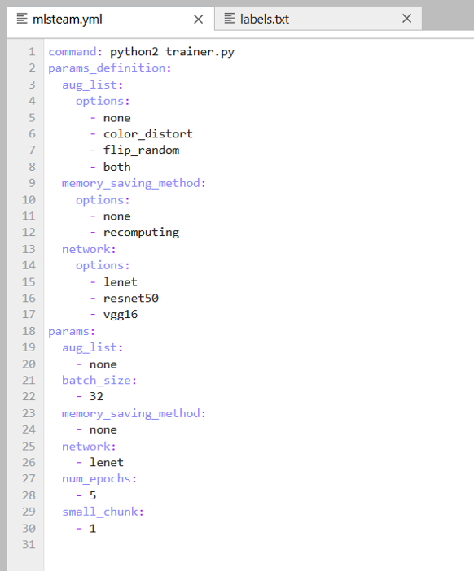

When you submit a *Job* to run this *Lab*, the *command* line will be run with optimons specified after the *params* keyword. Parameters from this YAML file can be automatically set and changed from the *Parameters* tab on the right side of the screen. 

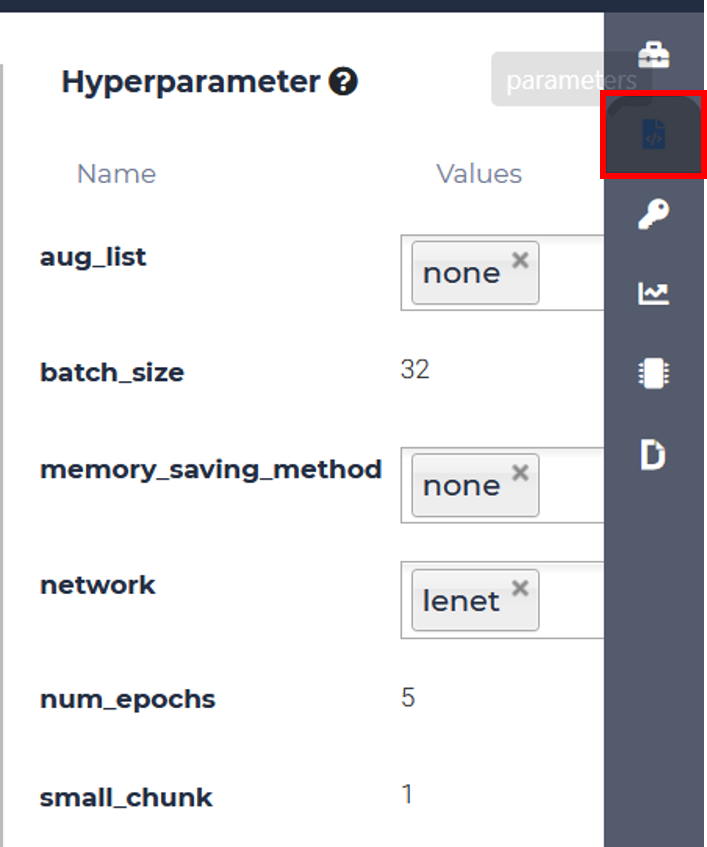

Classification Template Parameters (optional)
+++++++++++++++++++++++++++++++++++++++++++++

For this classification template, following parameters are supported:

* aug_list
* num_epoch 
* batch_size
* memory_saving_method - whether to apply or not GPU memory optimization
* small_chunk - forward accumulation times on each GPU
* network - network .py file to use

aug_list
^^^^^^^^
* *none* - do not apply any augmentation mechanism.
* *color_distortion* - apply color distortion to training images
* *flip_random* - randomply flip training images.
* *both* - use both options.

num_epoch
^^^^^^^^^

Specify the number of times we run through the while training dataset, positive integer

batch_size
^^^^^^^^^^

Specify the number of datapoints to compute gradient on at once, positive integer

memory_saving_method
^^^^^^^^^^^^^^^^^^^^

* *none* - do not apply any memory saving mechanism.
* *recomputing* - update graph to minimize GPU memory utilization.

small_chunk
^^^^^^^^^^^

Small chunk number means number of forward accumulation times on each GPU before doing backforward propogation. This can speed up GPU computing in multiple GPU setup when no nv-link is presented.

network
^^^^^^^

Specify which network to use. 

* *lenet* 
* *resnet50*
* *vgg16* 

Example
^^^^^^^

MLSteam allows users to automatically run multiple jobs with every combination of parameters they have specified. We will compare how 2 different networks will perform on the same classification task using MNIST dataset. First, modify the parameters tab to add another network.

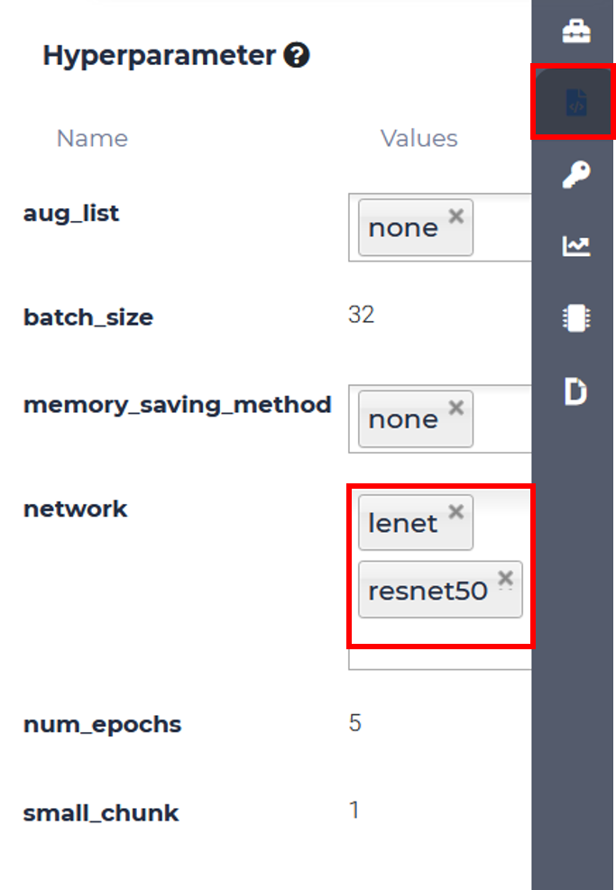

Then simply click *Submit Job*, choose an appropriate flavor, and MLSteam will do everything else for you!

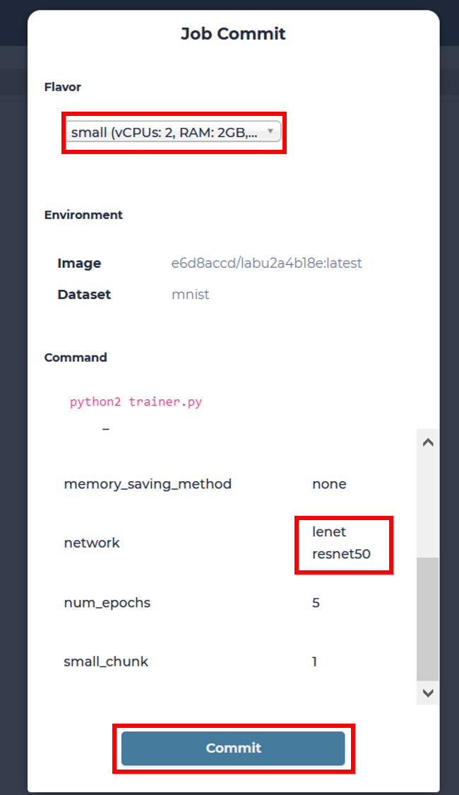

Two jobs have started running. You only need to check the results, after they are ready.

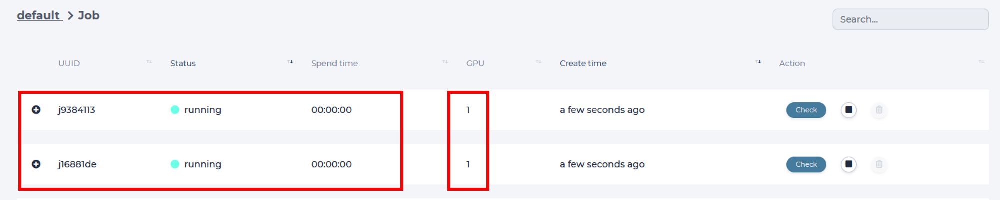

.. note::

  Notice that each job uses a GPU, make sure you don't run out of GPU resources!

There's a 30min difference between training time of 2 different networks.

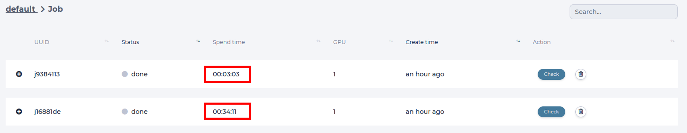

Final validation accuracy is only slightly higher for resnet50 (0.9854 vs. 0.9805), but training time is significantly larger

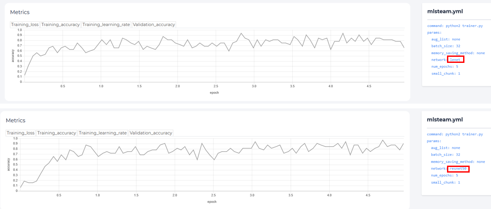

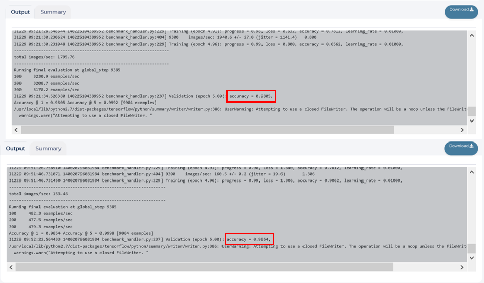

How to use TensorBoard
----------------------

TensorBoard provides the visualization and tooling needed for machine learning experimentation:

* Tracking and visualizing metrics such as loss and accuracy
* Visualizing the model graph (ops and layers)
* Viewing histograms of weights, biases, or other tensors as they change over time
* Projecting embeddings to a lower dimensional space
* Displaying images, text, and audio data
* Profiling TensorFlow programs
* And much more

.. tip::
   TensorBoard working with TensorFlow-based code.

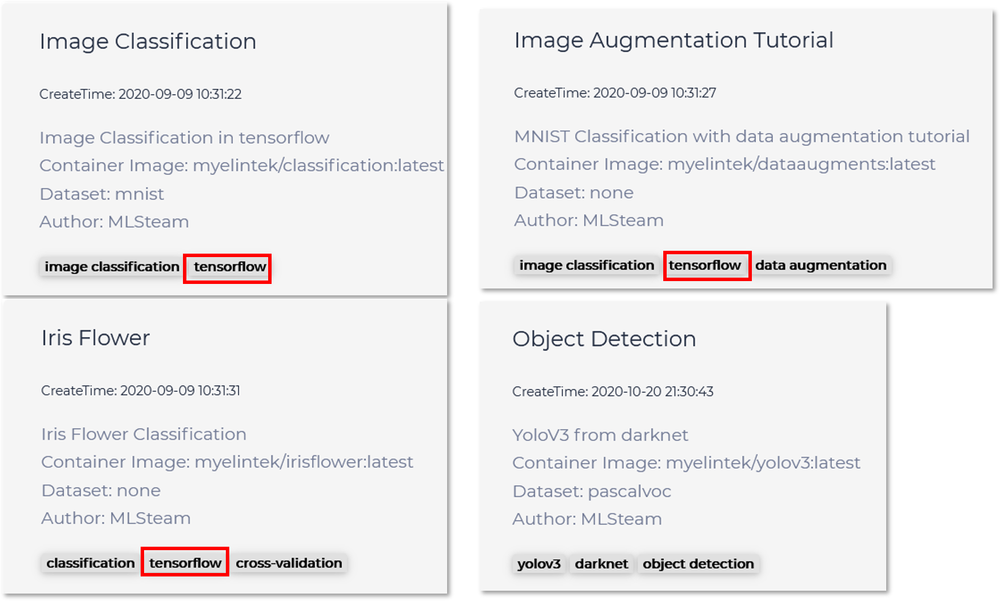

Starting TensorBoard
^^^^^^^^^^^^^^^^^^^^

Summit a job in the first, and wait for the job finished.

Then specify the file path of training result in logdir and click start. (The default directory is /mlsteam/output)

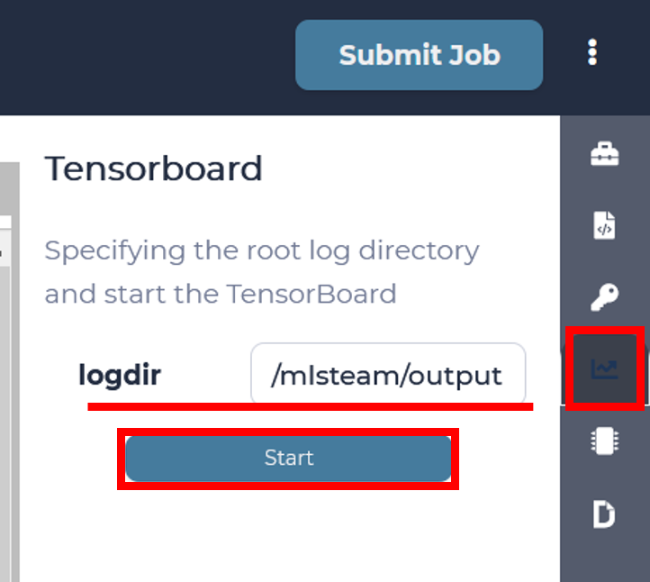
  

Click the url for starting TensorBoard.

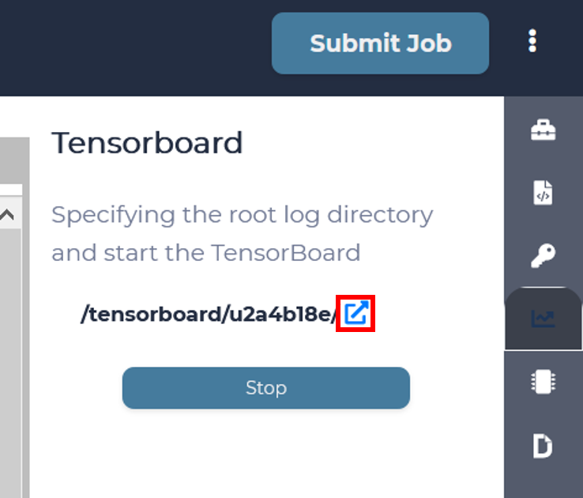

For more details, please see the link https://www.tensorflow.org/tensorboard/get_started.