.. _face_recognition:

***********
Face Recognition
***********

Prerequisite
============

Nvidia Tx2 device with webcam.

Quick Start
===========

1. Download docker image
-----------------------

.. code-block:: bash

    docker pull myelintek/face_rec:v1.0-tx2
    
2. Check camera device
-------------------------

Check dvice path

.. code-block:: bash
  
    ls /dev/video*

If target vdieo device are **/dev/video1** .
Modify **scripts/start.sh** and **scripts/start-daemon.sh**.

.. code-block:: bash

    ...
    CAMERA_DEVICE=/dev/video1
    CAMERA_DEVICE_NO=1
    ...

3. Start face recognition applicatinon
--------------------------------------

Run face recognition applicatin in foregrond mode.

.. code-block:: bash

    bash scripts/start.sh

Run face recognition application in background mode.

.. code-block:: bash

    bash scripts/start-daemon.sh

4. setup Grafana dashboard
---------------------------

Connect to http://localhost:3000 , login with default user **admin**, default password **admin**.

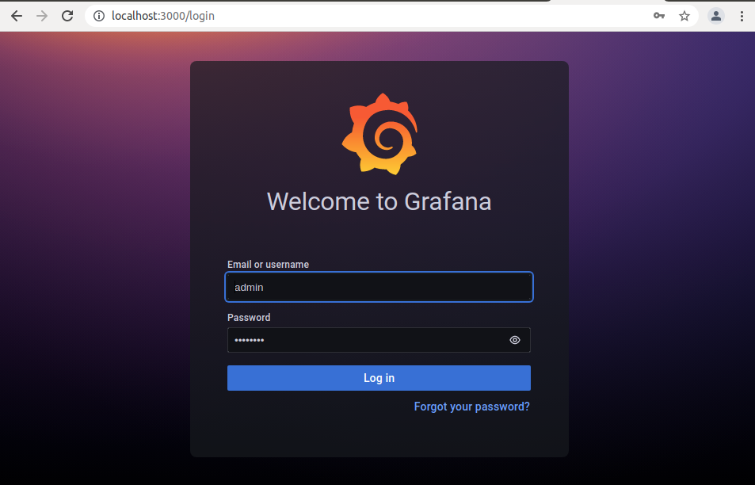

Change password

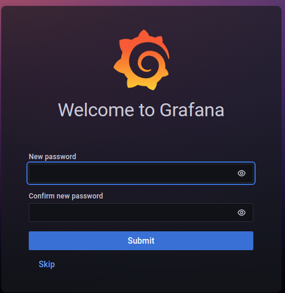

Go to "Config" > Data sources > Add Data sources

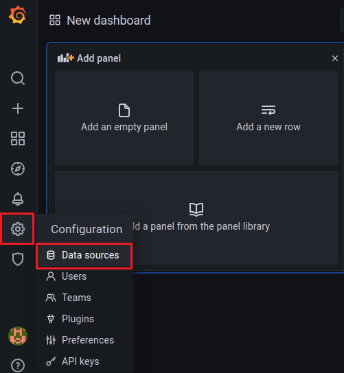

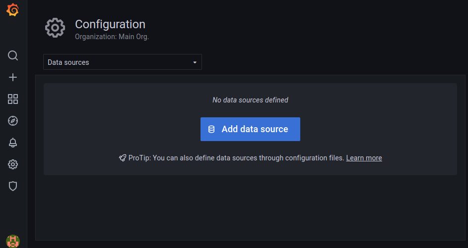

Add an influxdb data source

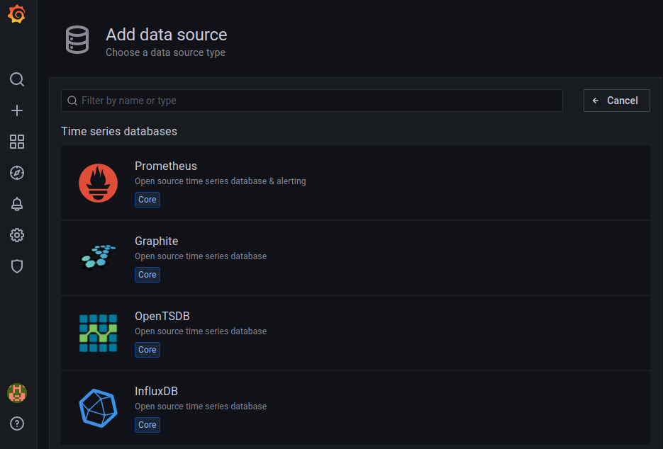

In HTTP scetion, specify URL http://localhost:8086

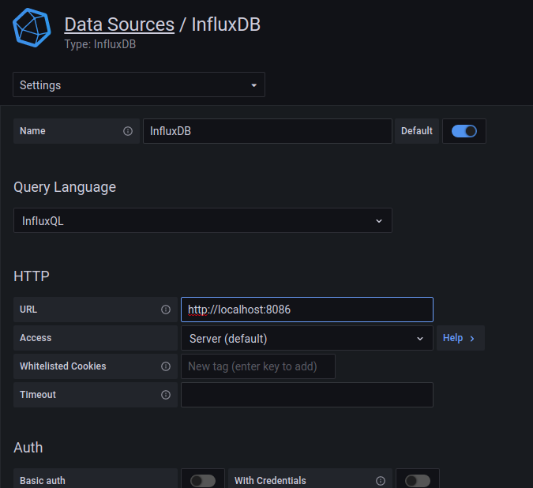

In Influxdb detail section, specify database face_rec, then click "Save & test"

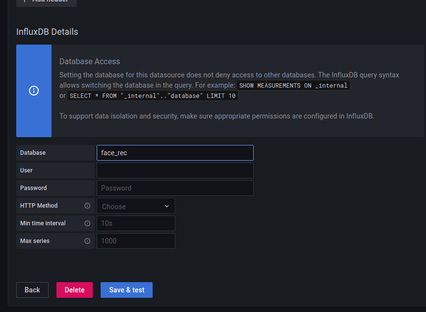

Go to "+" > Import > Upload JSON file

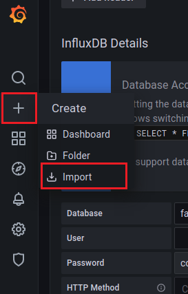

Upload JSON file configs/face_rec_grafana_dashboard.json, then click import

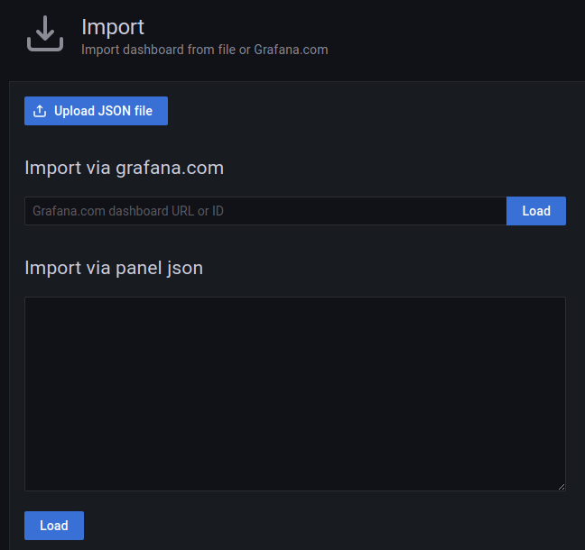

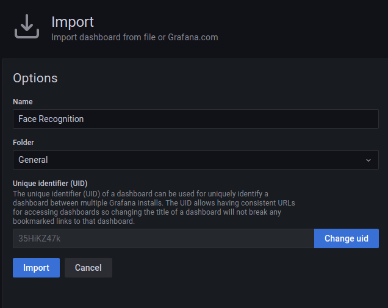

5. Start Monitoring
--------------------

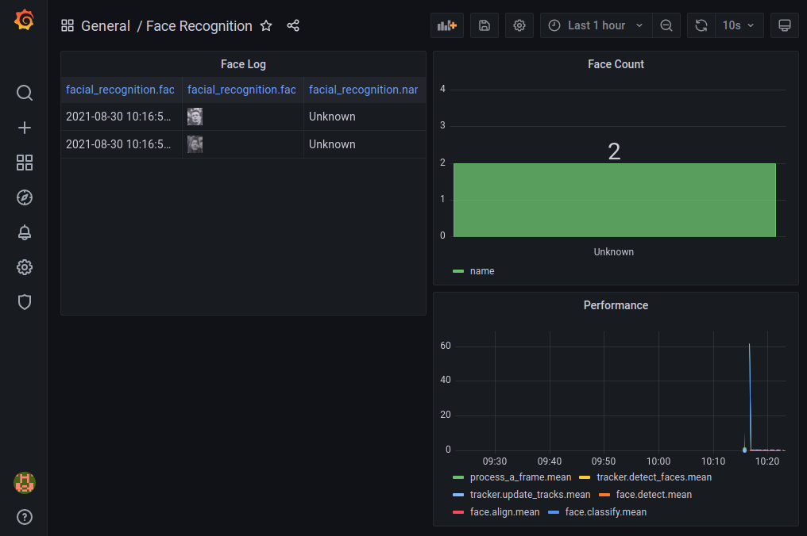

* Face log : When and who detected
* Face count:  Count in time period.
* Performance: face recognition performance.

Use you own model
=================

1. Prepare training dataset
---------------------------
Folder structure, use class name as folder name. each folder contain one people's picture.

.. code-block:: bash

    images/
        name_01/
            pic1.jpg
            pic2.jpg
        name_02/
            pic1.jpg
            pic2.jpg
        ...    

2. Train face classification model
----------------------------------

.. code-block:: bash
    
    bash scripts/train.sh <image_dir> <output_dir>

* image_dir: training image directory.
* output_dir: director for save trained model file

3. Replace model
----------------

Trained model should contain encoderSVM.pkl and classifierSVM.pkl. Then mount model_dir to /face-recognition/models folder in container to override the deafult model. Add following parameter when you start container.

.. code-block:: bash

    bash scripts/start.sh your/model_dir
    bash scripts/start-daemon.sh your/model_dir