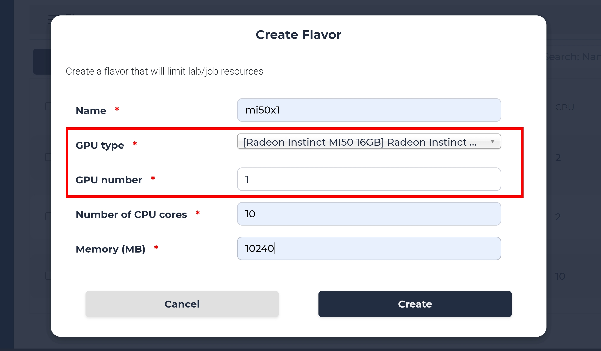
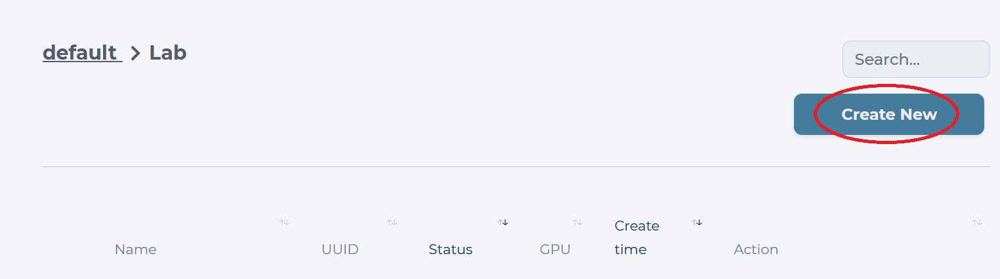
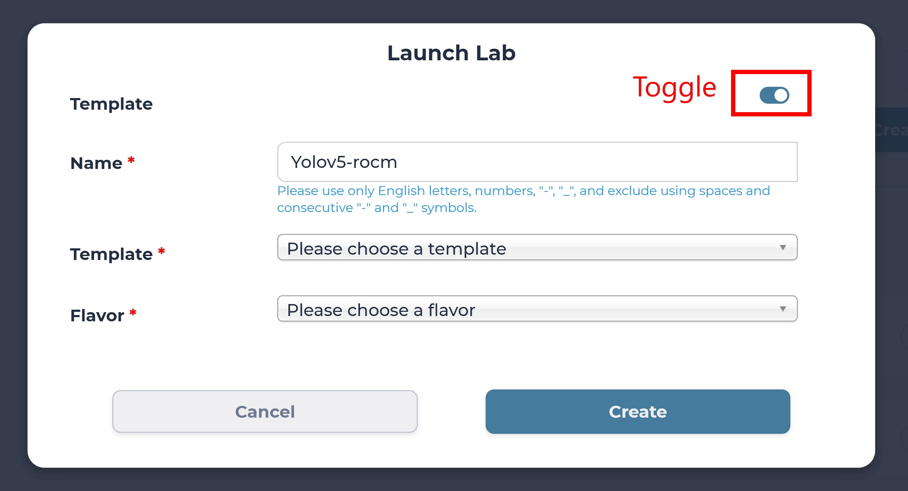
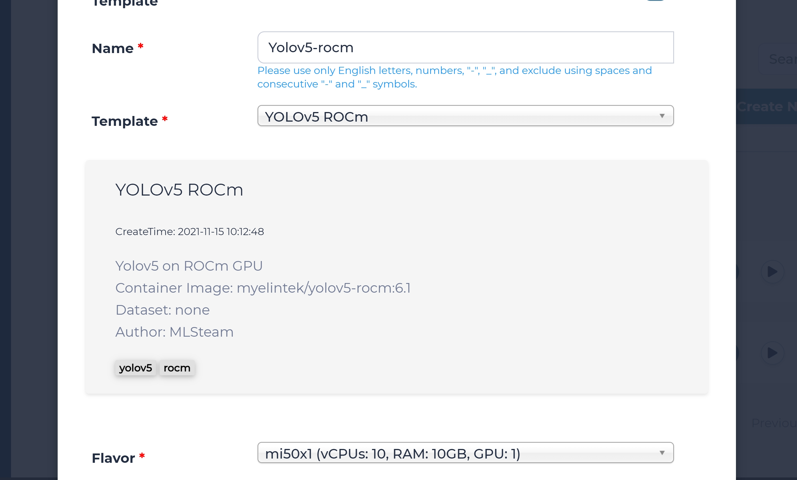
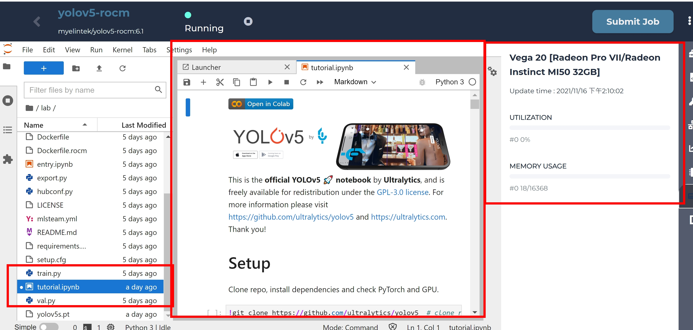
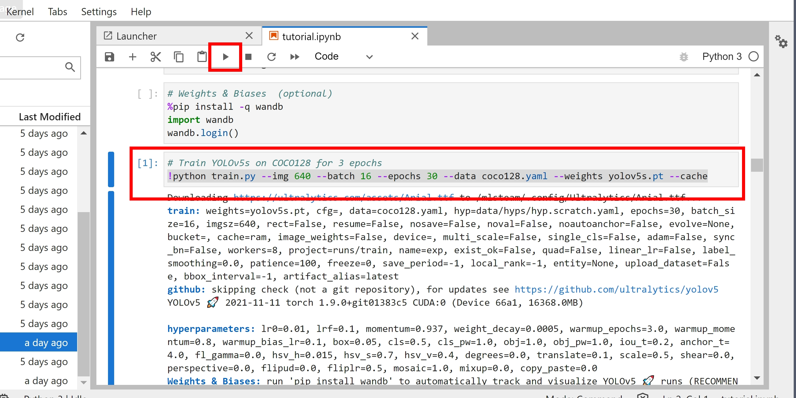
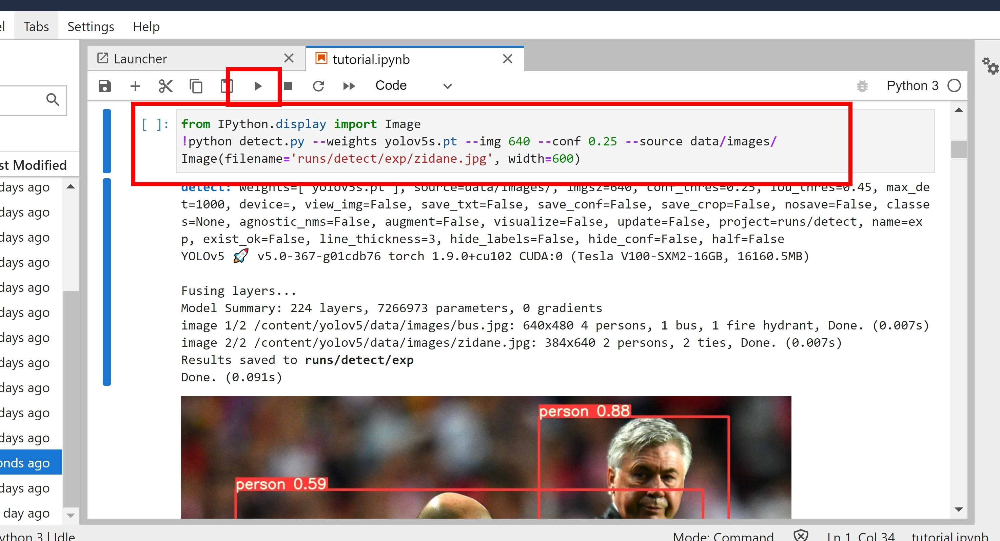
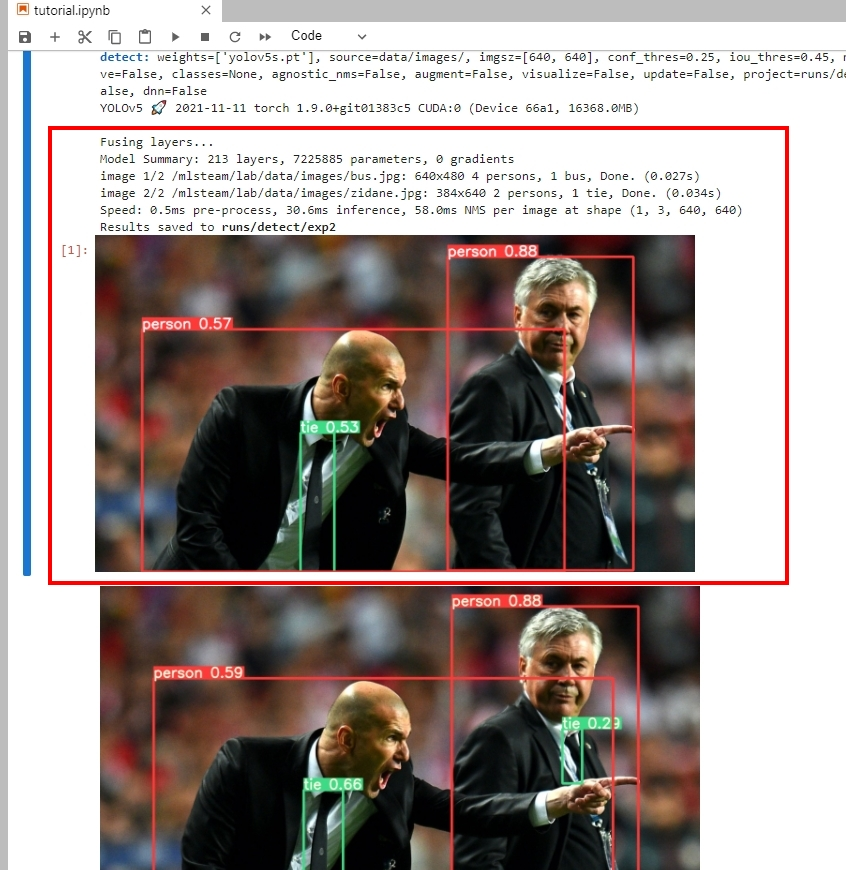

.. _yolov5_rocm:

Yolov5 ROCm
==============

This part will show how to run Yolov5 ROCm template.

Create Flavor
-------------
In the admin page, go to setting > flavor. Then, click Create button to create a flavor with the AMD GPU selected in GPU type option.
Here we name this flavor "mi50x1"

Create the lab
--------------

Inside your default Project, you will see all Labs you have created. Our goal is to create a new Lab using the template for classification, so we click the "Create New" button.

We are prompted with the **Launch Lab** window, where we need to toggle the **Template** option, come up with a name for this new Lab. 

We will use **Yolov5-rocm** as the name of the Lab in this guide, but you are free to give it any name shorter than 12 characters. Please choose **Yolov5-rocm** in "Template" option,
and select the flavor that you created in previous step. Finally, click Create button to launch the lab.

Yolov5 ROCm Training
--------------------

After you created the lab, you will see the jupyterlab page with yolov5 source code inside the lab, please open the **tutorial.ipynb** file.
You can also click **GPU Utitlization** tab on the right panel to see the GPU name and GPU utilization.

Scroll down to the **Train** section, click the below code section. You can click **run** to start the model training, this section will download the yolov5s.pt model file as pretrained model,
and start 3 epochs trainings with batch size 16. 

The training will take around 20 minutes to finish.

.. tip::
  Please note that when starting the pytorch, ROCm HIP will convert the cuda code into the ROCm HIP code in order to run on AMD GPU.
  This will take a while depending on the code size. 

Yolov5 ROCm Inferencing
-----------------------
Scroll up the **tutorial.ipynb** notebook, you will find the inferencing code like below, please import the Image library, then click run to trigger the inferencing.
This command will download the yolov5s.pt file and run the inferencing with downloaded model file.

The inferencing will take around 5 minutes, you will see the result in the end. You can compare the predicted image and the labeld image below. 

.. tip::
  For more details, please see the link https://github.com/ultralytics/yolov5